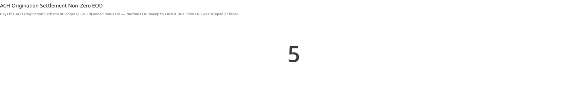
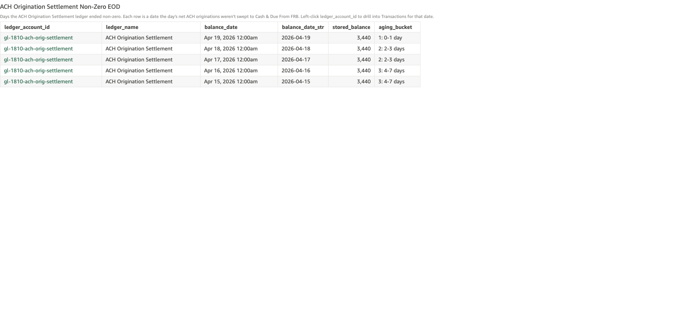
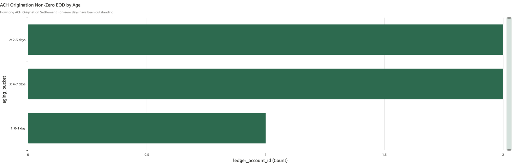

# ACH Origination Settlement Non-Zero EOD

*Per-check walkthrough — Account Reconciliation Exceptions sheet.*

## The story

ACH Origination Settlement (`gl-1810`) is a transitory clearing
account: every ACH origination customers initiate during the day
debits this ledger (with the credit landing on the customer's DDA),
and at end of day an internal sweep moves the day's net out to
**Cash & Due From FRB** (`gl-1010`), zeroing `gl-1810` for the
overnight cycle.

In a healthy day, gl-1810's stored EOD balance is exactly zero. If
the EOD sweep doesn't fire (skipped, failed, or never scheduled),
the day's net ACH originations sit on gl-1810 overnight — and they
keep sitting there until a corrective sweep finally drains them.
The next day's normal sweep only handles that day's net; it doesn't
catch up the prior day's residual. So once gl-1810 is non-zero,
it stays non-zero every subsequent day until somebody intervenes.

## The question

"Did the ACH Origination Settlement ledger end yesterday at zero —
i.e., did the EOD sweep to FRB actually fire?"

## Where to look

Open the AR dashboard, **Exceptions** sheet. In the CMS-specific
section, the **ACH Origination Settlement Non-Zero EOD** KPI sits
above its detail table and aging chart.

## What you'll see in the demo

The KPI shows **5** ACH origination non-zero days.

Screenshot — KPI

One planted skip in `_ACH_SWEEP_SKIP_PLANT` (days_ago=4 → Apr 15
2026) is the seed:

| date        | stored_balance | aging        |
|-------------|---------------:|--------------|
| Apr 19 2026 |          3,440 | 1: 0-1 day   |
| Apr 18 2026 |          3,440 | 2: 2-3 days  |
| Apr 17 2026 |          3,440 | 2: 2-3 days  |
| Apr 16 2026 |          3,440 | 3: 4-7 days  |
| Apr 15 2026 |          3,440 | 3: 4-7 days  |

The Apr 15 skip left $3,440 of net ACH originations parked on
gl-1810. Each subsequent day's normal sweep only swept that day's
net (back to zero), so gl-1810 stays at $3,440 EOD every day
since.

The detail table shows all five rows. Columns: `ledger_account_id`,
`ledger_name`, `balance_date`, `balance_date_str`, `stored_balance`,
`aging_bucket`. Sorted newest-first.

Screenshot — detail table

The aging bar chart shows the distribution: 1 row in bucket 1
(today), 2 rows in bucket 2 (Apr 17 + 18), 2 rows in bucket 3
(Apr 15 + 16). No rows in bucket 4 or 5 yet — the underlying
incident is only 4 days old.

Screenshot — aging chart

## What it means

Each row says: at end of day on `balance_date`, gl-1810's stored
balance was `stored_balance` dollars (non-zero). The constant
$3,440 across all five rows is the smoking gun — that's the same
unswept net from a single missed cycle four days ago, sitting
there ever since.

Two error patterns to distinguish:

- **One incident, sticky residual** (this case). One day's sweep
  was skipped; every day after carries the same residual. Fix:
  fire a one-time corrective sweep for the residual amount.
- **Daily pattern, varying residual.** Multiple skipped days,
  each with a different residual; the EOD balance climbs day over
  day. Fix: investigate the sweep automation itself — it's not
  firing reliably.

A different residual jumping back toward zero day-over-day means
partial corrective sweeps are landing — the ops team is catching
up but isn't fully done.

## Drilling in

Click `ledger_account_id` on any row. The drill switches to the
**Transactions** sheet filtered to that date, showing every
posting that touched gl-1810 that day — the day's individual ACH
origination debits, plus (if it fired) the EOD sweep credit.

On the skip day (Apr 15), the EOD sweep credit will be missing.
Walking forward to the day before the residual finally clears
shows the corrective sweep — typically tagged differently from
normal nightly sweeps because it's an off-cycle correction.

## Next step

ACH origination non-zero rows go to **ACH Operations**:

- **Bucket 1** (today's residual) → confirm whether the sweep
  actually missed or whether the snapshot is mid-cycle.
- **Bucket 2-3 (2-7 days)** → fire a corrective sweep. The
  amount equals the carry-forward residual from the original
  skip day.
- **Bucket 4-5 (8+ days)** → root-cause the original skip
  before correcting. A week-old residual on a CMS clearing
  account suggests nobody is monitoring this ledger; the
  operational gap matters more than the dollar amount.

Pair this check with **ACH Sweep Without Fed Confirmation**
(F.5.4 next to it). Both check the ACH origination cycle; this
one catches "internal sweep didn't post," the other catches
"internal sweep posted but Fed never confirmed."

## Related walkthroughs

- [ACH Sweep Without Fed Confirmation](ach-sweep-no-fed-confirmation.md) —
  the next stage of the same ACH origination cycle. After the
  internal sweep posts, a Fed-side confirmation should follow;
  that check catches days where the bank thinks the cash moved
  but FRB has no record.
- [GL vs Fed Master Drift](gl-vs-fed-master-drift.md) — broader
  GL vs Fed reconciliation. ACH origination non-zero is
  internal-side only; GL vs Fed compares the SNB internal view
  to the Fed-observed reality.
