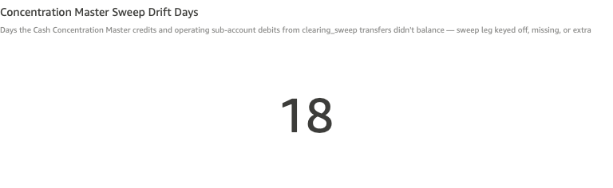
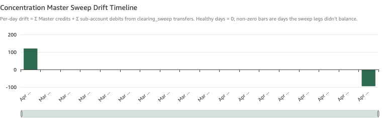

# Concentration Master Sweep Drift

*Per-check walkthrough — Account Reconciliation Exceptions sheet.*

## The story

The Cash Concentration Master sweep is a two-sided posting: every
clearing_sweep transfer credits the master account
(`gl-1850-cash-concentration-master`) and debits the operating
sub-account that's draining. Across a single business day, the sum
of master credits should exactly equal the negative of the sum of
sub-account debits. If they disagree, the sweep automation either
double-posted one side, missed one side, or applied a different
amount on each side.

This is a structural integrity check at the sweep-cycle level — a
companion to the per-account *Sweep Target Non-Zero EOD* check.
Sweep target non-zero catches "the sweep was skipped" (no transfer
at all that day). Sweep drift catches "the sweep fired but its
legs don't reconcile" (the transfer posted but the totals disagree).

## The question

"On the days a Cash Concentration Master sweep posted, did the
master credits and operating sub-account debits actually balance?"

## Where to look

Open the AR dashboard, **Exceptions** sheet. In the CMS-specific
section, the **Concentration Master Sweep Drift Days** KPI sits
half-width on the left, with the **Concentration Master Sweep Drift
Timeline** half-width on the right.

## What you'll see in the demo

The KPI shows **18** sweep drift days.

Screenshot — KPI

Two planted leg-mismatch incidents in `_ZBA_SWEEP_LEG_MISMATCH_PLANT`
are the visible spikes on the timeline:

| sub-account                          | sweep date  | master leg delta |
|--------------------------------------|-------------|-----------------:|
| Big Meadow Dairy — Operating Main    | Apr 13 2026 |       **+$120** (master long) |
| Big Meadow Dairy — Operating North   | Apr 8 2026  |     **−$95.50** (master short) |

Mixed signs are intentional so the timeline shows both upward and
downward spikes — drift in either direction is a problem.

The timeline shows daily drift bars: most days net to zero (no
visible bar), the two planted days carry the visible spikes near
+$120 and −$95.50, and the count of 18 also includes other smaller
sweep dates that the dataset includes in its scope.

Screenshot — timeline

## What it means

Each timeline bar is a sweep date with `drift =
master_total + subaccount_total`. (Master credits are positive,
sub-account debits are negative; a balanced day sums to zero.)

The two error patterns:

- **Master long** (`drift > 0`) means the master account got
  credited more than the sub-accounts got debited. The bank's
  concentrated position over-states by exactly that amount.
- **Master short** (`drift < 0`) means the master account got
  credited less than the sub-accounts got debited. The bank's
  concentrated position under-states; the cash effectively
  "disappeared" between the operating sub-account and the master.

Both planted incidents are on Big Meadow Dairy's two operating
sub-accounts — same customer, both directions. In a real CMS
incident, drift in both directions on the same customer often
points at a misconfigured sweep ratio or a rounding bug where one
side computes net-of-fees and the other doesn't.

## Drilling in

There's no left-click drill on this visual — the timeline is a
diagnostic surface, not a per-row drill target. To investigate a
specific drift date, switch to the **Transactions** sheet manually,
filter to `transfer_type = clearing_sweep` and the drift date, and
read the sweep transfers' legs side by side. The transfer with the
non-zero net is the sweep leg that mismatched.

The companion **Non-Zero Transfers** check on the baseline section
also surfaces these drift days at the per-transfer level — the
planted Apr 13 and Apr 8 sweep dates show up as `ar-zba-sweep-0004`
and `ar-zba-sweep-0017` in that table. Drilling from Non-Zero
Transfers gets you straight to the offending leg.

## Next step

Sweep drift days go to **CMS / Cash Concentration Operations**,
same team as Sweep Target Non-Zero. Hand off:

- The drift date and direction (master long or short)
- The amount of drift
- The sub-account whose sweep was involved
- A pointer to the sweep transfer ID from the Non-Zero Transfers
  drill

Sweep drift is a structural integrity issue — a single mis-amounted
sweep is rare; recurring drift on the same sub-account or same date
means the sweep computation has a bug. The first call should be to
the team that owns the sweep automation, not Treasury Operations.

## Related walkthroughs

- [Sweep Target Non-Zero EOD](sweep-target-non-zero.md) — companion
  check on the same sweep cycle. Sweep target catches "sweep was
  skipped"; sweep drift catches "sweep fired but legs disagreed."
  An incident might surface on both checks (skip on day N + drift
  on day N+1 catch-up sweep).
- [Non-Zero Transfers](non-zero-transfers.md) — the
  transfer-level view of the same incidents. Drift days here
  correspond to specific `transfer_id`s with non-zero net there.
  Drift gives you the daily summary; non-zero transfers gives you
  the per-transfer drill point.
