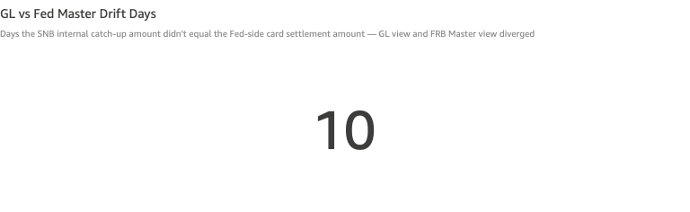
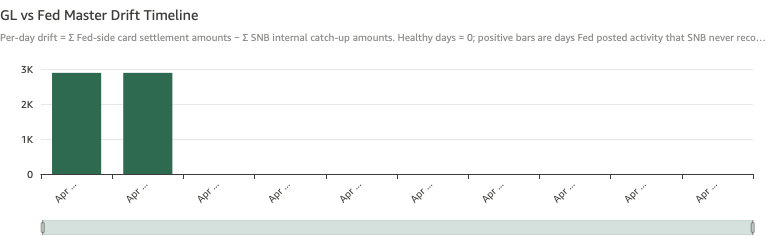

# GL vs Fed Master Drift

*Per-check walkthrough — Account Reconciliation Exceptions sheet.*

## The story

Every Fed-observed card settlement posting on the FRB master
account should have a matching SNB internal catch-up entry on
**Card Acquiring Settlement** (`gl-1815`). On any given day, the
sum of Fed-side card settlement amounts should exactly equal the
sum of SNB internal catch-up amounts. If they don't, the bank's
GL view of card acquiring has drifted from what the Fed actually
saw — either Fed posted activity SNB never recorded
(positive drift) or SNB posted catch-ups for activity the Fed
didn't see (negative drift, much rarer).

This check is a daily-aggregate companion to
*Fed Activity Without Internal Post*. That check operates at the
per-transfer level: which specific Fed settlement is missing its
internal entry. This check operates at the per-day level: how
much total drift is the bank carrying. The KPI counts drift days;
the timeline shows the per-day drift over the demo's window.

## The question

"Across the days the Fed observed card settlement activity, did
the bank's internal posts net to the same total — and if not,
how persistent and how large is the drift?"

## Where to look

Open the AR dashboard, **Exceptions** sheet. In the CMS-specific
section, the **GL vs Fed Master Drift Days** KPI sits half-width
on the left, with the **GL vs Fed Master Drift Timeline**
half-width on the right.

## What you'll see in the demo

The KPI shows **10** drift days.

Screenshot — KPI

The two visible drift bars on the timeline correspond to the two
planted incidents from `_CARD_INTERNAL_MISSING_PLANT` (days_ago
= 4 and 9 → Apr 15 and Apr 10):

| date        | drift  | source incident                                          |
|-------------|-------:|----------------------------------------------------------|
| Apr 15 2026 | ~2,890 | Fed posted `ar-card-fed-04` $2,890; no SNB internal post |
| Apr 10 2026 | ~2,890 | Fed posted `ar-card-fed-09` $2,890; no SNB internal post |

Both bars are positive (Fed minus SNB > 0) because the Fed posted
and SNB didn't catch up — the bank's GL view *understates* what
the Fed saw by exactly the missing settlement amount.

Screenshot — timeline

## What it means

Each timeline bar is one card-settlement date with `drift =
Σ Fed-side amounts − Σ SNB internal catch-up amounts`. A balanced
day has drift = 0 (no bar).

The two visible spikes are the planted Fed-without-internal
incidents — they show up here as drift bars because the Fed total
for those days was non-zero but the SNB internal total was. The
positive direction (Fed > SNB) is the typical CMS failure mode:
Fed feed lands and the bank fails to mirror it. Negative drift
(SNB > Fed) would mean the bank booked an internal catch-up for
something the Fed didn't post — much rarer, usually a bug in the
catch-up automation overshooting.

The persistence pattern matters more than any single bar:

- **One-off positive spikes** are individual missed catch-ups —
  fix in *Fed Activity Without Internal Post*.
- **A flat positive line that never reverts to zero** would mean
  the catch-up automation has a systematic shortfall — it's
  consistently posting less than the Fed sees. None visible in
  the demo.
- **Sign flips around zero day-to-day** would mean the catch-up
  automation has a timing offset — posting on the wrong day.
  Also not visible in the demo.

## Drilling in

There's no left-click drill on this visual — like the
Concentration Master Sweep Drift timeline, this is a diagnostic
surface, not a per-row drill target. To investigate a specific
drift day, switch to **Fed Activity Without Internal Post**
(directly above) and find the row whose `fed_at` matches the
drift date — that row is the per-transfer drill point.

## Next step

GL vs Fed drift days are a roll-up — per-day fixes happen in the
upstream check (*Fed Activity Without Internal Post*). What this
check tells the **Treasury Operations** team is the cumulative
exposure: total dollars the GL view is short by, in aggregate
across all unmatched Fed settlements.

For the demo: total drift exposure is **~$5,780** (two days at
$2,890 each). In a real CMS, the team would:

1. Add up the visible drift to size the gap.
2. Compare to the bank's tolerance for unreconciled GL exposure
   on the FRB master account (varies by institution; typically a
   small percentage of daily settlement volume).
3. If above tolerance, escalate the underlying *Fed Activity
   Without Internal Post* rows for immediate catch-up posting;
   if below tolerance, the catch-ups can wait for the next
   normal cycle.

## Related walkthroughs

- [Fed Activity Without Internal Post](fed-card-no-internal-catchup.md) —
  the per-transfer view of the same incidents that produce the
  drift bars on this timeline. Drilling individual drift days
  starts there.
- [ACH Sweep Without Fed Confirmation](ach-sweep-no-fed-confirmation.md) —
  the **opposite** direction of the SNB-vs-Fed mismatch class:
  bank posted, Fed didn't confirm. Together with *Fed Activity
  Without Internal Post*, the three checks cover both directions
  + the cumulative roll-up of the SNB/Fed reconciliation surface.
- [Concentration Master Sweep Drift](concentration-master-sweep-drift.md) —
  structurally analogous (KPI + timeline pair, drift in either
  direction) but on a different posting cycle (sweep transfers to
  the cash concentration master, not Fed reconciliation).
