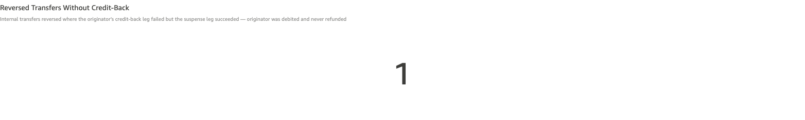
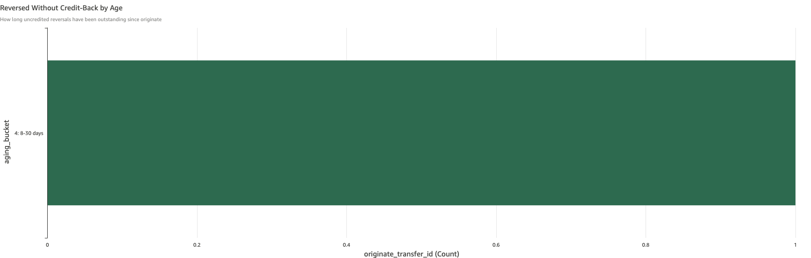

# Reversed Transfers Without Credit-Back

*Per-check walkthrough — Account Reconciliation Exceptions sheet.*

## The story

When an on-us internal transfer is reversed (e.g., the recipient
DDA refused the credit, fraud screen flagged it after Step 1, ops
manually unwound it), Step 2 is supposed to do two things in one
transfer: clear the suspense leg on `gl-1830` and credit the
originator's DDA back. Both legs must succeed for the customer to
end up whole.

This check surfaces reversals where the **suspense leg cleared but
the originator credit-back leg failed**. Internal Transfer
Suspense ends the day at zero (so *Internal Transfer Suspense
Non-Zero EOD* doesn't flag it), the originator's Step 1 debit is
still on their DDA, and no credit-back ever lands. The customer
was charged; nobody refunded them. From every other reconciliation
view this looks healthy — that's what makes it the most damaging
silent failure in the on-us transfer cycle.

It's a "double spend" pattern from the originator's perspective:
they paid once and never got the money back when the transfer
was reversed.

## The question

"For every reversed on-us transfer, did the originator's
credit-back leg actually post — or did the suspense clear without
refunding the customer?"

## Where to look

Open the AR dashboard, **Exceptions** sheet. In the CMS-specific
section, the **Reversed Transfers Without Credit-Back** KPI sits
above its detail table and aging chart — at the bottom of the
per-check stack, directly below *Internal Transfer Suspense
Non-Zero EOD*.

## What you'll see in the demo

The KPI shows **1** uncredited reversal.

Screenshot — KPI

The single planted incident in `_INTERNAL_TRANSFER_PLANT`
(`reversed_not_credited`, days_ago=17) is the seed:

| originate_transfer_id | originated_at       | originate_amount | reversal_transfer_id | reversal_at         | aging        |
|-----------------------|---------------------|-----------------:|----------------------|---------------------|--------------|
| `ar-on-us-orig-05`    | Apr 2 2026 9:30am   |            2,940 | `ar-on-us-step2-05`  | Apr 2 2026 2:45pm   | 4: 8-30 days |

The originator (`cust-700-0001-big-meadow-dairy`) was debited
$2,940 at originate; suspense held the funds; the reversal Step 2
cleared suspense (suspense leg `success`) but the credit-back to
the originator failed (status `failed`). Big Meadow Dairy is out
$2,940 with no offsetting credit on their DDA.

The detail table shows the row. Columns: `originate_transfer_id`,
`originated_at`, `originate_amount`, `reversal_transfer_id`,
`reversal_at`, `aging_bucket`. Sorted newest-first by
`originated_at`.

Screenshot — detail table

The aging bar chart shows a single bar in bucket 4 (8-30 days) —
the originate is 17 days old.

Screenshot — aging chart

## What it means

Each row says: on `originated_at`, the on-us transfer
`originate_transfer_id` debited the originator for
`originate_amount` and parked the funds on `gl-1830`. On
`reversal_at`, the reversal `reversal_transfer_id` cleared
`gl-1830` (suspense leg posted), but the originator's credit-back
leg failed — so the originator never got their money back.

A few patterns that produce this:

- **Credit-back leg explicitly failed.** The credit-back attempt
  posted with `status='failed'` (account closed/frozen, fraud
  hold blocked the credit, posting engine rejected the leg). The
  suspense-clear leg of the same transfer succeeded, so the
  reversal looks "done" from a transfer-status view.
- **Asymmetric posting bug.** A bug in the reversal automation
  posts the suspense-clear leg without ever attempting the
  originator credit-back. Functionally identical to the failed
  case from a balance perspective.
- **Manual reversal partial.** Ops manually unwound a stuck
  transfer by clearing suspense but forgot the credit-back step.

The single planted incident is the explicit-fail pattern:
`ar-on-us-step2-cust-05` was deliberately planted with
`status='failed'` while `ar-on-us-step2-susp-05` succeeded.

The damage compounds with time. Suspense looks healthy, the
transfer-level status reads "reversed", and the originator may
not notice the missing credit for days or weeks — especially for a
mid-five-figure transfer between commercial accounts where daily
balance fluctuations mask it. Audit catches it eventually via
sub-ledger sum vs. ledger control reconciliation, but by then the
customer relationship damage is done.

## Drilling in

Click `originate_transfer_id` in any row. The drill switches to
the **Transactions** sheet filtered to the originate transfer,
showing the Step 1 legs (debit originator DDA, credit suspense)
that posted normally.

To see the broken reversal itself, walk back to the **Transactions**
sheet and filter `transfer_id = <reversal_transfer_id>` (the
`ar-on-us-step2-XX` value from the row). You'll see two legs on
that transfer: the suspense-clear leg with `status='success'` and
the originator credit-back leg with `status='failed'`. That's the
asymmetry — the same transfer has one succeeded leg and one failed
leg, which is also why this row surfaces in **Non-Zero Transfers**
(failed_leg_count > 0).

To confirm the customer impact, switch to the **Balances** sheet
and look at the originator's DDA running balance — it shows the
Step 1 debit but no offsetting credit on `reversal_at`.

## Next step

Reversed-without-credit-back rows go to **Internal Transfer
Operations** with high urgency at any aging bucket — unlike the
other on-us-transfer checks, the customer is already short their
money:

- **Bucket 1-2 (0-3 days)** → manually post the originator
  credit-back leg. The amount is `originate_amount`; the target
  account is the originator DDA (visible in the originate
  transfer's Step 1 debit leg). If the original credit-back
  failed for a recoverable reason (transient hold lifted), retry
  is fine; otherwise post a compensating credit-back manually.
- **Bucket 3-4 (4-30 days)** → same fix as above, but also
  contact the originator. They've been short their money for
  more than three days; the relationship-management call is
  required.
- **Bucket 5 (>30 days)** → escalate to **Customer Operations
  Leadership**. A month-old uncredited reversal is the kind of
  thing that ends up in regulatory complaints if the customer
  finds it before the bank does.

The dollar exposure is in the `originate_amount` column — that's
the exact amount the originator is short.

## Related walkthroughs

- [Stuck in Internal Transfer Suspense](stuck-in-internal-transfer-suspense.md) —
  a *different* failure mode of the same on-us transfer cycle.
  There: Step 2 never lands, suspense stays non-zero, the
  recipient is never credited but the originator's debit is
  still in flight (recoverable by reversing). Here: Step 2 *did*
  land but only the suspense leg succeeded — suspense is clean,
  the originator is short, and the failure is invisible to
  suspense-balance checks.
- [Internal Transfer Suspense Non-Zero EOD](internal-transfer-suspense-non-zero.md) —
  the daily-aggregate companion to *Stuck in Internal Transfer
  Suspense*. The reversal-uncredited check exists precisely
  because suspense-non-zero **doesn't** catch this failure mode:
  when the suspense leg posted, gl-1830 ends the day at zero
  even though the originator was never refunded.
- [Non-Zero Transfers](non-zero-transfers.md) — broader invariant
  on every transfer's leg sum. Reversal-uncredited transfers
  also surface there as `failed_leg_count > 0` (one leg of the
  reversal failed). This check is the targeted view of that one
  specific failure shape.
