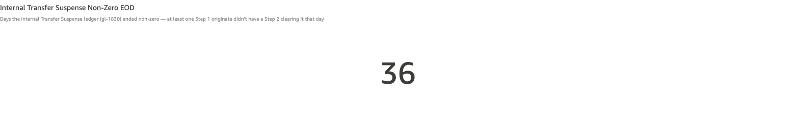
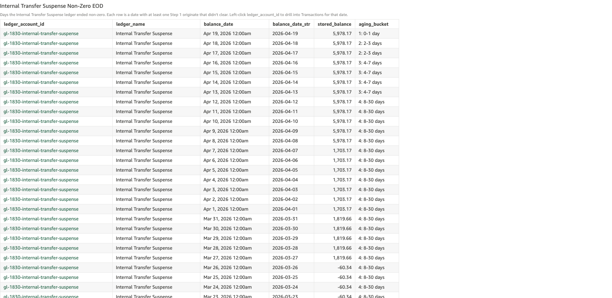
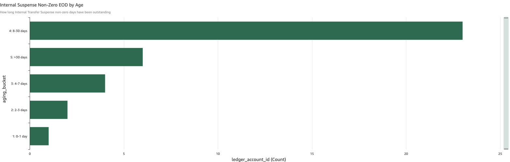

# Internal Transfer Suspense Non-Zero EOD

*Per-check walkthrough — Account Reconciliation Exceptions sheet.*

## The story

On-us internal transfers between two SNB customers post in two
steps: Step 1 debits **Internal Transfer Suspense** (`gl-1830`)
and credits the originator's DDA (the originator is debited first,
suspense holds the funds); Step 2 debits the recipient's DDA and
credits gl-1830 (the recipient is credited, suspense is cleared).
Step 1 lands immediately; Step 2 lands once a clearing/confirmation
cycle completes, usually within minutes but sometimes longer.

In a healthy day, every Step 1 has a corresponding Step 2 and
gl-1830 ends the day at exactly zero. Non-zero EOD on gl-1830
means at least one Step 1 originate didn't have a Step 2 clearing
it that day — either Step 2 hasn't landed yet (in flight), failed
(stuck), or the destination DDA refused the credit (rare).

This is the daily-aggregate companion to *Stuck in Internal
Transfer Suspense* (F.5.7). That check operates at the
per-transfer level: which specific Step 1 originates are stuck.
This check operates at the per-day level: how many days has
gl-1830 been carrying any non-zero EOD balance.

## The question

"Did the Internal Transfer Suspense ledger end yesterday at zero —
i.e., did every Step 1 have a Step 2 clearing it?"

## Where to look

Open the AR dashboard, **Exceptions** sheet. In the CMS-specific
section, the **Internal Transfer Suspense Non-Zero EOD** KPI sits
above its detail table and aging chart — directly below
*Stuck in Internal Transfer Suspense*.

## What you'll see in the demo

The KPI shows **36** suspense non-zero days.

Screenshot — KPI

The check is sticky: as long as a single Step 1 originate is
hanging on gl-1830, every subsequent EOD adds one row to the
count. The two stuck plants from `_INTERNAL_TRANSFER_PLANT` —
the `cust-800-0001 → cust-700-0001` $4,275 transfer from Apr 8
2026 (11 days ago) and the
`cust-800-0002 → cust-700-0002` $1,880 transfer from Mar 27 2026
(23 days ago) — each contribute every day they remain stuck.

The detail table lists every (gl-1830, date) cell where stored
balance ≠ 0. Columns: `ledger_account_id`, `ledger_name`,
`balance_date`, `balance_date_str`, `stored_balance`,
`aging_bucket`. Sorted newest-first.

Screenshot — detail table

The aging bar chart shows the distribution: bucket 4 (8-30 days)
dominates with ~23 rows — that's the stretch since the older
Mar 27 stuck plant first landed and aged into 8-30. Bucket 5
(>30 days) carries ~6 rows from older background suspense
activity. Buckets 1-3 carry the most recent days.

Screenshot — aging chart

## What it means

Each row says: at end of day on `balance_date`, gl-1830's stored
balance was `stored_balance` dollars (non-zero). The
`stored_balance` value reflects the running total of every
unmatched Step 1 originate currently hanging on suspense — so on
a day when both stuck plants are in flight,
`stored_balance ≈ $4,275 + $1,880 = $6,155`.

A few patterns to watch for:

- **Same `stored_balance` across consecutive days** means no new
  stuck originates landed *and* no stuck originate cleared. The
  same set of stuck transfers is just sitting there.
- **`stored_balance` stepping up** day-over-day means new stuck
  originates are accumulating on top of the existing backlog.
  The underlying clearing automation is getting worse, not just
  stuck on a few old items.
- **`stored_balance` stepping down** means at least one stuck
  originate finally cleared (or was reversed). Combined with the
  per-transfer view in *Stuck in Internal Transfer Suspense*,
  you can identify which one.

The suspense ledger going non-zero by even small amounts is
operationally significant — gl-1830 is a clearing account, not a
balance account. A non-zero EOD means real customer money is
parked in transit, not in a customer account.

## Drilling in

Click `ledger_account_id` in any row. The drill switches to the
**Transactions** sheet filtered to that date, showing every
posting that touched gl-1830 — Step 1 debits and Step 2 credits.
Step 1 originates with no matching Step 2 are the contributors to
that day's non-zero balance.

For the per-transfer view (which specific originates are stuck),
go up to the *Stuck in Internal Transfer Suspense* check directly
above this one — its table has the originate transfer IDs and
the originator/recipient pairs.

## Next step

Suspense non-zero rows go to **Internal Transfer Operations**:

- **Bucket 1-2 (0-3 days)** → likely Step 2 still in flight; let
  the next clearing cycle process. Worth flagging if the day
  count is unusually high (more stuck-in-flight than typical for
  the time of day).
- **Bucket 3-4 (4-30 days)** → Step 2 won't arrive on its own.
  Identify the stuck originates via *Stuck in Internal Transfer
  Suspense* and trigger the Step 2 retry or compensating reversal
  per transfer.
- **Bucket 5 (>30 days)** → escalate. A month-old non-zero
  suspense balance means the original incident wasn't worked at
  all, or the retry mechanism failed and nobody noticed.

The dollar exposure is in `stored_balance` of the latest row —
that's the current total of stuck originator funds parked in
suspense.

## Related walkthroughs

- [Stuck in Internal Transfer Suspense](stuck-in-internal-transfer-suspense.md) —
  the per-transfer view of the same root cause. This check tells
  you "the suspense ledger has been non-zero for N days"; that
  check tells you "here are the K specific originates causing
  it." Suspense non-zero is sticky (one stuck transfer × N days
  = N rows); stuck-in-suspense is per-transfer (1 originate = 1
  row, regardless of how many days).
- [Reversed Transfers Without Credit-Back](internal-reversal-uncredited.md) —
  a different failure mode of the same on-us transfer cycle.
  When a transfer is reversed and the credit-back fails, gl-1830
  itself ends up balanced (both Step 1 and Step 2 reversal
  posted), so this check **doesn't** flag it — but the
  originator is still short the original debit. The reversal-
  uncredited check exists precisely because suspense non-zero
  doesn't catch that failure mode.
- [Non-Zero Transfers](non-zero-transfers.md) — broader
  invariant on every transfer's leg sum. Stuck originates with
  Step 2 missing also surface there as `failed_leg_count = 0,
  one of total_debit/total_credit = 0` — the "stuck step" class.
  Internal-transfer-suspense-non-zero is the daily-aggregate
  view of those stuck-step rows.
