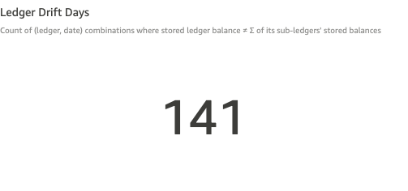
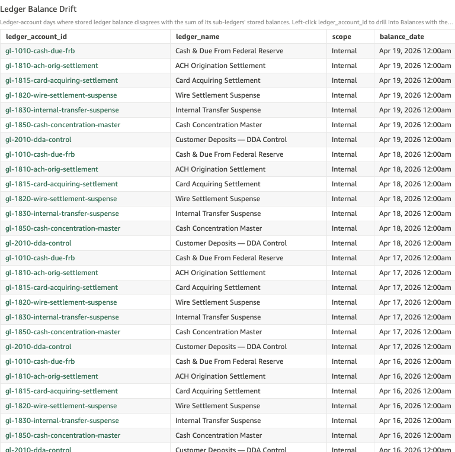
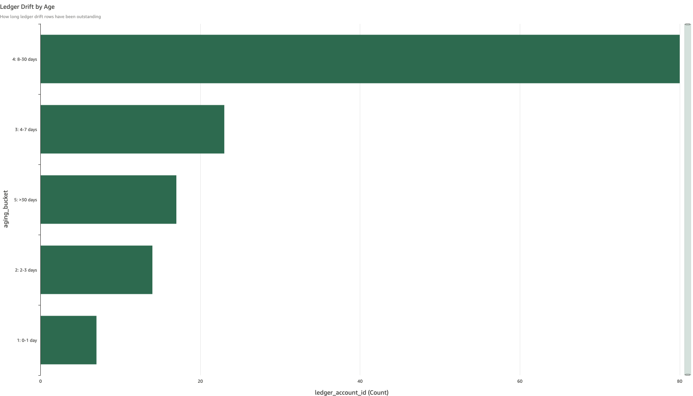

# Ledger Drift

*Per-check walkthrough — Account Reconciliation Exceptions sheet.*

## The story

Each GL control account at SNB sits at the top of a small accounting
hierarchy: it has a stored end-of-day balance fed by the upstream
system, and one or more sub-ledger accounts roll up into it. The
invariant the database enforces every day is straightforward:

> *stored ledger balance = Σ of its sub-ledgers' stored balances + Σ of direct postings to the ledger itself*

Anything else is a structural break — the ledger's own books and the
roll-up of its component accounts disagree. If left unresolved, the
GL rolls forward each day with the same gap, and any downstream
reporting (regulatory, internal financials, treasury cash position)
inherits the wrong number.

Like sub-ledger drift, ledger drift is sticky. One bad day at the
top of a control account propagates to every subsequent day's
snapshot until somebody restates either the ledger balance or one of
its components. So the day count is much larger than the number of
underlying incidents.

## The question

"Are any GL control accounts carrying a stored balance that doesn't
match the sum of their sub-ledgers (plus direct ledger postings)?"

## Where to look

Open the AR dashboard, **Exceptions** sheet. The KPI **Ledger Drift
Days** sits at the top-left of the upper KPI row, alongside
**Sub-Ledger Drift Days** and **Non-Zero Transfers**.

## What you'll see in the demo

The KPI shows **141** ledger drift days.

Screenshot — KPI

Three planted ledger-level drift incidents in `_LEDGER_DRIFT_PLANT`
account for the count. Each lands on one day and rolls forward
through every subsequent EOD until restated:

| ledger                          | started     | delta      |
|---------------------------------|-------------|------------|
| Customer Deposits — DDA Control | Apr 16 2026 | +$125.00   |
| Cash Concentration Master       | Apr 12 2026 | −$80.50    |
| Cash & Due From FRB             | Apr 5 2026  | +$310.00   |

Three ledgers, three different control hierarchies, three different
operational owners — the demo intentionally spreads the plants so
operators see the drift at every level of the GL.

The detail table lists every (ledger, date) cell where stored ≠
computed. Columns: `ledger_account_id`, `ledger_name`, `scope`,
`balance_date`, `stored_balance`, `computed_balance`, `drift`,
`aging_bucket`. Sorted newest-first.

Screenshot — detail table

The aging bar chart distributes the 141 days across buckets — bucket
4 (8-30 days) carries the bulk of the count because the older two
plants (Apr 5 and Apr 12) have already aged out of the recent
buckets.

Screenshot — aging chart

## What it means

Each row is one (ledger, date) cell where the ledger's stored EOD
balance disagrees with what its component sub-ledgers and direct
postings sum to. The `drift` column is the dollar gap.

The interesting thing about ledger drift versus sub-ledger drift:
ledger drift can come from a sub-ledger that's *not* drifting on its
own. If sub-ledger A's stored balance increased by $100 with no
posting (the sub-ledger drift check catches this), the ledger sum
shifts by $100 too — and the ledger drift check catches that
separately. So it's worth confirming whether a ledger drift cell has
a corresponding sub-ledger drift cell on the same day; if yes, fix
the sub-ledger and the ledger usually self-heals.

If no sub-ledger of the drifting ledger has a corresponding entry on
the same day, the drift is at the ledger level itself — most often
a direct ledger posting that landed without updating stored, or
vice-versa.

## Drilling in

Click the `ledger_account_id` value in a row. The drill switches to
the **Balances** sheet with the sub-ledger table filtered to the
sub-ledgers of that ledger. From there you can scan whether any one
sub-ledger's stored balance shifted on the drift date.

For direct ledger postings (where the gap doesn't come from a
sub-ledger), open the Transactions sheet and filter on the ledger as
the account_id; transfers with `transfer_type` of `funding_batch`,
`fee`, or `clearing_sweep` post directly against the ledger and are
the most common source of direct-ledger drift.

## Next step

Ledger drift goes to **GL Reconciliation** by default. They route to
the actual fix:

- Customer Deposits — DDA Control drift → typically pushes back to
  **Core Banking Operations** (component sub-ledgers come from the
  customer-balance feed).
- Cash Concentration Master drift → **ZBA Admin / Sweep Automation**.
- Cash & Due From FRB drift → **Treasury / Fed Reconciliation**.

Hand off the ledger ID, first drift date, and constant drift dollar
amount. The fix is either a restatement of the stored ledger balance
(if the components are right and the ledger feed was wrong) or a
restatement / posting of one of the components (if the ledger feed
is right and the component drifted).

Old ledger drift (bucket 5: >30 days) is high-priority — the GL
balance is what regulatory and internal financial reports read off,
so a >30-day gap can land in published numbers.

## Related walkthroughs

- [Sub-Ledger Drift](sub-ledger-drift.md) — the per-component view.
  Always check whether a ledger drift cell has a same-day sub-ledger
  drift cell first; fixing the sub-ledger usually clears both.
- [Balance Drift Timelines Rollup](balance-drift-timelines-rollup.md) —
  unrelated drift class (two-sided invariants like SNB↔Fed) that
  shares the word "drift" in its name. If you're looking for SNB-vs-
  Fed drift, that's the other rollup, not this check.
