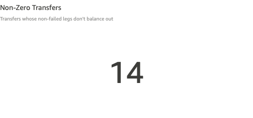
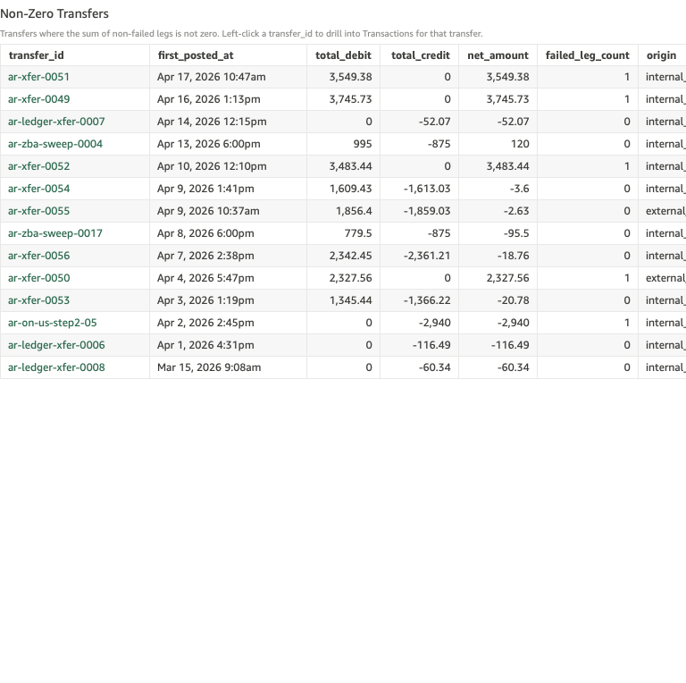
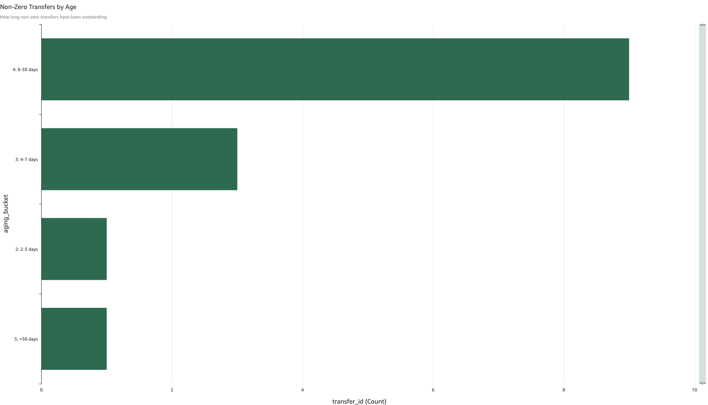

# Non-Zero Transfers

*Per-check walkthrough — Account Reconciliation Exceptions sheet.*

## The story

Every `transfer_id` in SNB's ledger represents one financial event —
an ACH, a wire, an internal transfer, a cash deposit, a sweep — that
posts as a set of legs (debit one account, credit another). The
double-entry invariant is that the non-failed legs of any transfer
must sum to zero. Money out of one account equals money into another.

When the non-failed legs *don't* sum to zero, one of three things
happened:

- **Failed leg.** A leg posted with `status='failed'`. The transfer
  is not in balance because the failed leg's amount didn't make it
  to its destination — the customer-facing money is short by exactly
  that amount.
- **Off amount.** Both legs posted successfully but with mismatched
  amounts (debit $1,000, credit $999). This is rarer but typically
  points at a fee miscalculation or a rounding bug in the upstream
  feed.
- **Stuck (one leg only).** Step 1 posted, Step 2 never arrived.
  Common in two-step internal transfers and external sweeps where
  the second leg is conditional on confirmation from another system.

The Non-Zero Transfers check catches all three at once. Each row is
a transfer that needs a person to look at it.

## The question

"Are there any transfers where the non-failed legs don't add up to
zero?"

## Where to look

Open the AR dashboard, **Exceptions** sheet. The KPI **Non-Zero
Transfers** sits in the upper KPI row, to the right of the two drift
KPIs.

## What you'll see in the demo

The KPI shows **14** non-zero transfers.

Screenshot — KPI

The detail table lists each one with columns: `transfer_id`,
`first_posted_at`, `total_debit`, `total_credit`, `net_amount`,
`failed_leg_count`, `origin`, `aging_bucket`, `memo`. Sorted
newest-first. From the demo seed:

| transfer_id           | first_posted_at      | total_debit | total_credit | net_amount | failed_leg_count |
|-----------------------|----------------------|------------:|-------------:|-----------:|-----------------:|
| `ar-xfer-0051`        | Apr 17 2026 10:47am  |    3,549.38 |            0 |   3,549.38 |                1 |
| `ar-xfer-0049`        | Apr 16 2026 1:13pm   |    3,745.73 |            0 |   3,745.73 |                1 |
| `ar-ledger-xfer-0007` | Apr 14 2026 12:15pm  |           0 |       −52.07 |     −52.07 |                0 |
| `ar-zba-sweep-0004`   | Apr 13 2026 6:00pm   |         995 |         −875 |        120 |                0 |
| `ar-xfer-0052`        | Apr 10 2026 12:10pm  |    3,483.44 |            0 |   3,483.44 |                1 |
| `ar-xfer-0054`        | Apr 9 2026 1:41pm    |    1,609.43 |    −1,613.03 |      −3.60 |                0 |
| `ar-xfer-0055`        | Apr 9 2026 10:37am   |    1,856.40 |    −1,859.03 |      −2.63 |                0 |
| `ar-zba-sweep-0017`   | Apr 8 2026 6:00pm    |       779.50 |        −875 |     −95.50 |                0 |
| `ar-xfer-0056`        | Apr 7 2026 2:38pm    |    2,342.45 |    −2,361.21 |     −18.76 |                0 |
| `ar-xfer-0050`        | Apr 4 2026 5:47pm    |    2,327.56 |            0 |   2,327.56 |                1 |
| `ar-xfer-0053`        | Apr 3 2026 1:19pm    |    1,345.44 |    −1,366.22 |     −20.78 |                0 |
| `ar-on-us-step2-05`   | Apr 2 2026 2:45pm    |           0 |       −2,940 |     −2,940 |                1 |
| `ar-ledger-xfer-0006` | Apr 1 2026 4:31pm    |           0 |      −116.49 |    −116.49 |                0 |
| `ar-ledger-xfer-0008` | Mar 15 2026 9:08am   |           0 |       −60.34 |     −60.34 |                0 |

Screenshot — detail table

The aging bar chart distributes the 14 transfers across buckets:
~9 in bucket 4 (8-30 days), ~3 in bucket 3 (4-7 days), ~1 each in
buckets 2 (2-3 days) and 5 (>30 days).

Screenshot — aging chart

The mix of error classes is visible right in the table:

- Rows with `failed_leg_count > 0` are the failed-leg class.
- Rows with `failed_leg_count = 0` and `total_debit ≠ −total_credit`
  are the off-amount class.
- Rows with one of `total_debit` / `total_credit` at zero (and
  `failed_leg_count = 0`) are the stuck-step class — the second leg
  hasn't arrived.

## What it means

Each row is a transfer that didn't balance — money is out of place
by exactly `net_amount` dollars. A failed leg means a customer is
short the failed amount; an off-amount means both sides booked but
disagree on how much; a stuck step means money posted to a suspense
account and never moved on.

The failed-leg cases are the loudest — both `ar-xfer-0049/0050/0051/
0052` show large outbound debits with no matching credit because the
credit leg failed to post. In each case the customer's account was
debited but the destination never received it.

The off-amount cases (`ar-xfer-0053/0054/0055/0056`) are smaller in
dollars (a few dollars off) and almost always trace back to either a
fee assessment that didn't make it into the credit leg or a rounding
disagreement between two upstream systems calculating the same
transfer.

The stuck-step cases (`ar-on-us-step2-05`, `ar-ledger-xfer-0006`,
`ar-ledger-xfer-0007`, `ar-ledger-xfer-0008`) are ones where Step 1
posted and Step 2 didn't — so you see a credit with no offsetting
debit, or vice versa.

## Drilling in

Click the `transfer_id` value in any row. The drill switches to the
**Transactions** sheet filtered to that one transfer ID, showing
every leg (posted and failed). Reading the legs tells you the error
class:

- One or more legs marked `status='failed'` → failed-leg case;
  resubmit or refund the failed leg.
- Two posted legs with mismatched amounts → off-amount case; the
  difference is the amount to investigate.
- One posted leg only → stuck-step case; chase the missing second
  leg in the originating system.

## Next step

Triage by error class:

- **Failed leg** → originating channel team (ACH Operations, Wire
  Operations, Cash Operations, Internal Transfer Operations). They
  resubmit the failed leg or initiate a refund.
- **Off amount** → typically a fee/rounding bug — escalate to the
  team that calculates the fee or the upstream system feeding the
  amount. The dollar gap is the diagnostic.
- **Stuck step** → see the *Stuck in Internal Transfer Suspense*
  walkthrough for the on-us flavor; for sweep / external flavors,
  the per-check walkthroughs in the Exceptions sheet's CMS section
  cover the specific patterns.

Bucket 4+ (8 days and up) means the transfer has been out of balance
long enough that either the originator or the recipient has likely
noticed. Prioritize accordingly.

## Related walkthroughs

- [Stuck in Internal Transfer Suspense](stuck-in-internal-transfer-suspense.md) —
  the on-us-transfer flavor of the stuck-step class. `ar-on-us-step2-05`
  in this table is one of those rows; that walkthrough shows the
  full Step 1 / Step 2 picture.
- [Sub-Ledger Drift](sub-ledger-drift.md) — unrelated check (drift
  is a stored-vs-computed mismatch on an account; non-zero is a
  posting-vs-posting mismatch on a transfer) but lives in the same
  KPI row and is sometimes confused. Different invariants, different
  diagnostic paths.
