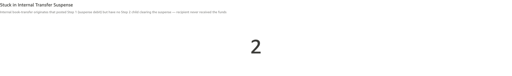
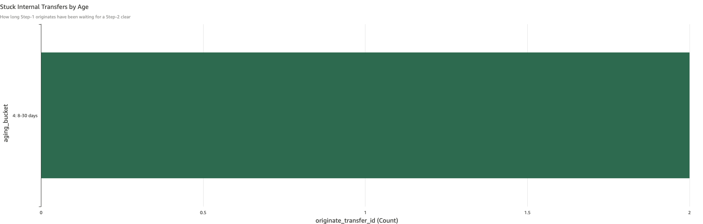

# Stuck in Internal Transfer Suspense

*Per-check walkthrough — Account Reconciliation Exceptions sheet.*

## The story

When an SNB customer initiates an on-us transfer to another SNB
customer, money moves in two steps. Step 1 debits the originator's
DDA and credits `gl-1830` Internal Transfer Suspense. Step 2 then
settles by debiting suspense and crediting the recipient's DDA — *or*
by reversing back to the originator if the transfer fails.

If only Step 1 posts and Step 2 never arrives, the money is stuck.
The originator can't see it (already debited from their DDA), the
recipient hasn't received it, and `gl-1830` carries a non-zero balance
that grows older every day.

## The question

"Are there any internal transfers where Step 1 posted but Step 2 never
did?"

## Where to look

Exceptions sheet, scroll past the rollups, past the baseline checks
(ledger / sub-ledger drift, non-zero transfers, limit breaches,
overdrafts), past the ACH and Fed-card sections. The check is titled
**Stuck in Internal Transfer Suspense** with a KPI, detail table, and
aging bar chart.

## What you'll see in the demo

The KPI shows **2** stuck transfers.

Screenshot — KPI

The detail table has four columns: `originate_transfer_id`,
`originated_at`, `originate_amount`, and `aging_bucket`. From the demo
seed:

| originate_transfer_id | originated_at        | originate_amount | aging_bucket  |
|-----------------------|----------------------|------------------|---------------|
| `ar-on-us-orig-03`    | Apr 8, 2026 9:30am   | 4,275            | 4: 8-30 days  |
| `ar-on-us-orig-04`    | Mar 27, 2026 9:30am  | 1,880            | 4: 8-30 days  |

Screenshot — detail table

The two rows correspond to the planted scenarios in
`_INTERNAL_TRANSFER_PLANT` (Cascade Timber Mill → Big Meadow Dairy and
Pinecrest Vineyards LLC → Harvest Moon Bakery) — the originator and
recipient names aren't in this table; you'll see them when you drill
into Transactions.

The aging bar chart shows both rows in the **8-30 days** bucket — well
past the 1-3 day "normal in-flight" window.

Screenshot — aging chart

## What it means

The originating customer has been short the funds for the indicated
number of days. The recipient never got their money. Suspense is
carrying $6,155.00 in stuck balances that should have settled the day
they originated. This is a customer-facing problem on at least two
counts: the originator may be calling about a failed payment, and the
recipient may be calling about a missing payment.

## Drilling in

Click the `originate_transfer_id` value in a row of the detail table.
The drill switches to the **Transactions** sheet filtered to that
transfer ID, showing the Step 1 originate posting (debit suspense,
credit originator DDA) with no matching Step 2. The absence of Step 2
is the diagnosis — the internal transfer system stopped halfway. The
Transactions sheet also shows the originator's `account_name`, which
the rollup table doesn't carry.

## Next step

Stuck-in-suspense rows always go to **Internal Transfer Operations**.
Hand off the `originate_transfer_id` plus the originator name (from
the drilled Transactions sheet) and amount. They check the transfer
system log for why Step 2 didn't fire — common causes are recipient
account flagged for review, intra-day system restart that lost the
in-flight state, or a NSF check that didn't trigger the reversal path.

After 30 days, stuck transfers escalate to legal / compliance — money
held that long without resolution is a regulatory issue.

## Related walkthroughs

- [Expected-Zero EOD Rollup](expected-zero-eod-rollup.md) — these stuck transfers also surface in the Expected-Zero rollup as residual `gl-1830` balance.
- *Internal Transfer Suspense Non-Zero EOD* (forthcoming) — the account-level view: the same money seen as "suspense holding $6,155 overnight" instead of "two specific transfers stuck".
- *Internal Reversal Uncredited* (forthcoming) — the related failure mode: Step 2 *did* fire, but as a reversal rather than the destination credit, and the originator never got their money back.
