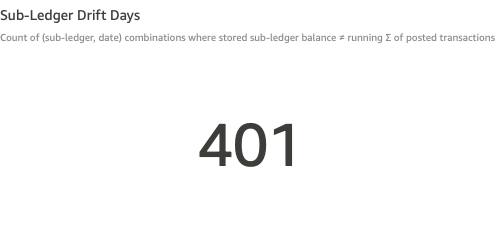
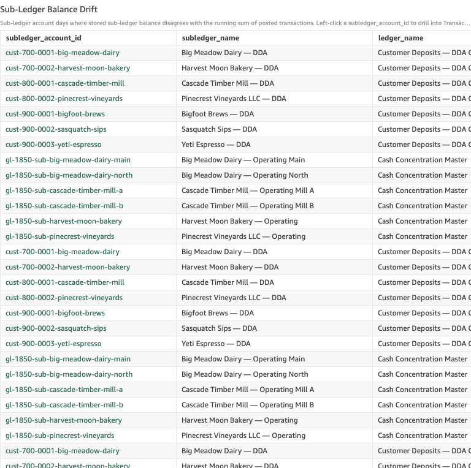
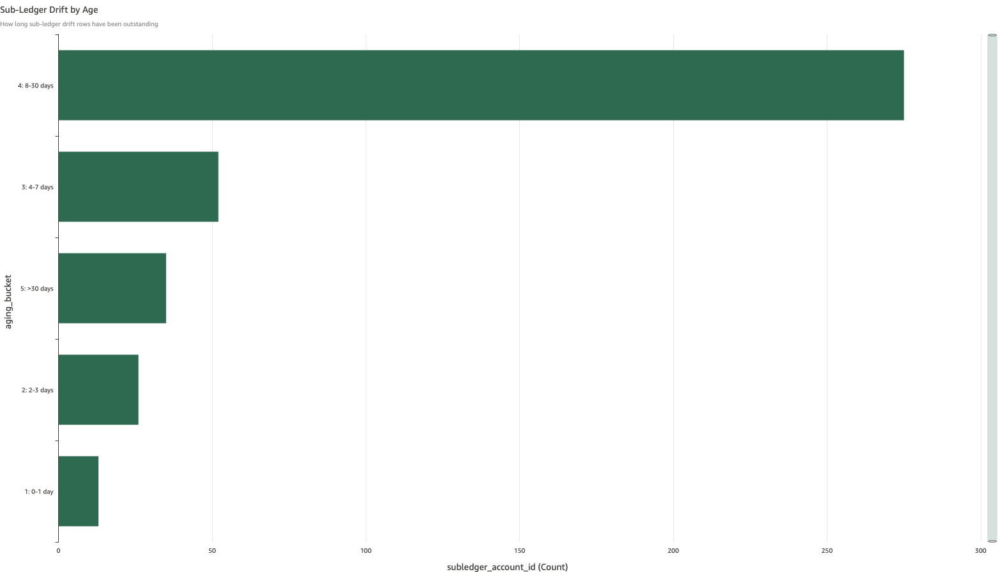

# Sub-Ledger Drift

*Per-check walkthrough — Account Reconciliation Exceptions sheet.*

## The story

Every customer DDA and ZBA operating sub-account at SNB carries a
*stored* end-of-day balance — the number the upstream system asserts
the account ended the day at. The same account also has a posting
history: every transaction that touched it. Sum the postings forward
day by day and you have the *computed* balance.

When the two disagree, somebody's wrong. Either a posting landed
without updating the stored balance, or the stored balance moved
without a posting to back it. Either case is a feed-integrity break
the operator wants to see *before* a customer calls about a balance
that doesn't match their statement.

Drift is sticky. Once stored balance is altered on a single day with
no compensating posting, every subsequent day inherits the same gap
until somebody restates. So one bad posting on Tuesday surfaces as
drift on Tuesday, Wednesday, Thursday — every day forward — which is
why the count is large relative to the number of underlying incidents.

## The question

"Are any sub-ledger accounts carrying a stored balance that doesn't
match what their posting history adds up to?"

## Where to look

Open the AR dashboard, **Exceptions** sheet. Scroll past the rollups
(Balance Drift Timelines, Two-Sided Post Mismatch, Expected-Zero EOD)
to the baseline-checks block. Look for the KPI titled **Sub-Ledger
Drift Days** in the upper KPI row, next to **Ledger Drift Days** and
**Non-Zero Transfers**.

## What you'll see in the demo

The KPI shows **401** sub-ledger drift days.

Screenshot — KPI

The number is large because drift persists day-to-day. Four planted
sub-ledger drift incidents in `_SUBLEDGER_DRIFT_PLANT`, each landing
on a specific day and then rolling forward through every subsequent
day's stored balance, account for the full count. The four incidents:

| sub-ledger                              | started     | delta       |
|-----------------------------------------|-------------|-------------|
| Big Meadow Dairy — DDA                  | Apr 17 2026 | −$75.00     |
| Bigfoot Brews — DDA                     | Apr 14 2026 | +$200.00    |
| Big Meadow Dairy — ZBA Operating (main) | Apr 9 2026  | −$150.50    |
| Cascade Timber Mill — DDA               | Mar 30 2026 | +$450.00    |

The detail table lists every (sub-ledger, date) cell where stored ≠
computed. Columns: `subledger_account_id`, `subledger_name`,
`ledger_name`, `scope`, `balance_date`, `stored_balance`,
`computed_balance`, `drift`, `aging_bucket`. Sorted newest-first by
date.

Screenshot — detail table

The aging bar chart shows the count by bucket. Bucket 4 (8-30 days)
dominates because the older two plants (Mar 30 and Apr 9) have already
rolled through enough days to push their cells out of the recent
buckets.

Screenshot — aging chart

## What it means

Each row is one (sub-ledger, date) cell where the upstream-fed stored
balance disagrees with the running sum of postings to that sub-ledger.
The `drift` column is the dollar gap: positive means stored is higher
than postings explain (a posting is missing, or a stored credit
landed without a backing transaction); negative means stored is lower
than postings explain (a posting is duplicated, or a stored debit
landed without a backing transaction).

The drift amount is the same on every consecutive day after the
incident — same dollars rolling forward. A large bucket-4 count with
just a few distinct dollar amounts means the *number of underlying
incidents* is small; what's growing is days-since-restated. Sort the
table by `subledger_account_id` mentally: cells with the same
`drift` value on consecutive dates trace back to one event.

## Drilling in

Click a `subledger_account_id` value in any row of the detail table.
The drill switches to the **Transactions** sheet, filtered to that
sub-ledger. The recompute is straightforward there: sum the postings
forward from a known-good day; the day the sum stops matching stored
is the day the incident landed.

If a sub-ledger appears with `drift` constant across multiple dates,
look at the date *before* the first drift day — the upstream feed
either reported a balance that doesn't reflect that day's postings,
or a posting landed without updating stored. The Transactions sheet
shows both sides.

## Next step

Sub-ledger drift goes to whichever team owns the upstream feed for
that account class:

- **Customer DDA drift** (Bigfoot Brews, Big Meadow Dairy, etc.) →
  **Core Banking Operations**. Their daily customer-balance feed is
  the source of truth for `stored_balance` on cust-* rows.
- **ZBA operating sub-account drift** (`gl-1850-sub-*` rows) → **ZBA
  Admin / Sweep Automation**. The sweep engine writes both the
  postings and the stored balance for these; if they disagree, the
  engine emitted one without the other.

Hand off the sub-ledger ID, the first drift date, and the constant
drift dollar amount. The owning team restates the stored balance to
match the computed balance for that day forward, or finds and posts
the missing transaction — both paths zero out the drift on the next
day's snapshot.

Old drift (bucket 5: >30 days) usually means the operational fix is
beyond the live feed window and needs an explicit prior-period
adjustment journal entry.

## Related walkthroughs

- [Ledger Drift](ledger-drift.md) — the corresponding check at the
  ledger level: stored ledger balance vs Σ of its sub-ledgers'
  stored balances. Sub-ledger drift here can also surface as ledger
  drift there if the sub-ledger rolls up to a control account.
- [Balance Drift Timelines Rollup](balance-drift-timelines-rollup.md) —
  not directly related (that rollup tracks two-sided invariant drift,
  not sub-ledger feed drift) but lives nearby on the sheet and is
  often confused; the rollup teaches "are SNB↔Fed totals matching?",
  this check teaches "is stored sub-ledger ≡ posted sub-ledger?".
