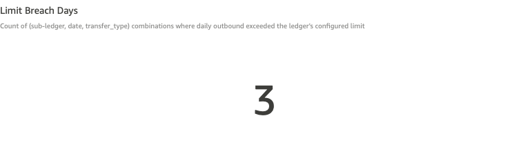
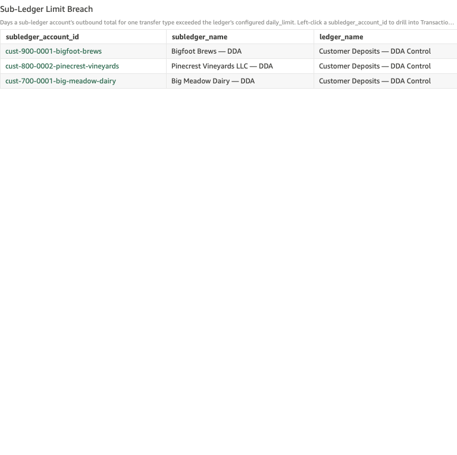
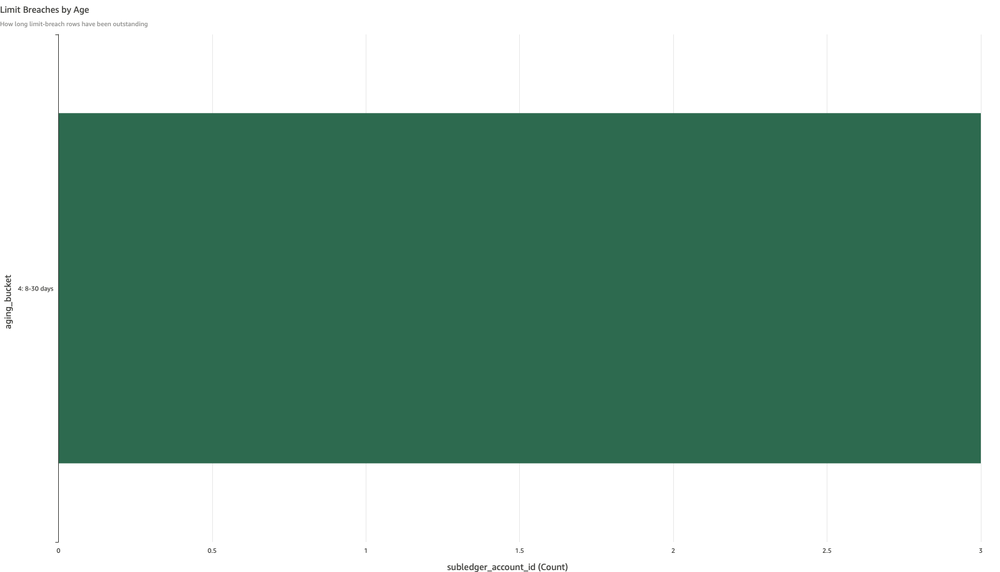

# Sub-Ledger Limit Breach

*Per-check walkthrough — Account Reconciliation Exceptions sheet.*

## The story

SNB's GL control accounts carry per-transfer-type daily outbound
limits that govern how much the sub-ledgers under them are allowed
to push out in a single business day. The limits are policy, not
physics — a sub-ledger account *can* originate a wire bigger than
the limit; the limit-breach check exists to catch when it does so
the policy team hears about it the morning after, not weeks later
in an audit.

Limits today live on the **Customer Deposits — DDA Control** ledger:

- ACH outbound: **$12,000 / day** per sub-ledger
- Wire outbound: **$15,000 / day** per sub-ledger
- Cash outbound: **$10,000 / day** per sub-ledger

A limit breach is one (sub-ledger, day, transfer_type) combination
where the sum of outbound transfers of that type exceeded the
configured limit. Each combination becomes one row.

## The question

"Did any customer DDA push more than its allowed daily total out
yesterday — by ACH, wire, or cash?"

## Where to look

Open the AR dashboard, **Exceptions** sheet. The KPI **Limit Breach
Days** sits in the second KPI row (with **Overdraft Days**), just
below the upper drift / non-zero KPI row.

## What you'll see in the demo

The KPI shows **3** limit-breach days.

Screenshot — KPI

The detail table lists each breach with columns:
`subledger_account_id`, `subledger_name`, `ledger_name`,
`activity_date`, `transfer_type`, `outbound_total`, `daily_limit`,
`overage`, `aging_bucket`. From the demo seed (`_LIMIT_BREACH_PLANT`):

| subledger              | date        | type | outbound | limit  | overage |
|------------------------|-------------|------|---------:|-------:|--------:|
| Bigfoot Brews — DDA    | Apr 11 2026 | wire |  ~22,000 | 15,000 |  ~7,000 |
| Pinecrest Vineyards LLC — DDA | Apr 7 2026 | ach |  ~16,000 | 12,000 |  ~4,000 |
| Big Meadow Dairy — DDA | Apr 1 2026  | cash |  ~13,000 | 10,000 |  ~3,000 |

All three sub-ledgers roll up to **Customer Deposits — DDA Control**.

Screenshot — detail table

The aging bar chart shows all 3 rows in the **8-30 days** bucket —
the planted breach dates are 8, 12, and 18 days back, all squarely
inside that range.

Screenshot — aging chart

## What it means

Each row says: on `activity_date`, sub-ledger `subledger_name`
originated `outbound_total` dollars of `transfer_type` outbound, and
that exceeded the policy limit for that ledger / type combination by
`overage` dollars.

Limit breaches don't necessarily mean fraud or error — large
legitimate transactions happen, and policy is intentionally a soft
ceiling. But every breach is something the policy team needs to know
about so they can decide whether to:

1. Approve the breach retroactively (this customer routinely sends
   bigger wires; consider a higher per-account limit).
2. Investigate the breach (the customer doesn't usually move money
   this size; somebody should ask why).
3. Adjust the policy itself (the limit hasn't been re-reviewed in
   N years; current normal activity routinely brushes against it).

The check doesn't decide which response — it surfaces the breach so
a human can.

## Drilling in

Click a `subledger_account_id` value. The drill switches to the
**Transactions** sheet filtered to that sub-ledger, that date, and
that transfer type — exactly the legs that made up the
`outbound_total` figure. From there you can see the individual
transfers (often one big transfer plus several smaller ones, or one
unusually large single transfer that single-handedly tripped the
limit).

Look at the `account_name` and `memo` columns on the drilled rows —
together with the customer relationship context, that's enough to
classify the breach as routine-large-transfer vs.
needs-investigation.

## Next step

Limit breach rows go to **Compliance / Policy Review** by default.
Hand off:

- The sub-ledger ID + customer name
- The activity date and transfer type
- The `outbound_total`, `daily_limit`, and `overage` figures
- A pointer to the underlying transfers from the drill

Compliance decides whether the breach is approved, investigated, or
prompts a policy adjustment. Recurring breaches by the same customer
on the same transfer type strongly suggest the limit is too low for
that customer's normal activity — that's a per-account limit
adjustment, not a global policy change.

If the customer is new and the breach is the first ACH/wire/cash
outbound they've ever originated, that's a different conversation
(initial KYC review, not policy adjustment).

## Related walkthroughs

- [Sub-Ledger Overdraft](sub-ledger-overdraft.md) — different
  invariant (negative balance, not exceeding policy) but the same
  shape of investigation: pick the sub-ledger, drill into
  Transactions, look at the legs that drove the breach. Lives in
  the same KPI row.
- *Internal Transfer Suspense Non-Zero EOD* (forthcoming) —
  unrelated check but an analogous "this account is doing something
  the system says it shouldn't" pattern; sometimes a stuck transfer
  inflates a sub-ledger's apparent outbound and looks like a limit
  breach when it's actually a settlement issue.
