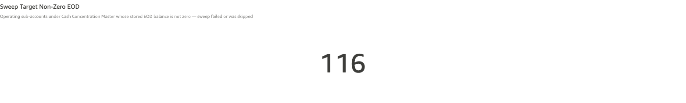
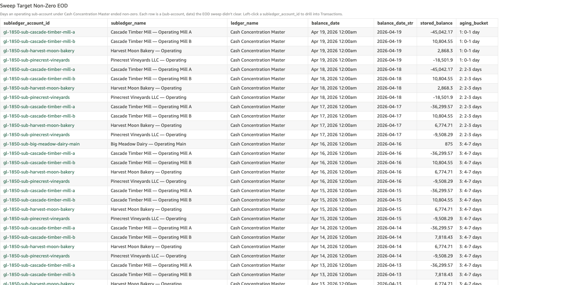
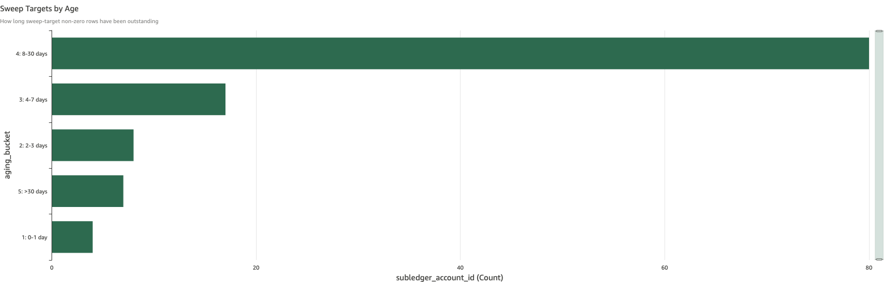

# Sweep Target Non-Zero EOD

*Per-check walkthrough — Account Reconciliation Exceptions sheet.*

## The story

SNB runs a Cash Concentration Master sweep at end of day: every
operating sub-account under **Cash Concentration Master**
(`gl-1850`) is supposed to drain to zero, with the day's accumulated
balance moving up to the master account. The pattern is standard for
Cash Management Suite (CMS) treasury operations — operating
sub-accounts shouldn't carry overnight balances, and the master holds
the bank's concentrated position.

If a sub-account ends the day with a non-zero stored balance, the
sweep either failed to fire, was skipped, or only partially executed.
Like overdraft, this check is sticky: once a sweep skip leaves a
sub-account non-zero, every subsequent EOD it stays non-zero adds
another row to the count — until a corrective sweep finally drains
it.

## The question

"Did any operating sub-account under Cash Concentration Master end
the day with a non-zero balance — and how long has it been sitting
non-zero?"

## Where to look

Open the AR dashboard, **Exceptions** sheet. Scroll past the baseline
checks (drift, non-zero, breach, overdraft) to the CMS-specific
section. The first KPI in that section is **Sweep Target Non-Zero
EOD**.

## What you'll see in the demo

The KPI shows **116** sweep-target non-zero days.

Screenshot — KPI

Two planted sweep-fail incidents in `_ZBA_SWEEP_FAIL_PLANT` are the
seed:

| sub-account                              | sweep skipped | residual            |
|------------------------------------------|---------------|--------------------:|
| Big Meadow Dairy — Operating Main        | Apr 16 2026   | $875.00 (1 day ago) |
| Big Meadow Dairy — Operating North       | Apr 5 2026    | $875.00 (14 days ago) |

Both plants land a guaranteed $875 deposit on the skip day so the
EOD balance reliably ends non-zero. Once a skip lands, that
sub-account stays non-zero every subsequent day — driving the count
up quickly.

The detail table lists every (sub-account, date) cell where the
stored balance is non-zero. Columns: `subledger_account_id`,
`subledger_name`, `ledger_name`, `balance_date`, `balance_date_str`,
`stored_balance`, `aging_bucket`. Sorted newest-first.

Screenshot — detail table

The aging bar chart shows bucket 4 (8-30 days) carrying the dominant
share — the older Apr 5 plant on Big Meadow Dairy — Operating North
has aged through buckets 1, 2, 3 into 4 and is the bulk of the count.
Bucket 3 (4-7 days) and bucket 5 (>30 days) carry smaller counts;
buckets 1 and 2 hold the most recent sweep-target non-zero days from
the Apr 16 plant on Operating Main.

Screenshot — aging chart

## What it means

Each row says: on `balance_date`, sub-account `subledger_name` ended
the day with `stored_balance` dollars (non-zero). The row recurs
every day the sub-account stays non-zero — so a single skipped sweep
14 days back shows up as 14 rows, each carrying the same
`stored_balance`.

A few patterns to watch for:

- **Same `stored_balance` across consecutive days** for one
  sub-account means no posting activity in between — the sweep just
  hasn't fired again to clear it.
- **`stored_balance` drifting up day over day** means the sub-account
  is continuing to receive deposits without sweeping — the daily
  sweep is still broken, not just back-stuck on one missed cycle.
- **`stored_balance` near zero but non-zero** (a few cents to a few
  dollars) usually means the sweep ran but rounded oddly, or a late
  posting landed after the sweep fired.

The two planted sub-accounts both belong to Big Meadow Dairy, which
has two operating accounts (Main + North) under the concentration
master. If both customer's sub-accounts are non-zero on the same
day, the sweep automation likely has a customer-level issue, not a
per-account issue.

## Drilling in

Click a `subledger_account_id` value in any row. The drill switches
to the **Transactions** sheet filtered to that sub-account and date.
On a normal day you'd see the day's deposit credit followed by the
EOD sweep debit netting back to zero. On a sweep-skip day the EOD
sweep debit is missing — the deposit credit sits alone with no
offsetting drain.

Then walk forward day by day in the Transactions sheet to find the
day a corrective sweep actually drains the account back to zero. If
no corrective sweep ever lands, the sub-account stays non-zero
indefinitely.

## Next step

Sweep-target non-zero rows go to **CMS / Cash Concentration
Operations**:

- **Bucket 1-2 (0-3 days)** → automated retry / next-cycle catch.
  Worth confirming the sweep engine has the sub-account in its plan.
- **Bucket 3-4 (4-30 days)** → operator intervention. Either the
  sweep automation has a configuration issue (the sub-account
  dropped out of the sweep plan) or the upstream deposit is landing
  after the sweep window and the sweep is reading a zero balance
  when it fires.
- **Bucket 5 (>30 days)** → escalate. A sub-account sitting
  non-zero for over a month is a structural automation gap, not a
  single missed cycle. Treasury Operations should pull the sweep
  schedule for that account and confirm it's still configured.

Pair the investigation with **Concentration Master Sweep Drift** —
the F.5.2 check next to this one — which measures whether the
Master account credits actually equal the operating sub-account
debits on the days a sweep *did* fire. The two checks together
cover both "sweep didn't fire" and "sweep fired but the legs
disagreed."

## Related walkthroughs

- [Concentration Master Sweep Drift](concentration-master-sweep-drift.md) —
  the same sweep cycle viewed from the master side. Sweep target
  non-zero catches days the sweep was skipped; sweep drift catches
  days the sweep fired but the master and sub-account legs didn't
  agree on the amount.
- [Sub-Ledger Drift](sub-ledger-drift.md) — independent stored-vs-
  computed drift check on each sub-account. A sweep failure
  typically *doesn't* cause sub-ledger drift (the deposit + missing
  sweep both consistently appear in stored and computed) — so a
  sub-account showing on both checks usually has two distinct issues.
