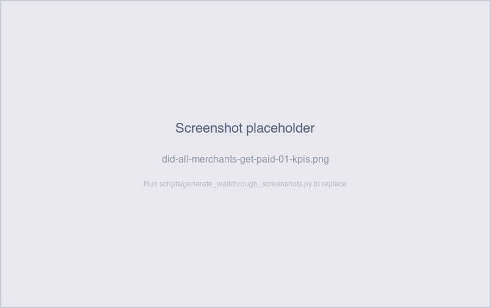
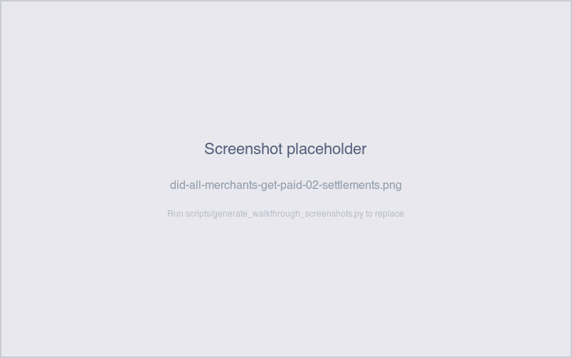

# Did all merchants get paid yesterday?

*Operator-question walkthrough — Payment Reconciliation dashboard.*

## The story

Most mornings, the Merchant Support team's first job is the
opposite of incident triage. It's confirmation: *did the pipeline
finish overnight for everyone who sold yesterday?* No one
specifically called in — the question is "is anything broken
*before* the phone rings?"

The answer falls out of three KPIs and four tabs that already exist
on the Payment Reconciliation dashboard. There's no dedicated
"yesterday's roll-up" sheet — instead the date filter on each tab
narrows the view, and the per-merchant aggregation columns surface
who's behind.

## The question

"For every merchant who sold yesterday, did the pipeline get all
the way to a posted payment — and is anything visibly stuck?"

## Where to look

Open the Payment Reconciliation dashboard. Three sheets answer
this in sequence:

1. **Sales** — confirm every merchant has sales for yesterday's
   date.
2. **Settlements** — for each merchant, count yesterday's
   settlements and confirm none are `failed`. Recent ones may be
   `pending` (expected); older ones should be `completed`.
3. **Payments** — for each completed settlement that's outside the
   payment-emission window, confirm a payment exists.

The **Exceptions** tab also carries the rollup KPIs you'll want to
glance at: *Settlement Exceptions*, *Payment Returns*, and the
mismatch counters. If they're all green, the morning is healthy
even if the per-merchant tabs look busy.

## What you'll see in the demo

The demo carries six merchants on three different settlement
cadences:

| Merchant              | Cadence  | Yesterday expectation                        |
|-----------------------|----------|----------------------------------------------|
| Bigfoot Brews         | daily    | 1 settlement, 1 payment in flight            |
| Sasquatch Sips        | daily    | 1 settlement, 1 payment in flight            |
| Yeti Espresso         | weekly   | maybe — depends on day of week               |
| Skookum Coffee Co.    | weekly   | maybe — depends on day of week               |
| Wildman's Roastery    | weekly   | maybe — depends on day of week               |
| Cryptid Coffee Cart   | monthly  | only on the monthly batch day                |

So "did everyone get paid yesterday" is shorthand for "did
everyone whose batch *was due* yesterday get all the way through."

The KPIs at the top of the **Exceptions** tab summarize the
overnight state:

- **Settlement Exceptions** (unsettled sales): 10 in the demo —
  all from Yeti or Cryptid, deliberately stranded so the visual is
  non-empty.
- **Payment Returns**: 5 in the demo — 2 from Sasquatch Sips, 1
  from Yeti, 2 from Cryptid.
- **Sale ↔ Settlement Mismatch**: 3 in the demo (planted ±$10
  bumps).
- **Settlement ↔ Payment Mismatch**: 3 in the demo (planted ±$5
  bumps).
- **Unmatched External Transactions**: ~13 in the demo (8 recent,
  5 older).

Screenshot — Exceptions KPI strip

Per-merchant view on the **Settlements** tab — group by merchant
and look at the most recent settlement date and status:

Screenshot — Settlements per merchant

In the demo, **stl-0001** and **stl-0002** are deliberately
`failed` — they're the first two settlements in iteration order
and never generate a payment. If you scroll back to those dates,
you'll see the merchant they belong to (whichever is highest in
iteration order — typically Bigfoot Brews) with a failed
settlement and no downstream payment row.

## What it means

Reading top-to-bottom on this dashboard tells you the bank's
overnight processing health:

- **All KPI counters at expected demo levels** → nothing changed
  overnight; the morning is normal. The 10 unsettled / 5 returned
  / 6 mismatch / 13 unmatched-ext are baked into the demo seed
  and don't grow.
- **A counter rising** → something fired overnight. The aging
  bar charts on each per-check section show whether new rows
  landed in bucket 1 (`0-1 day`) — those are last night's
  fires.
- **Per-merchant settlement count zero where it shouldn't be**
  → the batch missed that merchant entirely. Drill into
  *Which sales never made it to settlement?*
- **Per-merchant payment count zero where settlements exist**
  → the settlement was created but the payment didn't post.
  Drill into *Why is there a payment but no settlement?*

The healthy "yesterday" picture: every franchise and every
weekly merchant whose batch day was yesterday shows
1 settlement → 1 payment, with no rollups firing fresh.

## Drilling in

This is a scan-then-narrow flow more than a click-through:

1. **Date filter** on Settlements / Payments — narrow to
   `settlement_date = yesterday` (or `payment_date = yesterday`).
2. **Group by merchant** in the Settlements / Payments tables —
   counts surface who's covered.
3. **Click a row** to drill the usual way: settlement → payment,
   payment → external transaction.

If a per-check KPI is non-zero and you want to see the
underlying rows, click the KPI count itself or scroll down to
that check's detail table on the **Exceptions** tab.

## Next step

The morning yields one of three patterns:

- **Clean** → no follow-up. Note that the demo's planted
  exceptions (10/5/6/13) are still present — that's the demo
  baseline, not new fires.
- **Per-check KPI rose** → open the relevant per-check
  walkthrough below. Anything in bucket 1 is overnight; anything
  in bucket 2+ is older and should already have been triaged.
- **Specific merchant zero where they shouldn't be** → start the
  *Where's my money for [merchant]?* walkthrough on that
  merchant.

Customer-facing: most "did everyone get paid" mornings end with
no merchant outreach at all. The check is purely defensive —
catching a bad overnight batch *before* the merchant calls.

## Related walkthroughs

- [Where's my money for [merchant]?](wheres-my-money-for-merchant.md) —
  the deep-dive view when one merchant's pipeline looks off.
- [Which sales never made it to settlement?](which-sales-never-made-it-to-settlement.md) —
  drill the Settlement Exceptions KPI when it rises overnight.
- [How much did we return last week?](how-much-did-we-return.md) —
  drill the Payment Returns KPI; also useful for the weekly
  return rollup.
- [Why does this settlement look short?](why-does-this-settlement-look-short.md) —
  drill Sale ↔ Settlement Mismatch.
- [Why doesn't this payment match the settlement?](why-doesnt-this-payment-match-the-settlement.md) —
  drill Settlement ↔ Payment Mismatch.
- [Why is this external transaction unmatched?](why-is-this-external-transaction-unmatched.md) —
  drill Unmatched External Transactions.
