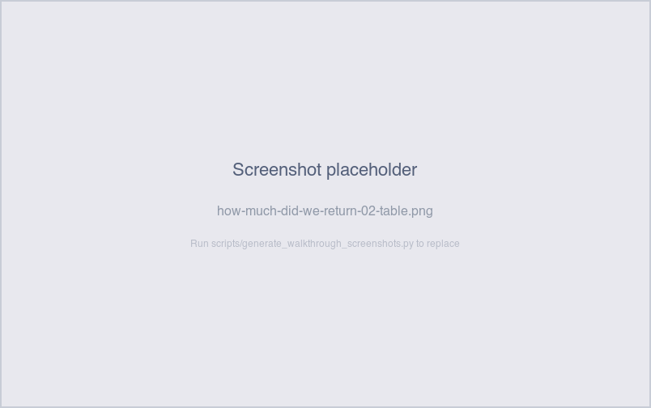

# How much did we return last week?

*Operator-question walkthrough — Payment Reconciliation Exceptions sheet.*

## The story

Some payments get sent and don't make it. The destination bank
rejects the ACH (account closed, insufficient funds, frozen),
the merchant disputes the deposit (fraud claim, amount dispute),
or the underlying account info is invalid. SNB marks those
payments `returned` with a `return_reason`, and the merchant has
to be told *why* the deposit they expected isn't going to land.

The Merchant Support team scans the Payment Returns table on a
weekly cadence to:

- Total the dollar exposure of returns this week.
- See which merchants are showing up repeatedly (a merchant with
  multiple returns in a short window is a likely
  account-validation issue).
- Drive the per-return follow-up call: "your deposit was returned
  because…"

The check is also a leading indicator for a stuck merchant — if
the same merchant returns twice for the same reason, the
underlying account info needs fixing, not just retrying.

## The question

"How many payments were returned recently, for what reasons,
totalling how much, and to which merchants?"

## Where to look

Open the Payment Reconciliation dashboard, **Exceptions** sheet.
The **Payment Returns** section sits in the per-check area, with
its KPI count, detail table, and aging bar chart.

## What you'll see in the demo

The KPI shows **5** returned payments.

Screenshot — KPI

Five planted returns in `_RETURNED_PAYMENTS`, distributed across
three merchants and five distinct reasons:

| merchant            | return_reason          |
|---------------------|------------------------|
| Sasquatch Sips      | `insufficient_funds`   |
| Sasquatch Sips      | `bank_rejected`        |
| Yeti Espresso       | `disputed`             |
| Cryptid Coffee Cart | `account_closed`       |
| Cryptid Coffee Cart | `invalid_account`      |

Note the pattern: Sasquatch Sips and Cryptid each have **two**
returns. Cryptid's pair (`account_closed` + `invalid_account`)
points strongly at a destination-account-info problem on
Cryptid's side; the operator's likely takeaway is *Cryptid needs
to update their banking info before any new payments will land.*

The detail table carries: `payment_id`, `settlement_id`,
`merchant_id`, `merchant_name`, `payment_amount`, `payment_date`,
`return_reason`, `days_outstanding`, `aging_bucket`. Sorted
newest-first.

Screenshot — detail table

The aging bar chart shows the bucket distribution — each return
ages from its `payment_date`, which is `settlement_date + 1–5
days`. So a return on a settlement from 4 weeks ago lands in
bucket 4 (`8-30 days`); one from 3 months ago lands in bucket
5 (`>30 days`). Distribution depends on which settlements got
picked but typically spans buckets 3–5.

Screenshot — aging chart

## What it means

Each row says: this payment was sent for `payment_amount` to
`merchant_name`'s configured bank account, and the destination
bank (or the merchant) rejected it with `return_reason`.

The reasons map to different operational responses:

- **`insufficient_funds`** → returned by the destination bank
  because the account they pulled from didn't have enough. For
  ACH credit (which is what merchant deposits are), this
  usually means a routing or account-type misconfiguration on
  SNB's side — actual NSF is rare on outbound credits.
- **`bank_rejected`** → the destination bank rejected for
  another reason (account type, beneficiary mismatch). Generic
  bucket; usually requires a follow-up call to the destination
  bank.
- **`disputed`** → the merchant claimed the deposit was
  incorrect (wrong amount, unexpected, or fraudulent). Don't
  retry — investigate first.
- **`account_closed`** → the merchant's destination account no
  longer exists. Always requires updated bank info before any
  retry.
- **`invalid_account`** → the destination account number or
  routing number doesn't validate. Always requires the merchant
  to provide corrected info.

Of the five demo reasons, three (`account_closed`,
`invalid_account`, `bank_rejected`) require new bank info from
the merchant. One (`disputed`) requires a call to the merchant
before any further action. One (`insufficient_funds`) is
diagnostic — investigate the routing config.

## Drilling in

Click `payment_id` in any row. The drill switches to the
**Payments** sheet filtered to that one payment, where you can
see `payment_amount`, `payment_status = returned`, and the
`return_reason` (same as the table here).

Click `settlement_id` to drill back to the parent settlement —
useful for confirming which sales are now effectively unpaid
because the payment that should have remitted them was
returned.

To see all returns for one merchant — particularly useful when
a merchant has multiple returns — filter the Payment Returns
table by `merchant_id`. In the demo, filtering to Cryptid
surfaces both their returns side-by-side; the
`account_closed → invalid_account` sequence makes the bad
account info diagnosis obvious.

## Next step

Returned payments go to **Merchant Support**:

- **Bucket 1-2 (0-3 days)** → fresh return, customer hasn't
  called yet. Outbound call: explain the return reason and
  collect corrected bank info if the reason requires it. Beat
  them to it.
- **Bucket 3-4 (4-30 days)** → likely already in the support
  queue. Confirm a ticket exists; if not, open one.
- **Bucket 5 (>30 days)** → escalation. A month-old return
  with no resolution means the payment is still sitting
  un-remitted; the merchant has a real cash-flow problem.
  Escalate to Account Management.

Aggregate questions:

- **Total returned this week** → filter `payment_date >= today
  - 7` and SUM `payment_amount`. The KPI title strip on the
  Exceptions tab includes a *Returned $* metric for exactly
  this.
- **Repeat-offender merchants** → group the table by
  `merchant_id` and count. Two or more returns in a 30-day
  window for the same merchant means their bank info needs
  validation.

## Related walkthroughs

- [Where's my money for [merchant]?](wheres-my-money-for-merchant.md) —
  if the merchant calls before you call them, this walkthrough
  is the structured pipeline trace that surfaces the return.
- [Did all merchants get paid yesterday?](did-all-merchants-get-paid.md) —
  the morning-scan version. The Payment Returns KPI on the
  Exceptions tab is the same row count this walkthrough drills
  into.
