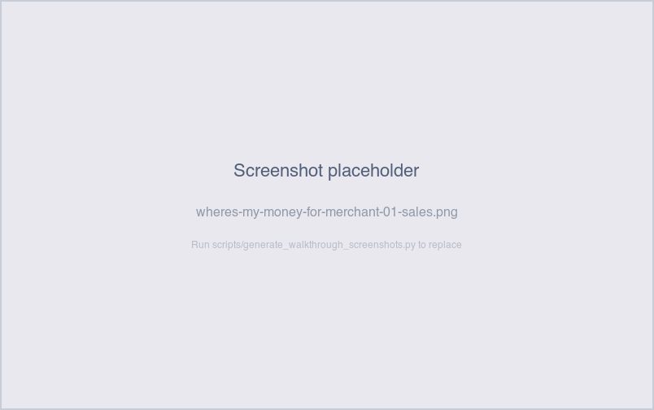
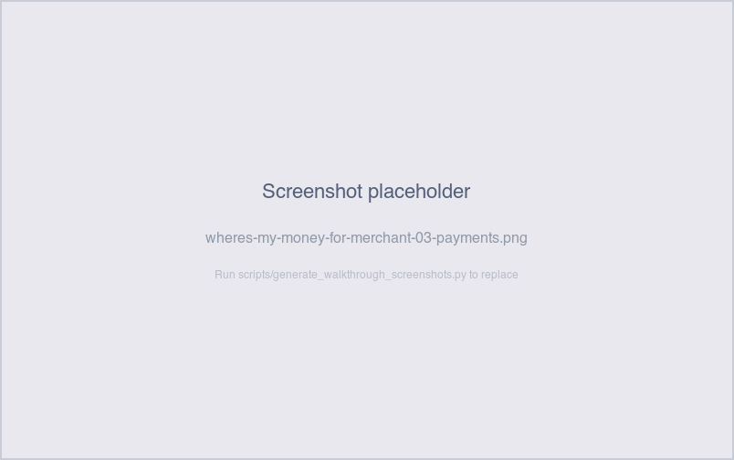

# Where's my money for [merchant]?

*Operator-question walkthrough — Payment Reconciliation dashboard.*

## The story

A merchant calls Support: *"It's been five days since the long
weekend and I haven't seen the deposit hit my account."* The
operator's job is to walk that one merchant's money through the
pipeline — sales → settlements → payments → external transaction —
and report back at which stage it stalled, or whether it's already
on its way and the merchant just hasn't seen it post yet.

Sasquatch National Bank's merchant-acquiring side is built around
this pipeline. The four pipeline tabs (**Sales**, **Settlements**,
**Payments**, **Payment Reconciliation**) are deliberately laid out
in the order the money actually moves, so the operator can scroll
left-to-right through tabs and watch the trail.

## The question

"Where's the money for *this* merchant — and at which stage did the
pipeline stop?"

## Where to look

Open the Payment Reconciliation dashboard. Start on the **Sales**
tab, set the merchant filter to the merchant in question, and walk
forward:

1. **Sales** — what did the merchant sell, and is each sale tagged
   with a settlement?
2. **Settlements** — for each settlement, what's its status
   (`completed`, `pending`, `failed`) and is there a payment
   referencing it?
3. **Payments** — for each payment, what's its status (`completed`,
   `returned`) and is there an external transaction referencing it?
4. **Payment Reconciliation** — does the external transaction match
   the payment exactly?

The merchant filter cascades across tabs, so once you pick the
merchant on Sales, the other three tabs stay scoped to them.

## What you'll see in the demo

The demo carries six merchants — three franchises, two
independents, one cart — each on a different settlement cadence:

| Merchant              | Type        | Settlement cadence |
|-----------------------|-------------|--------------------|
| Bigfoot Brews         | franchise   | daily              |
| Sasquatch Sips        | franchise   | daily              |
| Yeti Espresso         | independent | weekly             |
| Skookum Coffee Co.    | independent | weekly             |
| Wildman's Roastery    | independent | weekly             |
| Cryptid Coffee Cart   | cart        | monthly            |

So "where's my money" has different shapes per merchant. A
Bigfoot sale older than 2–3 days that's still tagged `Unsettled`
is a real exception; a Cryptid sale that's still unsettled at day
14 is just the monthly batch hasn't run yet.

Walk a typical case — pick **Yeti Espresso**:

- **Sales tab** with Yeti filtered: ~30 sales over the trailing 90
  days. A handful at the bottom of the list have
  `settlement_state = Unsettled` and a populated
  `days_outstanding`. These are the planted unsettled sales (10
  total across Yeti + Cryptid).

  

Screenshot — Sales filtered to Yeti

  

  

- **Settlements tab** with Yeti filtered: ~5–6 weekly settlements.
  Most are `completed` with a `payment_id` populated. A recent
  settlement (within 2 days) may be `pending` with no payment yet —
  expected, payment posts 1–5 days after the settlement date.

  

Screenshot — Settlements filtered to Yeti

  

  

- **Payments tab** with Yeti filtered: one payment per non-pending
  settlement. One payment has `payment_status = returned` with
  `return_reason = disputed` — that's the planted Yeti return.

  

Screenshot — Payments filtered to Yeti

  

  

- **Payment Reconciliation tab** with Yeti filtered: each completed
  payment links to a BankSync / PaymentHub / ClearSettle external
  transaction. Most show `match_status = matched`; a few may show
  `not_yet_matched` if the external feed is drifting.

So the answer "where's Yeti's money?" depends on the row: most
payments completed and reconciled fine; some sales never settled
(weekly batch missed them); one payment was returned and the funds
went back.

## What it means

Each tab tells you **which stage owns the stall**:

- **Stuck on Sales** (`Unsettled` past the merchant's expected
  cadence) → the settlement batch missed the sale. Open the
  *Which Sales Never Made It to Settlement* walkthrough.
- **Stuck on Settlements** (`failed` or `pending` past the SLA) →
  the settlement was created but didn't generate a payment. Open
  the *Why is there a payment but no settlement?* walkthrough — or
  the *Why does this settlement look short?* one if the amount is
  off.
- **Stuck on Payments** (`returned`) → the payment posted but the
  bank rejected it. Open *How much did we return?* for the
  reason-code breakdown.
- **Stuck on Payment Reconciliation** (`not_yet_matched` /
  `late`) → SNB sent the money out, but the external system
  hasn't confirmed the matching transaction. Open *Why is this
  external transaction unmatched?*

If everything looks healthy on all four tabs but the merchant
still hasn't seen the deposit, the gap is on their bank's side —
not SNB's.

## Drilling in

The dashboard's natural traversal is left-to-right through the
tabs, but for a one-merchant trace you can also click directly:

- **Sale → Settlement.** On Sales, click `settlement_id` in any
  row — the drill switches to Settlements filtered to that one
  settlement. You can see whether it's `completed`, what payment
  it generated, and how it ties back to the sale.
- **Settlement → Payment.** On Settlements, click `payment_id` —
  drills to Payments filtered to that one payment.
- **Payment → External Transaction.** On Payments, click
  `external_transaction_id` — drills to the Payment Recon tab
  filtered to that one external row.

Going the other direction works too: click `settlement_id` on a
Payments row to drill back to its parent settlement, etc.

## Next step

Once you know which stage owns the stall, route to the right
walkthrough:

- **Bigfoot / Sasquatch with sales >3 days unsettled** → these
  shouldn't exist for daily-batch franchises. Treat as a real
  exception.
- **Yeti / Skookum / Wildman with sales >10 days unsettled** →
  weekly batch missed; check the *Which sales never made it to
  settlement?* walkthrough.
- **Cryptid with sales <30 days unsettled** → expected; monthly
  batch hasn't fired yet. No action.
- **Returned payment** → call the merchant with the
  `return_reason` and ask them to confirm/correct the underlying
  account info.

The merchant-facing message follows the stage: *"Settlement is
scheduled for Friday"* (pending settlement) is very different
from *"The payment was returned because the destination account
was closed"* (returned payment).

## Related walkthroughs

- [Did all merchants get paid yesterday?](did-all-merchants-get-paid.md) —
  the inverse view: instead of one merchant deep-dive, scan all
  six merchants for any whose pipeline looks off this morning.
- [Which sales never made it to settlement?](which-sales-never-made-it-to-settlement.md) —
  the next step when the trail ends at the Sales tab.
- [Why doesn't this payment match the settlement?](why-doesnt-this-payment-match-the-settlement.md) —
  the next step when the trail ends at the Settlements tab with
  a payment whose amount doesn't agree.
- [How much did we return last week?](how-much-did-we-return.md) —
  the next step when the trail ends at the Payments tab with a
  `returned` row.
- [Why is this external transaction unmatched?](why-is-this-external-transaction-unmatched.md) —
  the next step when the trail ends at the Payment Reconciliation
  tab with a non-matched row.
