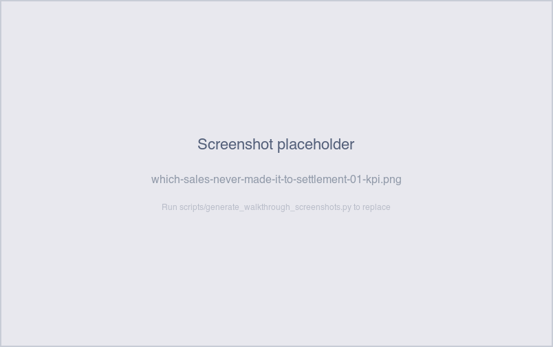

# Which sales never made it to settlement?

*Operator-question walkthrough — Payment Reconciliation Exceptions sheet.*

## The story

Sales come in continuously from the merchant's POS feed.
Settlements are batched on a per-merchant cadence — daily for
franchises, weekly for independents, monthly for the cart. The
batch grabs every "settle-able" sale for the merchant and groups
them into one settlement record.

Most of the time, every sale gets caught by its merchant's next
batch. But every now and again a sale slips through: the batch
ran but didn't include it, or the merchant configuration was off,
or the sale arrived after the batch had closed and there was no
follow-up batch yet. Those are the **Settlement Exceptions** —
sales that exist in the Sales table but have no `settlement_id`.

The longer a sale sits without a settlement, the worse the
exposure: that sale's revenue is sitting in SNB's books but
hasn't been remitted to the merchant.

## The question

"For each merchant, which sales never got picked up by a
settlement batch — and how old are they?"

## Where to look

Open the Payment Reconciliation dashboard, **Exceptions** sheet.
The **Settlement Exceptions** section sits in the per-check area,
with its KPI count, detail table, and aging bar chart.

## What you'll see in the demo

The KPI shows **10** unsettled sales.

Screenshot — KPI

All 10 planted unsettled sales come from the
`_UNSETTLED_MERCHANTS` set: **Yeti Espresso** and **Cryptid
Coffee Cart**. The split between them depends on which sales the
shuffle picked, but typically both merchants are represented.

That choice of merchants is intentional in the demo — Yeti is on
the weekly cadence and Cryptid is on the monthly, so their
unsettled sales naturally age into the higher buckets faster than
a franchise sale would.

The detail table carries: `sale_id`, `merchant_id`,
`merchant_name`, `location_id`, `amount`, `sale_timestamp`,
`days_outstanding`, `aging_bucket`. Sorted newest-first.

Screenshot — detail table

The aging bar chart shows the bucket distribution. In the demo,
sales are spread across the trailing 90 days, so the unsettled
sales typically span all five buckets — a few in 0-1 day (very
recent), a few in 8-30 days, a couple older than 30 days that
have aged into bucket 5.

Screenshot — aging chart

## What it means

Each row says: this sale exists in the Sales table with a real
amount and timestamp, but its `settlement_id` is `NULL` — no
settlement record references it. The sale's revenue is sitting
in SNB's books but hasn't been bundled into a remittance to the
merchant.

Three patterns this typically arises from in production:

- **Batch missed the sale.** The merchant's settlement batch ran
  on a sale's settlement-eligibility date but excluded it — usually
  because of a per-sale flag (e.g., a hold) that's since
  resolved. A re-batch picks the sale up next cycle. Buckets
  1–2 are mostly this.
- **Merchant config issue.** The merchant's settlement schedule
  was paused, or the batch job lost track of them. No batch is
  running, so no future cycle will pick the sale up
  automatically. Bucket 3+ rows for franchise merchants are
  almost always this — franchises run daily and shouldn't have
  4+ day-old unsettled sales.
- **Late-arriving sale.** The POS feed delivered the sale after
  its merchant's batch already closed. The next cycle will pick
  it up. Buckets 1–2 for any merchant are consistent with this
  — buckets 3+ are not (the next cycle should have run by then).

In the demo, all 10 plants are option A (deliberately
stranded — no special pattern, just `_UNSETTLED_COUNT = 10` sales
held back from the settlement assembler).

## Drilling in

Click `sale_id` in any row. The drill switches to the **Sales**
sheet filtered to that one sale, where you can see the full sale
detail (`amount`, `sale_timestamp`, `card_brand`,
`payment_method`, `cashier`, `metadata`) and confirm the
`settlement_state = Unsettled` and `settlement_id = NULL`.

To see *all* unsettled sales for one merchant — useful when
deciding whether the merchant's settlement schedule is broken —
filter the Sales tab by `merchant_id` and toggle the *Show Only
Unsettled* control. In the demo, doing this for Yeti or Cryptid
surfaces their share of the 10.

To investigate the cadence question — *should this merchant have
settled by now?* — cross-reference the merchant's settlement
type:

- Franchise (Bigfoot, Sasquatch) → daily; anything in bucket 2+
  is real.
- Independent (Yeti, Skookum, Wildman) → weekly; bucket 3+ is
  real.
- Cart (Cryptid) → monthly; bucket 4+ is real.

In the demo, all 10 unsettled sales belong to Yeti or Cryptid,
so any of them in bucket 3+ for Yeti or bucket 4+ for Cryptid
would be diagnostic in production.

## Next step

Settlement-exceptions rows go to **Settlement Operations**:

- **Bucket 1-2 (0-3 days)** → wait one batch cycle. Most
  same-day rows clear when the next batch runs.
- **Bucket 3 (4-7 days)** → for franchises, real exception —
  the daily batch missed; investigate why. For independents, may
  still be waiting on the weekly cycle; check the next-batch
  date.
- **Bucket 4 (8-30 days)** → real exception for any merchant
  except the cart. Audit the merchant's settlement schedule
  config; trigger a manual settlement if needed.
- **Bucket 5 (>30 days)** → escalate. The merchant has been
  un-remitted for over a month — they almost certainly have
  noticed and called. Often signals a broken merchant
  configuration that needs Account Management intervention.

Customer-facing: when a merchant calls about an old sale that
"never showed up in a deposit", this is the table to confirm
whether the issue is a missed batch (the row exists here) or
just the merchant's misunderstanding of their settlement
schedule (no row, sale settled normally and merchant didn't
notice it on the deposit).

## Related walkthroughs

- [Where's my money for [merchant]?](wheres-my-money-for-merchant.md) —
  the merchant-first deep-dive. If a merchant calls about a
  missing deposit and the trail ends with `Unsettled` sales,
  this walkthrough is the next step.
- [Did all merchants get paid yesterday?](did-all-merchants-get-paid.md) —
  the morning-scan version. The Settlement Exceptions KPI on
  the Exceptions tab is the same row count this walkthrough
  drills into.
- [Why does this settlement look short?](why-does-this-settlement-look-short.md) —
  the inverse case: the settlement *did* fire, but its amount
  doesn't agree with its sales. Together this check + that one
  cover both directions of "the settlement and the sales don't
  agree."
