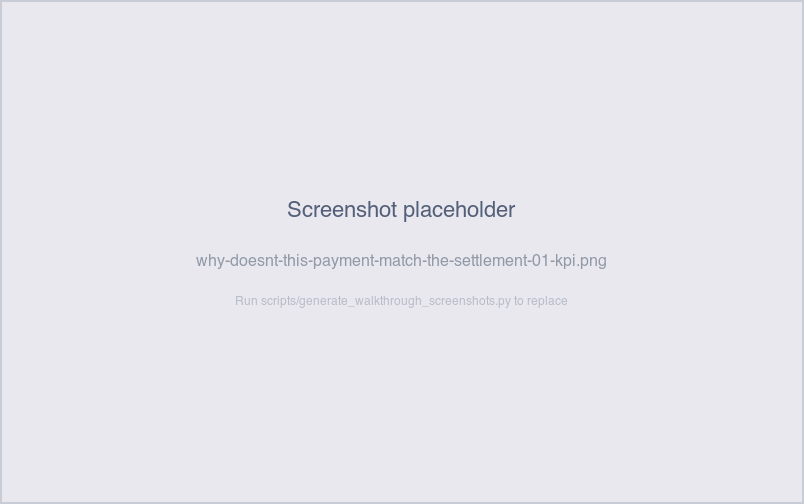
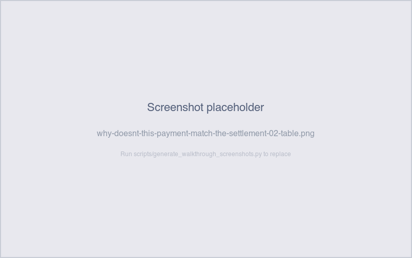

# Why doesn't this payment match the settlement?

*Operator-question walkthrough — Payment Reconciliation Exceptions sheet.*

## The story

Once a settlement is completed, SNB emits exactly one payment to
the merchant for `settlement_amount` dollars. The two records
should agree — `payment_amount` should equal `settlement_amount`
to the cent. When they don't, the **Settlement ↔ Payment
Mismatch** check fires.

This is the *next* link in the same chain that *Why does this
settlement look short?* covers. There the question was whether the
settlement record agrees with its underlying sales; here it's
whether the payment record agrees with its parent settlement.
Either link can break independently — and the $5–$10 size of these
mismatches is small enough that the merchant might or might not
call, but real enough that it materially shifts the deposit.

## The question

"For this payment, does the recorded payment amount equal the
settlement amount it was supposed to remit? If not, where did
the difference come from?"

## Where to look

Open the Payment Reconciliation dashboard, **Exceptions** sheet.
The **Settlement ↔ Payment Mismatch** section sits in the
per-check area, with its KPI count, detail table, and aging bar
chart — directly below the Sale ↔ Settlement Mismatch section.

## What you'll see in the demo

The KPI shows **3** settlement↔payment mismatches.

Screenshot — KPI

Three planted mismatches in `_inject_mismatches` — each one bumps
a payment's `payment_amount` by ±$5 while leaving the parent
settlement unchanged. So the *settlement* side is correct (and
won't appear on the Sale ↔ Settlement Mismatch table); only the
payment-vs-settlement comparison breaks.

The detail table carries: `payment_id`, `settlement_id`,
`merchant_id`, `payment_amount`, `settlement_amount`, `difference`
(= payment − settlement, so ±$5 in the demo), `payment_date`,
`days_outstanding`, `aging_bucket`.

Screenshot — detail table

The plants come from the *next 3* settlements after the
sale-settlement plants, so the merchant distribution is
deterministic but not predictable without re-running the
generator. The **count is always 3** and the **difference is
always exactly ±$5**.

The aging bar chart shows the bucket distribution — typically
1–2 in bucket 4, 1–2 in bucket 5.

Screenshot — aging chart

## What it means

Each row says: this payment was supposed to remit
`settlement_amount` dollars (per its parent settlement record),
but the actual `payment_amount` is different by `difference`
dollars. The payment-emission step either applied a fee/holdback
not reflected in the settlement, or got a typoed amount.

Three patterns this typically arises from in production:

- **Fee / holdback applied at payment time.** SNB's payment
  generator sometimes deducts a per-transaction fee from the
  remittance (e.g., chargeback reserve, processing fee). If the
  fee logic ran but the settlement record wasn't updated to
  reflect the net amount, the two diverge by exactly the fee.
- **Manual edit on the payment.** Operations adjusted the
  payment after it was generated — usually to apply a manual
  reversal or correction — without writing back to the
  settlement.
- **Rounding or currency drift.** Less common, but a
  decimal-precision issue between the settlement record (stored
  with 2 decimals) and the payment record (computed with more
  precision and rounded differently) can produce sub-dollar
  drift.

In the demo, all 3 are option B (manual edit on payment): the
`_inject_mismatches` helper bumps `payment_amount` directly with
no fee logic involved.

## Drilling in

Click `payment_id` in any row. The drill switches to the
**Payments** sheet filtered to that one payment, where you can
see `payment_amount`, `payment_status` (`completed` for these),
and the `external_transaction_id` if matching went through.

To see the parent settlement, click `settlement_id` from the
Payments row, or filter the **Settlements** sheet directly. The
`settlement_amount` shown there is the "correct" amount; the
mismatch row's `difference` column is the gap.

The matching downstream — does the external transaction reflect
the bumped payment amount, or the original settlement amount? —
is best answered on the **Payment Reconciliation** sheet by
clicking the payment row and watching the external transactions
table. In the demo, the external transactions are generated from
SUM(payment_amount), so they reflect the bumped value — meaning
the external system "agrees" with the wrong number.

## Next step

Settlement-payment mismatch rows go to **Payment Operations**:

- **Bucket 1-2 (0-3 days)** → check whether a fee or holdback
  was applied at payment time. If yes, the row is benign and
  the settlement record should be updated to net the fee. If
  no, investigate the payment generation step.
- **Bucket 3-4 (4-30 days)** → walk the payment's audit log for
  a manual edit. If a manual edit is logged, confirm whether
  the edit was correct (e.g., adjustment for a chargeback) or a
  data error to reverse.
- **Bucket 5 (>30 days)** → escalate. The merchant has either
  already noticed and called, or accepted the variance silently
  (and may flag it later). Either way, the settlement vs
  payment records will not agree without intervention.

Customer-facing: a $5–$10 variance per payment is small enough
that some merchants don't notice, but operationally important
because it accumulates. If the merchant *has* noticed, they'll
ask "you owe me $5" — confirming the mismatch row exists in the
table is the whole answer.

## Related walkthroughs

- [Why does this settlement look short?](why-does-this-settlement-look-short.md) —
  the **prior stage** of the same chain. There: the settlement
  doesn't agree with its sales. Here: the payment doesn't agree
  with its settlement. Together they cover both ways the
  pipeline's dollar-amount invariant can break.
- [Where's my money for [merchant]?](wheres-my-money-for-merchant.md) —
  the merchant-first deep-dive. If a merchant calls about a
  short payment, this walkthrough is the structured trace.
- [Why is this external transaction unmatched?](why-is-this-external-transaction-unmatched.md) —
  the next stage if the bumped payment doesn't reconcile against
  the external system. Most demo bumps still match externally
  because the external_amount is generated from the bumped
  payment SUM.
