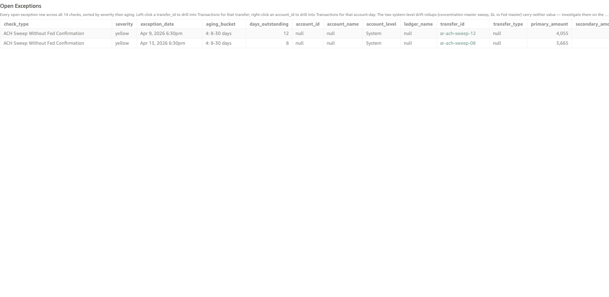

# ACH Sweep Without Fed Confirmation

*Per-check walkthrough — Account Reconciliation Today's Exceptions sheet.*

## The story

Each successful EOD sweep on **ACH Origination Settlement**
(`gl-1810`) is supposed to be followed by a Fed-side confirmation
child transfer attesting that the **FRB Master Account**
(`ext-frb-snb-master`) actually moved by the same amount. The
internal sweep is the bank's own posting; the Fed confirmation is
the Fed's. Both must land for the cash position to actually be
where SNB's books say it is.

This check surfaces sweeps where the **internal leg posted but the
Fed confirmation never landed**. The bank's ledger says the cash
moved out of `gl-1810` to `gl-1010` (Cash & Due From FRB); the Fed
has no corresponding posting on the master account. From SNB's
internal view, everything looks fine — only by reaching across to
the Fed-side feed does the gap show up.

This is a one-sided silent failure. Internal balances reconcile.
Customers see what they expect to see. The discrepancy only matters
when SNB asks FRB for its current master-account balance and the
answer is short by exactly the unconfirmed sweep amount.

## The question

"For every internal EOD sweep that posted on gl-1810, did the
Fed-side confirmation actually land?"

## Where to look

Open the AR dashboard, **Today's Exceptions** sheet. In the Controls
strip at the top of the sheet, set **Check Type** to
`ACH Sweep Without Fed Confirmation`. The **Total Exceptions** KPI
recounts to just this check's rows, the **Exceptions by Check**
breakdown bar collapses to a single yellow bar, and the **Open
Exceptions** table below shows every row for this check — one row
per internal sweep transfer with no Fed confirmation.

Screenshot — Open Exceptions filtered to this check

## What you'll see in the demo

Two rows, one per planted unconfirmed sweep. Key columns to read:

| column            | value for this check                                                  |
|-------------------|-----------------------------------------------------------------------|
| `account_id`      | blank — this check is a per-transfer system check, not per-account    |
| `account_level`   | `System`                                                              |
| `transfer_id`     | the internal sweep transfer that didn't get confirmed (e.g. `ar-ach-sweep-08`) |
| `primary_amount`  | `sweep_amount` — the dollars the internal sweep posted for            |
| `secondary_amount`| blank                                                                 |

Two planted incidents in `_ACH_FED_CONFIRMATION_MISSING` (days_ago
= 8 and 12) are the seed — both land in bucket 4 (8-30 days):

| transfer_id       | sweep_at            | sweep_amount | aging        |
|-------------------|---------------------|-------------:|--------------|
| `ar-ach-sweep-08` | Apr 11 2026 6:30pm  |        3,665 | 4: 8-30 days |
| `ar-ach-sweep-12` | Apr 7 2026 6:30pm   |        4,055 | 4: 8-30 days |

Unlike drift checks, this check doesn't roll forward day-over-day:
one missing confirmation contributes one row forever (until the
confirmation lands or the gap is reconciled manually).

## What it means

Each row says: on `exception_date`, the internal EOD sweep transfer
`transfer_id` posted for `primary_amount` dollars on gl-1810, but
no Fed-side confirmation child transfer ever landed. The bank's
internal view shows the cash moved; the Fed's view doesn't.

The two patterns this typically arises from:

- **Fed feed lag.** The Fed confirmation will eventually arrive —
  the feed is just delayed by a few hours. Bucket 1 (0-1 day) rows
  are consistent with normal feed lag.
- **Fed feed gap.** The Fed confirmation never arrived — the
  outbound message to FRB was lost, the response was lost, or the
  Fed's response wasn't captured by the inbound feed. Bucket 3+
  (4+ days) rows are essentially never feed lag; they're real
  gaps that need investigation.

Both planted rows are in bucket 4, so the demo is showing two
genuine confirmation gaps — the ACH Operations team would need to
contact the Fed and ask whether those specific sweeps were
actually received.

## Drilling in

The `transfer_id` cell renders as accent-colored text — that tint
is the dashboard's cue that the cell is clickable. **Left-click**
any `transfer_id` value. The drill switches to the **Transactions**
sheet filtered to that one transfer, showing the internal EOD sweep
legs that posted (debit gl-1010, credit gl-1810). The missing Fed
confirmation would be a separate child transfer
(parent = the sweep transfer ID), but it never landed — so the
drill shows only the internal posting, not the non-existent
confirmation.

To confirm this is a Fed gap and not an internal posting issue,
walk back to the Transactions sheet manually and search for
transfers with `parent_transfer_id = <sweep_transfer_id>` — for
healthy sweeps you'd find one with `origin = external_force_posted`
representing the Fed confirmation; for gap rows the result is
empty.

## Next step

Sweep-without-confirmation rows go to **ACH Operations**:

- **Bucket 1 (0-1 day)** → wait for the next feed cycle. Most
  same-day rows clear on their own as the Fed feed catches up.
- **Bucket 2-3 (2-7 days)** → contact FRB. Either the
  confirmation message was lost in transit or the inbound feed
  failed to capture it. The Fed can resend if the underlying
  posting on their side actually happened; if it didn't, the
  bank needs to determine whether the internal sweep should be
  reversed.
- **Bucket 4+ (8+ days)** → escalate. A week-old missing
  confirmation usually means the bank's internal view of the
  FRB master account balance has drifted from the Fed's reality
  by a non-trivial amount. The dollar exposure equals the
  cumulative `primary_amount` of all unconfirmed sweeps.

Pair this with **GL vs Fed Master Drift** — that check shows the
cumulative drift between SNB's internal view of the FRB master
account and the Fed's view, in chart form. Each row here
contributes one drift day to that chart.

## Related walkthroughs

- [ACH Origination Settlement Non-Zero EOD](ach-origination-non-zero.md) —
  the prior stage of the same ACH cycle. That check catches days
  the internal sweep didn't post; this check catches days the
  internal sweep posted but the Fed didn't confirm. They share
  the same originating cycle but surface different failure
  modes.
- [Fed Activity Without Internal Catch-Up](fed-card-no-internal-catchup.md) —
  the **opposite** direction of the same class of mismatch: Fed
  posted, SNB never matched it. Together this check + that one
  cover both directions of a "two-sided post mismatch" pattern.
- [Two-Sided Post Mismatch Rollup](two-sided-post-mismatch-rollup.md) —
  the Trends-sheet rollup that unions this check with *Fed Activity
  Without Internal Catch-Up*. Each row here contributes one
  "side_present = SNB internal sweep" row there.
- [GL vs Fed Master Drift](gl-vs-fed-master-drift.md) — the
  cumulative-drift roll-up of the same SNB-vs-Fed reconciliation
  surface.
