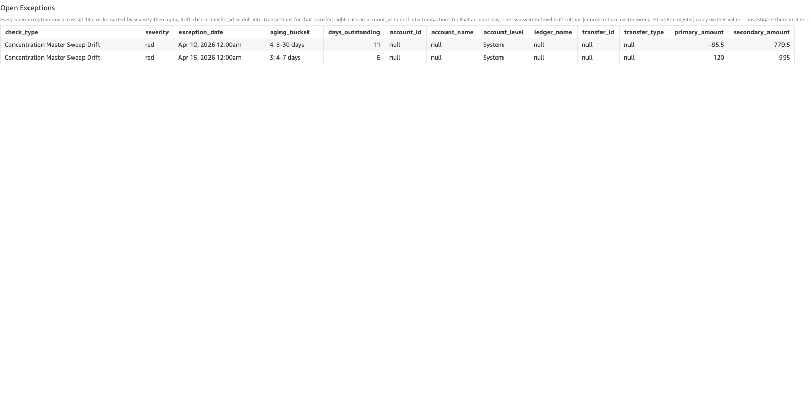

# Concentration Master Sweep Drift

*Per-check walkthrough — Account Reconciliation Today's Exceptions sheet.*

## The story

The Cash Concentration Master sweep is a two-sided posting: every
clearing_sweep transfer credits the master account
(`gl-1850-cash-concentration-master`) and debits the operating
sub-account that's draining. Across a single business day, the sum
of master credits should exactly equal the negative of the sum of
sub-account debits. If they disagree, the sweep automation either
double-posted one side, missed one side, or applied a different
amount on each side.

This is a structural integrity check at the sweep-cycle level — a
companion to the per-account *Sweep Target Non-Zero EOD* check.
Sweep target non-zero catches "the sweep was skipped" (no transfer
at all that day). Sweep drift catches "the sweep fired but its
legs don't reconcile" (the transfer posted but the totals disagree).

## The question

"On the days a Cash Concentration Master sweep posted, did the
master credits and operating sub-account debits actually balance?"

## Where to look

Open the AR dashboard, **Today's Exceptions** sheet. In the Controls
strip at the top of the sheet, set **Check Type** to
`Concentration Master Sweep Drift`. The **Total Exceptions** KPI
recounts to just this check's rows, the **Exceptions by Check**
breakdown bar collapses to a single red bar, and the **Open
Exceptions** table below shows every row for this check — one row
per sweep date where master credits ≠ sub-account debits.

Screenshot — Open Exceptions filtered to this check

## What you'll see in the demo

A handful of rows — one per sweep date where the master and
sub-account legs disagreed. Key columns to read:

| column            | value for this check                                                |
|-------------------|---------------------------------------------------------------------|
| `account_id`      | blank — sweep drift is a system-level cycle aggregate, not per-account |
| `account_level`   | `System`                                                            |
| `transfer_id`     | blank — drift is the residual of *all* sweep transfers on a date    |
| `primary_amount`  | `drift` — `master_total + subaccount_total`; sign tells direction    |
| `secondary_amount`| `master_total` — the sum of master-side credits on that date         |

Two planted leg-mismatch incidents in `_ZBA_SWEEP_LEG_MISMATCH_PLANT`
are the visible drift dates:

| sub-account                          | sweep date  | drift                          |
|--------------------------------------|-------------|--------------------------------|
| Big Meadow Dairy — Operating Main    | Apr 13 2026 | **+$120.00** (master long)     |
| Big Meadow Dairy — Operating North   | Apr 8 2026  | **−$95.50** (master short)     |

Mixed signs are intentional so the picture shows both directions —
drift in either direction is a problem.

## What it means

Each row is a sweep date with `drift = master_total + subaccount_total`.
(Master credits are positive, sub-account debits are negative; a
balanced day sums to zero — and balanced days don't appear here.)

The two error patterns:

- **Master long** (`drift > 0`) means the master account got
  credited more than the sub-accounts got debited. The bank's
  concentrated position over-states by exactly that amount.
- **Master short** (`drift < 0`) means the master account got
  credited less than the sub-accounts got debited. The bank's
  concentrated position under-states; the cash effectively
  "disappeared" between the operating sub-account and the master.

Both planted incidents are on Big Meadow Dairy's two operating
sub-accounts — same customer, both directions. In a real CMS
incident, drift in both directions on the same customer often
points at a misconfigured sweep ratio or a rounding bug where one
side computes net-of-fees and the other doesn't.

## Drilling in

This check is a system-level aggregate — `account_id` and
`transfer_id` are both blank, so neither the right-click
account-day drill nor the left-click transfer drill applies on
these rows directly. To investigate a specific drift date:

1. Note the `exception_date` for the row.
2. Set **Check Type** to `Non-Zero Transfer`. The same incidents
   surface there at the per-transfer level — the planted Apr 13
   and Apr 8 sweep dates show up as `ar-zba-sweep-0004` and
   `ar-zba-sweep-0017` (small non-zero amounts on rows with
   `transfer_type = clearing_sweep`).
3. Left-click the `transfer_id` of the offending sweep transfer to
   land on the **Transactions** sheet filtered to that one
   transfer's legs. The leg with the wrong amount is the source
   of the drift.

For a broader view of how this check trends over time, switch to
the **Exceptions Trends** sheet and read the *Concentration Master
Sweep Drift Timeline* under the Balance Drift Timelines rollup.

## Next step

Sweep drift days go to **CMS / Cash Concentration Operations**,
same team as Sweep Target Non-Zero. Hand off:

- The drift date and direction (master long or short)
- The amount of drift
- The sub-account whose sweep was involved (visible after drilling
  through Non-Zero Transfer to the underlying transfer)
- A pointer to the sweep transfer ID

Sweep drift is a structural integrity issue — a single mis-amounted
sweep is rare; recurring drift on the same sub-account or same date
means the sweep computation has a bug. The first call should be to
the team that owns the sweep automation, not Treasury Operations.

## Related walkthroughs

- [Sweep Target Non-Zero EOD](sweep-target-non-zero.md) — companion
  check on the same sweep cycle. Sweep target catches "sweep was
  skipped"; sweep drift catches "sweep fired but legs disagreed."
  An incident might surface on both checks (skip on day N + drift
  on day N+1 catch-up sweep).
- [Non-Zero Transfers](non-zero-transfers.md) — the
  transfer-level view of the same incidents. Drift days here
  correspond to specific `transfer_id`s with non-zero net there;
  drilling individual drift days starts there.
- [Balance Drift Timelines Rollup](balance-drift-timelines-rollup.md) —
  the Trends-sheet rollup that includes the Concentration Master
  Sweep Drift Timeline alongside Ledger / Sub-Ledger / GL-vs-Fed
  drift timelines.
