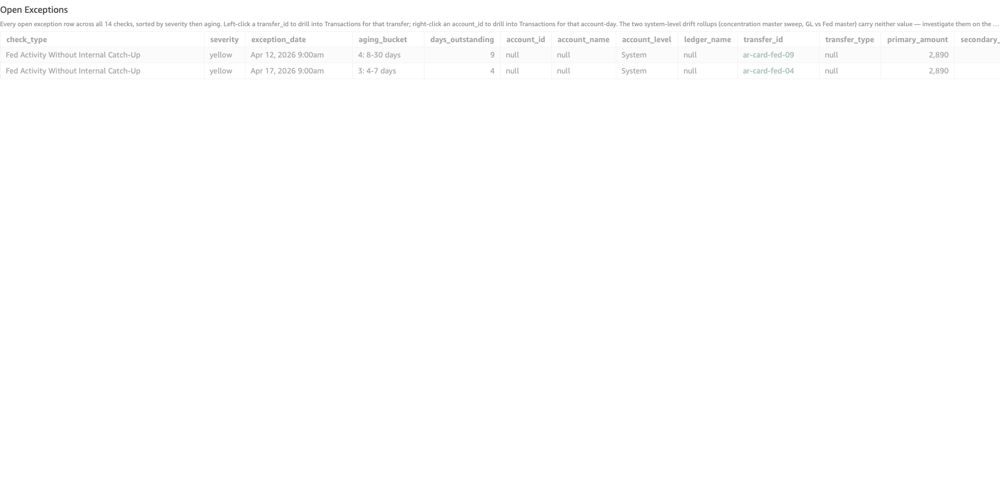

# Fed Activity Without Internal Catch-Up

*Per-check walkthrough — Account Reconciliation Today's Exceptions sheet.*

## The story

External card-acquiring settlements work the opposite way from ACH
originations. The Fed posts first: the **Payment Gateway Processor**
clears a day's card sales into a merchant's DDA via the **FRB Master
Account**, and SNB observes the Fed posting (origin =
`external_force_posted`). Then SNB's internal books are supposed to
follow with a force-posted internal entry — debiting **Card
Acquiring Settlement** (`gl-1815`) and crediting the merchant's
DDA — to reflect the same money movement on the bank's own ledger.

If the Fed posts but the SNB internal catch-up never lands, the bank
has a Fed-observed settlement on its records but no corresponding
internal entry. The bank's view of card acquiring is short by
exactly the missing settlement amount. This is the mirror image of
*ACH Sweep Without Fed Confirmation*: same two-sided mismatch shape,
opposite direction.

This is also a silent failure from the customer's perspective — the
funds may eventually land in the merchant DDA via a different
settlement path or via manual force-post — but it leaves an
unreconciled gap on the GL side that audit will flag.

## The question

"For every Fed-observed card settlement, did SNB's internal
catch-up entry actually post?"

## Where to look

Open the AR dashboard, **Today's Exceptions** sheet. In the Controls
strip at the top of the sheet, set **Check Type** to
`Fed Activity Without Internal Catch-Up`. The **Total Exceptions**
KPI recounts to just this check's rows, the **Exceptions by Check**
breakdown bar collapses to a single yellow bar, and the **Open
Exceptions** table below shows every row for this check — one row
per Fed-observed settlement transfer with no SNB internal catch-up.

Screenshot — Open Exceptions filtered to this check

## What you'll see in the demo

Two rows, one per planted unmatched Fed settlement. Key columns to
read:

| column            | value for this check                                                  |
|-------------------|-----------------------------------------------------------------------|
| `account_id`      | blank — this check is a per-transfer system check, not per-account    |
| `account_level`   | `System`                                                              |
| `transfer_id`     | the Fed-side observation transfer (e.g. `ar-card-fed-04`)             |
| `primary_amount`  | `fed_amount` — the dollars the Fed posted for                         |
| `secondary_amount`| blank                                                                 |

Two planted incidents in `_CARD_INTERNAL_MISSING_PLANT` (days_ago
= 4 and 9) are the seed:

| transfer_id      | fed_at              | fed_amount | aging        |
|------------------|---------------------|-----------:|--------------|
| `ar-card-fed-04` | Apr 15 2026 9:00am  |      2,890 | 3: 4-7 days  |
| `ar-card-fed-09` | Apr 10 2026 9:00am  |      2,890 | 4: 8-30 days |

Both planted Fed observations are for the same $2,890 amount —
that's a coincidence of the demo amount pool, not a real-world
pattern. Like the ACH sweep check, this one doesn't roll forward
day-over-day: one missing catch-up = one row.

## What it means

Each row says: on `exception_date`, the Fed-side card settlement
transfer `transfer_id` posted for `primary_amount` dollars on the
FRB master account, but no SNB internal catch-up child transfer
ever landed. The Fed says the cash cleared; the bank's own books
don't record it.

A few patterns that produce this:

- **Catch-up automation skipped.** The internal force-post
  automation that's supposed to mirror Fed-observed settlements
  didn't run for that day or that merchant.
- **Manual force-post needed.** Some Fed settlement types require
  a manual entry (e.g., one-off settlement classes outside the
  automation's plan). The Fed posted; nobody's flagged the
  internal entry to be made yet.
- **Categorization mismatch.** The Fed observation came in with a
  metadata key the catch-up automation doesn't recognize, so it
  fell through without posting an internal entry. Hardest to
  catch — the Fed observation looks normal in isolation.

The two planted incidents in the demo are just "automation
skipped" — both `ar-card-fed-04` and `ar-card-fed-09` are routine
$2,890 card settlements where the catch-up internal entry
deliberately wasn't generated.

## Drilling in

The `transfer_id` cell renders as accent-colored text — that tint
is the dashboard's cue that the cell is clickable. **Left-click**
any `transfer_id` value. The drill switches to the **Transactions**
sheet filtered to that one transfer, showing the Fed-side
observation legs — typically a debit on
`ext-payment-gateway-sub-clearing` and a credit on the FRB
inbound rail. The internal catch-up child transfer (parent =
this transfer ID) never landed, so it doesn't appear in the
drill output.

To confirm there really is no catch-up child, walk back to the
**Transactions** sheet manually and filter
`parent_transfer_id = <fed_transfer_id>`. For healthy
settlements you'd find an internal entry with
`origin = external_force_posted` debiting gl-1815 and crediting
the merchant DDA; for gap rows the filter returns nothing.

## Next step

Fed-without-internal rows go to **Card Acquiring Operations**:

- **Bucket 1-2 (0-3 days)** → confirm whether the catch-up
  automation simply hasn't run yet (some settlement classes are
  intra-day, not real-time) or whether it's actually skipped.
- **Bucket 3-4 (4-30 days)** → manually post the internal
  catch-up entry. The amount is `primary_amount`; the merchant DDA
  is identifiable from the Fed observation's metadata.
- **Bucket 5 (>30 days)** → escalate. A month-old gap usually
  means the Fed and SNB views of card acquiring revenue have
  drifted by a non-trivial amount, which audit will surface
  before this check does.

Customer-facing: a Fed settlement that posts on their side but
never gets the internal catch-up *may* still credit the merchant
DDA via the Fed-side leg directly, depending on how the
settlement rail is wired. Confirm before contacting the merchant —
they may not have noticed anything wrong.

Pair with **GL vs Fed Master Drift** which shows the cumulative
drift this check contributes to — each row here is a drift day
there.

## Related walkthroughs

- [ACH Sweep Without Fed Confirmation](ach-sweep-no-fed-confirmation.md) —
  the **opposite** direction of the same two-sided mismatch
  pattern. There: SNB posted internally, Fed never confirmed.
  Here: Fed posted, SNB never caught up. The two checks together
  cover both directions of the SNB-vs-Fed reconciliation gap.
- [Two-Sided Post Mismatch Rollup](two-sided-post-mismatch-rollup.md) —
  the Trends-sheet rollup that unions this check with *ACH Sweep
  Without Fed Confirmation*. Each row here contributes one
  "side_present = Fed card observation" row there.
- [GL vs Fed Master Drift](gl-vs-fed-master-drift.md) — the
  cumulative drift between the SNB internal view and the Fed
  view of the FRB master account. Days here contribute to the
  drift timeline there.
