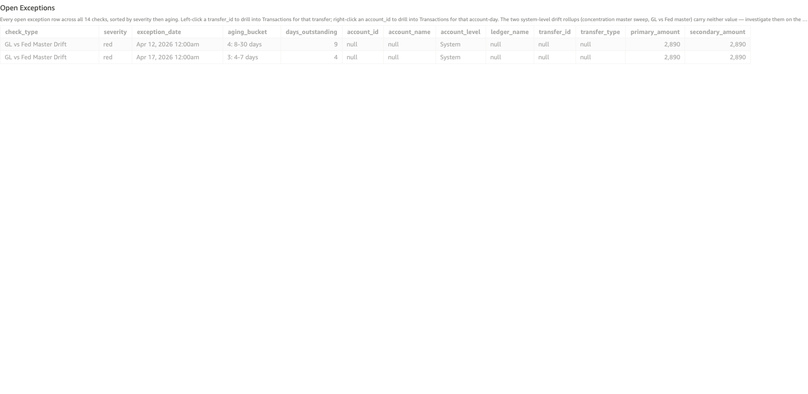

# GL vs Fed Master Drift

*Per-check walkthrough — Account Reconciliation Today's Exceptions sheet.*

## The story

Every Fed-observed card settlement posting on the FRB master
account should have a matching SNB internal catch-up entry on
**Card Acquiring Settlement** (`gl-1815`). On any given day, the
sum of Fed-side card settlement amounts should exactly equal the
sum of SNB internal catch-up amounts. If they don't, the bank's
GL view of card acquiring has drifted from what the Fed actually
saw — either Fed posted activity SNB never recorded
(positive drift) or SNB posted catch-ups for activity the Fed
didn't see (negative drift, much rarer).

This check is a daily-aggregate companion to
*Fed Activity Without Internal Catch-Up*. That check operates at the
per-transfer level: which specific Fed settlement is missing its
internal entry. This check operates at the per-day level: how
much total drift is the bank carrying.

## The question

"Across the days the Fed observed card settlement activity, did
the bank's internal posts net to the same total — and if not,
how persistent and how large is the drift?"

## Where to look

Open the AR dashboard, **Today's Exceptions** sheet. In the Controls
strip at the top of the sheet, set **Check Type** to
`GL vs Fed Master Drift`. The **Total Exceptions** KPI recounts to
just this check's rows, the **Exceptions by Check** breakdown bar
collapses to a single red bar, and the **Open Exceptions** table
below shows every row for this check — one row per
card-settlement date where Fed total ≠ SNB internal total.

Screenshot — Open Exceptions filtered to this check

## What you'll see in the demo

A handful of rows — one per card-settlement date where Fed and SNB
internal totals don't match. Key columns to read:

| column            | value for this check                                                |
|-------------------|---------------------------------------------------------------------|
| `account_id`      | blank — this is a system-level daily aggregate, not per-account     |
| `account_level`   | `System`                                                            |
| `transfer_id`     | blank — drift is the residual of *all* card postings on a date      |
| `primary_amount`  | `drift` — `Σ Fed amounts − Σ SNB internal amounts`; sign tells direction |
| `secondary_amount`| `fed_total` — the sum of Fed-side card settlement amounts on the date |

The visible drift dates correspond to the two planted incidents
from `_CARD_INTERNAL_MISSING_PLANT` (days_ago = 4 and 9 → Apr 15
and Apr 10):

| date        | drift  | source incident                                          |
|-------------|-------:|----------------------------------------------------------|
| Apr 15 2026 | ~2,890 | Fed posted `ar-card-fed-04` $2,890; no SNB internal post |
| Apr 10 2026 | ~2,890 | Fed posted `ar-card-fed-09` $2,890; no SNB internal post |

Both rows are positive (Fed minus SNB > 0) because the Fed posted
and SNB didn't catch up — the bank's GL view *understates* what
the Fed saw by exactly the missing settlement amount.

## What it means

Each row is one card-settlement date with `drift =
Σ Fed-side amounts − Σ SNB internal catch-up amounts`. A balanced
day has drift = 0 and doesn't appear here.

The two visible drift dates are the planted Fed-without-internal
incidents — they show up here because the Fed total for those days
was non-zero but the SNB internal total was zero. The positive
direction (Fed > SNB) is the typical CMS failure mode: Fed feed
lands and the bank fails to mirror it. Negative drift (SNB > Fed)
would mean the bank booked an internal catch-up for something the
Fed didn't post — much rarer, usually a bug in the catch-up
automation overshooting.

The persistence pattern matters more than any single row:

- **One-off positive drift dates** are individual missed catch-ups —
  fix in *Fed Activity Without Internal Catch-Up*.
- **A flat positive row pattern that never reverts to zero** would
  mean the catch-up automation has a systematic shortfall — it's
  consistently posting less than the Fed sees. None visible in
  the demo.
- **Sign flips around zero day-to-day** would mean the catch-up
  automation has a timing offset — posting on the wrong day.
  Also not visible in the demo.

## Drilling in

This check is a system-level daily aggregate — `account_id` and
`transfer_id` are both blank, so neither right-click nor left-click
drill applies on these rows directly. To investigate a specific
drift date:

1. Note the `exception_date` for the row.
2. Set **Check Type** to `Fed Activity Without Internal Catch-Up`.
   The same incidents surface there at the per-transfer level —
   each row's `fed_at` matches a drift date here.
3. Left-click the `transfer_id` of the offending Fed settlement to
   land on the **Transactions** sheet for the per-transfer view.

For a broader view of how this check trends over time, switch to
the **Exceptions Trends** sheet and read the *GL vs Fed Master
Drift Timeline* under the Balance Drift Timelines rollup.

## Next step

GL vs Fed drift days are a roll-up — per-day fixes happen in the
upstream check (*Fed Activity Without Internal Catch-Up*). What
this check tells the **Treasury Operations** team is the cumulative
exposure: total dollars the GL view is short by, in aggregate
across all unmatched Fed settlements.

For the demo: total drift exposure is **~$5,780** (two days at
$2,890 each). In a real CMS, the team would:

1. Add up the visible drift to size the gap.
2. Compare to the bank's tolerance for unreconciled GL exposure
   on the FRB master account (varies by institution; typically a
   small percentage of daily settlement volume).
3. If above tolerance, escalate the underlying *Fed Activity
   Without Internal Catch-Up* rows for immediate catch-up posting;
   if below tolerance, the catch-ups can wait for the next
   normal cycle.

## Related walkthroughs

- [Fed Activity Without Internal Catch-Up](fed-card-no-internal-catchup.md) —
  the per-transfer view of the same incidents that produce the
  drift rows here. Drilling individual drift days starts there.
- [ACH Sweep Without Fed Confirmation](ach-sweep-no-fed-confirmation.md) —
  the **opposite** direction of the SNB-vs-Fed mismatch class:
  bank posted, Fed didn't confirm. Together with *Fed Activity
  Without Internal Catch-Up*, the three checks cover both directions
  + the cumulative roll-up of the SNB/Fed reconciliation surface.
- [Concentration Master Sweep Drift](concentration-master-sweep-drift.md) —
  structurally analogous (system-level daily aggregate, drift in
  either direction) but on a different posting cycle (sweep
  transfers to the cash concentration master, not Fed
  reconciliation).
- [Balance Drift Timelines Rollup](balance-drift-timelines-rollup.md) —
  the Trends-sheet rollup that includes the GL vs Fed Master Drift
  Timeline alongside Ledger / Sub-Ledger / Concentration Master
  drift timelines.
