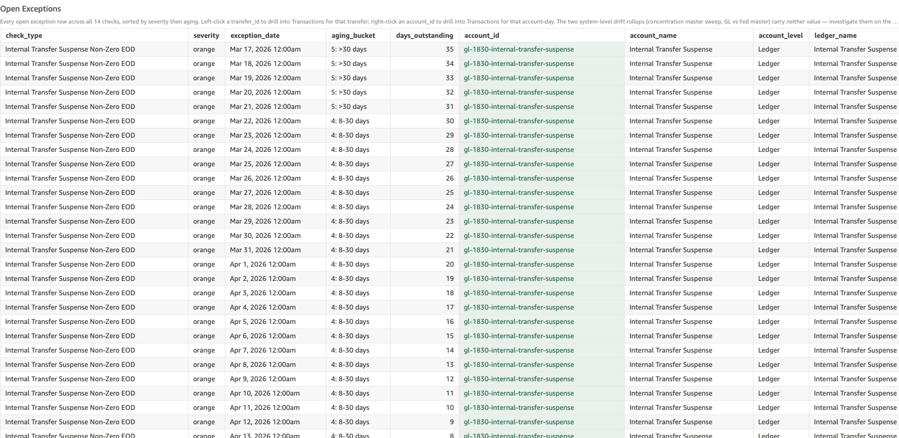

# Internal Transfer Suspense Non-Zero EOD

*Per-check walkthrough — Account Reconciliation Today's Exceptions sheet.*

## The story

On-us internal transfers between two SNB customers post in two
steps: Step 1 debits the originator's DDA and credits **Internal
Transfer Suspense** (`gl-1830`); Step 2 debits suspense and credits
the recipient's DDA. Step 1 lands immediately; Step 2 lands once a
clearing/confirmation cycle completes, usually within minutes but
sometimes longer.

In a healthy day, every Step 1 has a corresponding Step 2 and
gl-1830 ends the day at exactly zero. Non-zero EOD on gl-1830
means at least one Step 1 originate didn't have a Step 2 clearing
it that day — either Step 2 hasn't landed yet (in flight), failed
(stuck), or the destination DDA refused the credit (rare).

This is the daily-aggregate companion to *Stuck in Internal
Transfer Suspense*. That check operates at the per-transfer level:
which specific Step 1 originates are stuck. This check operates at
the per-day level: how many days has gl-1830 been carrying any
non-zero EOD balance.

## The question

"Did the Internal Transfer Suspense ledger end yesterday at zero —
i.e., did every Step 1 have a Step 2 clearing it?"

## Where to look

Open the AR dashboard, **Today's Exceptions** sheet. In the Controls
strip at the top of the sheet, set **Check Type** to
`Internal Transfer Suspense Non-Zero EOD`. The **Total Exceptions**
KPI recounts to just this check's rows, the **Exceptions by Check**
breakdown bar collapses to a single orange bar, and the **Open
Exceptions** table below shows every row for this check — one row
per (gl-1830, date) cell where stored balance ≠ 0.

Screenshot — Open Exceptions filtered to this check

## What you'll see in the demo

Several dozen rows — this check is sticky: as long as a single
Step 1 originate is hanging on gl-1830, every subsequent EOD adds
one row to the count. Key columns to read:

| column            | value for this check                                          |
|-------------------|---------------------------------------------------------------|
| `account_id`      | `gl-1830` on every row (the Internal Transfer Suspense ledger) |
| `account_name`    | "Internal Transfer Suspense"                                  |
| `account_level`   | `Ledger`                                                      |
| `transfer_id`     | blank — this check is an EOD-balance shape, not a single-transfer shape |
| `primary_amount`  | `stored_balance` — the non-zero EOD dollar amount             |
| `secondary_amount`| blank                                                         |

The two stuck plants from `_INTERNAL_TRANSFER_PLANT` —
`ar-on-us-orig-03` ($4,275 from Apr 8 2026, 11 days ago) and
`ar-on-us-orig-04` ($1,880 from Mar 27 2026, 23 days ago) — each
contribute every day they remain stuck. On a day when both stuck
plants are in flight, `primary_amount ≈ $4,275 + $1,880 = $6,155`.

## What it means

Each row says: at end of day on `exception_date`, gl-1830's stored
balance was `primary_amount` dollars (non-zero). The
`primary_amount` value reflects the running total of every
unmatched Step 1 originate currently hanging on suspense.

A few patterns to watch for:

- **Same `primary_amount` across consecutive days** means no new
  stuck originates landed *and* no stuck originate cleared. The
  same set of stuck transfers is just sitting there.
- **`primary_amount` stepping up** day-over-day means new stuck
  originates are accumulating on top of the existing backlog.
  The underlying clearing automation is getting worse, not just
  stuck on a few old items.
- **`primary_amount` stepping down** means at least one stuck
  originate finally cleared (or was reversed). Combined with the
  per-transfer view in *Stuck in Internal Transfer Suspense*,
  you can identify which one.

The suspense ledger going non-zero by even small amounts is
operationally significant — gl-1830 is a clearing account, not a
balance account. A non-zero EOD means real customer money is
parked in transit, not in a customer account.

## Drilling in

The `account_id` cell renders with a pale-green background — that
tint is the dashboard's cue that a right-click menu is available.
**Right-click** any `account_id` value and choose
**View Transactions for Account-Day** from the context menu.
QuickSight switches to the **Transactions** sheet and filters to
every posting that touched gl-1830 on that specific date — Step 1
debits and Step 2 credits. Step 1 originates with no matching
Step 2 are the contributors to that day's non-zero balance.

For the per-transfer view (which specific originates are stuck),
set **Check Type** to `Internal Transfer Stuck in Suspense` —
that view has the originate transfer IDs as left-click drill
targets.

The `transfer_id` column is left blank for this check because no
single transfer represents the non-zero balance — the residual is
the net of every unmatched Step 1 currently in flight. The
account-day scope is the meaningful one.

## Next step

Suspense non-zero rows go to **Internal Transfer Operations**:

- **Bucket 1-2 (0-3 days)** → likely Step 2 still in flight; let
  the next clearing cycle process. Worth flagging if the day
  count is unusually high (more stuck-in-flight than typical for
  the time of day).
- **Bucket 3-4 (4-30 days)** → Step 2 won't arrive on its own.
  Identify the stuck originates via *Internal Transfer Stuck in
  Suspense* and trigger the Step 2 retry or compensating reversal
  per transfer.
- **Bucket 5 (>30 days)** → escalate. A month-old non-zero
  suspense balance means the original incident wasn't worked at
  all, or the retry mechanism failed and nobody noticed.

The dollar exposure is in `primary_amount` of the latest row —
that's the current total of stuck originator funds parked in
suspense.

## Related walkthroughs

- [Stuck in Internal Transfer Suspense](stuck-in-internal-transfer-suspense.md) —
  the per-transfer view of the same root cause. This check tells
  you "the suspense ledger has been non-zero for N days"; that
  check tells you "here are the K specific originates causing
  it." Suspense non-zero is sticky (one stuck transfer × N days
  = N rows); stuck-in-suspense is per-transfer (1 originate = 1
  row, regardless of how many days).
- [Reversed Transfers Without Credit-Back](internal-reversal-uncredited.md) —
  a different failure mode of the same on-us transfer cycle.
  When a transfer is reversed and the credit-back fails, gl-1830
  itself ends up balanced (both Step 1 and Step 2 reversal
  posted), so this check **doesn't** flag it — but the
  originator is still short the original debit. The reversal-
  uncredited check exists precisely because suspense non-zero
  doesn't catch that failure mode.
- [Expected-Zero EOD Rollup](expected-zero-eod-rollup.md) — the
  Trends-sheet rollup. This check is one of the expected-zero
  ledgers (along with gl-1810 ACH Origination Settlement); the
  rollup compares them side-by-side over the recent window.
