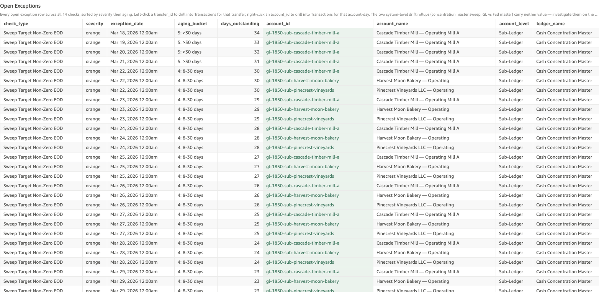

# Ledger Drift

*Per-check walkthrough — Account Reconciliation Today's Exceptions sheet.*

## The story

Each GL control account at SNB sits at the top of a small accounting
hierarchy: it has a stored end-of-day balance fed by the upstream
system, and one or more sub-ledger accounts roll up into it. The
invariant the database enforces every day is straightforward:

> *stored ledger balance = Σ of its sub-ledgers' stored balances + Σ of direct postings to the ledger itself*

Anything else is a structural break — the ledger's own books and the
roll-up of its component accounts disagree. If left unresolved, the
GL rolls forward each day with the same gap, and any downstream
reporting (regulatory, internal financials, treasury cash position)
inherits the wrong number.

Like sub-ledger drift, ledger drift is sticky. One bad day at the
top of a control account propagates to every subsequent day's
snapshot until somebody restates either the ledger balance or one of
its components. So the day count is much larger than the number of
underlying incidents.

## The question

"Are any GL control accounts carrying a stored balance that doesn't
match the sum of their sub-ledgers (plus direct ledger postings)?"

## Where to look

Open the AR dashboard, **Today's Exceptions** sheet. In the Controls
strip at the top of the sheet, set **Check Type** to
`Ledger Drift`. The **Total Exceptions** KPI recounts to just this
check's rows, the **Exceptions by Check** breakdown bar collapses
to a single red bar, and the **Open Exceptions** table below shows
every row for this check — one row per (ledger, date) cell where
stored disagrees with computed.

Screenshot — Open Exceptions filtered to this check

## What you'll see in the demo

Rows roll forward day-over-day from three planted incidents, so the
row count is much larger than the incident count. Key columns to
read:

| column            | value for this check                                                                |
|-------------------|-------------------------------------------------------------------------------------|
| `account_id`      | the ledger that's drifting (e.g. `gl-2010-dda-control`, `gl-1850-cash-concentration-master`) |
| `account_name`    | the ledger's display name                                                           |
| `account_level`   | `Ledger`                                                                            |
| `transfer_id`     | blank — drift is a balance shape, not a single-transfer shape                       |
| `primary_amount`  | `drift` — the dollar gap (stored − computed); sign tells you the direction          |
| `secondary_amount`| `stored_balance` — the stored EOD number the feed asserted                          |

Three planted incidents in `_LEDGER_DRIFT_PLANT` drive the entire
count. Each lands on one day and rolls forward through every
subsequent EOD until restated:

| ledger                          | started     | drift      |
|---------------------------------|-------------|-----------:|
| Customer Deposits — DDA Control | Apr 16 2026 | +$125.00   |
| Cash Concentration Master       | Apr 12 2026 | −$80.50    |
| Cash & Due From FRB             | Apr 5 2026  | +$310.00   |

Three ledgers, three different control hierarchies, three different
operational owners — the demo intentionally spreads the plants so
operators see the drift at every level of the GL. The count per
incident equals "days since the incident day."

## What it means

Each row is one (ledger, date) cell where the ledger's stored EOD
balance disagrees with what its component sub-ledgers and direct
postings sum to. `primary_amount` is the dollar gap.

The interesting thing about ledger drift versus sub-ledger drift:
ledger drift can come from a sub-ledger that's *not* drifting on its
own. If sub-ledger A's stored balance increased by $100 with no
posting (the sub-ledger drift check catches this), the ledger sum
shifts by $100 too — and the ledger drift check catches that
separately. So it's worth confirming whether a ledger drift cell has
a corresponding sub-ledger drift cell on the same day; if yes, fix
the sub-ledger and the ledger usually self-heals.

If no sub-ledger of the drifting ledger has a corresponding entry on
the same day, the drift is at the ledger level itself — most often
a direct ledger posting that landed without updating stored, or
vice-versa.

## Drilling in

The `account_id` cell renders with a pale-green background — that
tint is the dashboard's cue that a right-click menu is available.
**Right-click** any `account_id` value and choose
**View Transactions for Account-Day** from the context menu.
QuickSight switches to the **Transactions** sheet and filters to
every posting that touched that ledger on that specific date — the
day's direct postings (funding batches, fees, clearing sweeps) plus
any transfer that rolls up to that ledger.

To trace the drift back to its origin, right-click the *oldest* row
for a given `account_id` first: that's the earliest day the gap
appeared. From there, cross-check against Sub-Ledger Drift for the
same date — a same-day sub-ledger drift cell under the drifting
ledger usually explains the whole gap.

The `transfer_id` column is left blank for this check because no
single transfer represents the drift — the residual is a balance-shape
disagreement across the ledger's full posting history. The
ledger-day scope is the meaningful one.

## Next step

Ledger drift goes to **GL Reconciliation** by default. They route to
the actual fix:

- Customer Deposits — DDA Control drift → typically pushes back to
  **Core Banking Operations** (component sub-ledgers come from the
  customer-balance feed).
- Cash Concentration Master drift → **ZBA Admin / Sweep Automation**.
- Cash & Due From FRB drift → **Treasury / Fed Reconciliation**.

Hand off the `account_id`, first (oldest) drift date, and the
constant drift dollar amount. The fix is either a restatement of the
stored ledger balance (if the components are right and the ledger
feed was wrong) or a restatement / posting of one of the components
(if the ledger feed is right and the component drifted).

Old ledger drift (`aging_bucket` = 5: >30 days) is high-priority —
the GL balance is what regulatory and internal financial reports
read off, so a >30-day gap can land in published numbers.

## Related walkthroughs

- [Sub-Ledger Drift](sub-ledger-drift.md) — the per-component view.
  Always check whether a ledger drift cell has a same-day sub-ledger
  drift cell first; fixing the sub-ledger usually clears both.
- [Balance Drift Timelines Rollup](balance-drift-timelines-rollup.md) —
  the Trends-sheet rollup of the same invariant. Read there for "is
  this building or isolated"; read here for the row-level ledger-day
  cells. The rollup also covers the SNB↔Fed two-sided drift shape,
  so don't confuse that chart with this check.
