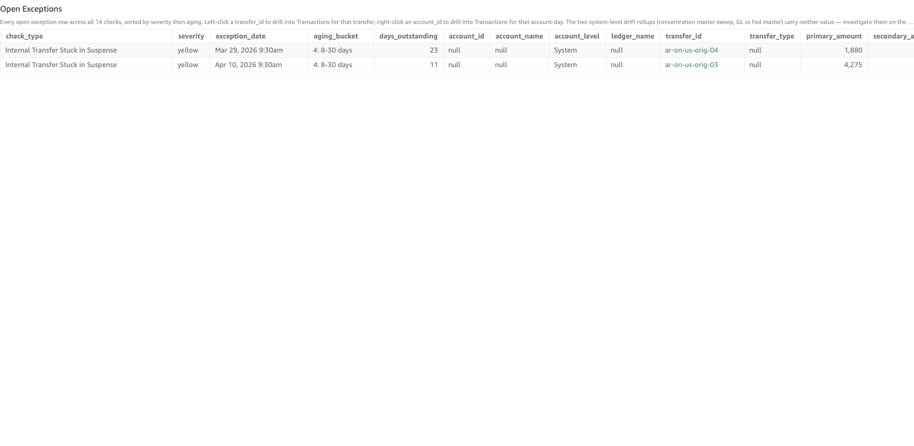

# Stuck in Internal Transfer Suspense

*Per-check walkthrough — Account Reconciliation Today's Exceptions sheet.*

## The story

When an SNB customer initiates an on-us transfer to another SNB
customer, money moves in two steps. Step 1 debits the originator's
DDA and credits `gl-1830` Internal Transfer Suspense. Step 2 then
settles by debiting suspense and crediting the recipient's DDA — *or*
by reversing back to the originator if the transfer fails.

If only Step 1 posts and Step 2 never arrives, the money is stuck.
The originator can't see it (already debited from their DDA), the
recipient hasn't received it, and `gl-1830` carries a non-zero balance
that grows older every day.

## The question

"Are there any internal transfers where Step 1 posted but Step 2 never
did?"

## Where to look

Open the AR dashboard, **Today's Exceptions** sheet. In the Controls
strip at the top of the sheet, set **Check Type** to
`Internal Transfer Stuck in Suspense`. The **Total Exceptions** KPI
recounts to just this check's rows, the **Exceptions by Check**
breakdown bar collapses to a single yellow bar, and the **Open
Exceptions** table below shows every row for this check — one row
per stuck originate.

Screenshot — Open Exceptions filtered to this check

## What you'll see in the demo

Two rows, one per planted stuck originate. Key columns to read:

| column            | value for this check                                                  |
|-------------------|-----------------------------------------------------------------------|
| `account_id`      | blank — this check is a per-transfer system check, not per-account    |
| `account_level`   | `System`                                                              |
| `transfer_id`     | the Step 1 originate transfer (e.g. `ar-on-us-orig-03`)               |
| `primary_amount`  | `originate_amount` — the dollars Step 1 debited from the originator   |
| `secondary_amount`| blank                                                                 |

The two planted scenarios in `_INTERNAL_TRANSFER_PLANT`:

| transfer_id        | originated_at        | originate_amount | aging_bucket  |
|--------------------|----------------------|-----------------:|---------------|
| `ar-on-us-orig-03` | Apr 8 2026 9:30am    |            4,275 | 4: 8-30 days  |
| `ar-on-us-orig-04` | Mar 27 2026 9:30am   |            1,880 | 4: 8-30 days  |

The originator and recipient names aren't on this row — the unified
table carries the transfer ID and amount only. You'll see the
originator and recipient names when you drill into Transactions.
The two scenarios are Cascade Timber Mill → Big Meadow Dairy and
Pinecrest Vineyards LLC → Harvest Moon Bakery.

Like the other transfer-shaped checks, this one doesn't roll
forward day-over-day: one stuck originate = one row.

## What it means

Each row is an originate where Step 2 never posted. The originator
has been short the funds for the indicated number of days. The
recipient never got their money. Suspense is carrying the combined
stuck total ($6,155 across the two demo plants) that should have
settled the day each originated. This is a customer-facing problem
on at least two counts: the originator may be calling about a
failed payment, and the recipient may be calling about a missing
payment.

## Drilling in

The `transfer_id` cell renders as accent-colored text — that tint
is the dashboard's cue that the cell is clickable. **Left-click**
any `transfer_id` value. The drill switches to the **Transactions**
sheet filtered to that originate transfer, showing the Step 1
posting (debit suspense, credit originator DDA) with no matching
Step 2. The absence of Step 2 is the diagnosis — the internal
transfer system stopped halfway. The Transactions sheet also shows
the originator's `account_name`, which the unified table doesn't
carry.

## Next step

Stuck-in-suspense rows always go to **Internal Transfer Operations**.
Hand off the `transfer_id` plus the originator name (from the
drilled Transactions sheet) and amount. They check the transfer
system log for why Step 2 didn't fire — common causes are recipient
account flagged for review, intra-day system restart that lost the
in-flight state, or a NSF check that didn't trigger the reversal path.

After 30 days, stuck transfers escalate to legal / compliance — money
held that long without resolution is a regulatory issue.

## Related walkthroughs

- [Internal Transfer Suspense Non-Zero EOD](internal-transfer-suspense-non-zero.md) —
  the account-level view: the same money seen as "suspense holding
  non-zero balance overnight" instead of "two specific transfers
  stuck."
- [Reversed Transfers Without Credit-Back](internal-reversal-uncredited.md) —
  the related failure mode: Step 2 *did* fire, but as a reversal
  rather than the destination credit, and the originator never got
  their money back.
- [Expected-Zero EOD Rollup](expected-zero-eod-rollup.md) — the
  Trends-sheet rollup; these stuck transfers also surface there as
  residual `gl-1830` balance that should have ended at zero.
