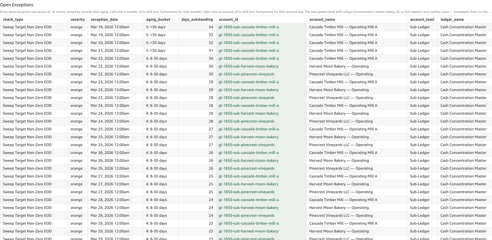

# Sub-Ledger Drift

*Per-check walkthrough — Account Reconciliation Today's Exceptions sheet.*

## The story

Every customer DDA and ZBA operating sub-account at SNB carries a
*stored* end-of-day balance — the number the upstream system asserts
the account ended the day at. The same account also has a posting
history: every transaction that touched it. Sum the postings forward
day by day and you have the *computed* balance.

When the two disagree, somebody's wrong. Either a posting landed
without updating the stored balance, or the stored balance moved
without a posting to back it. Either case is a feed-integrity break
the operator wants to see *before* a customer calls about a balance
that doesn't match their statement.

Drift is sticky. Once stored balance is altered on a single day with
no compensating posting, every subsequent day inherits the same gap
until somebody restates. So one bad posting on Tuesday surfaces as
drift on Tuesday, Wednesday, Thursday — every day forward — which is
why the count is large relative to the number of underlying incidents.

## The question

"Are any sub-ledger accounts carrying a stored balance that doesn't
match what their posting history adds up to?"

## Where to look

Open the AR dashboard, **Today's Exceptions** sheet. In the Controls
strip at the top of the sheet, set **Check Type** to
`Sub-Ledger Drift`. The **Total Exceptions** KPI recounts to just
this check's rows, the **Exceptions by Check** breakdown bar collapses
to a single red bar, and the **Open Exceptions** table below shows
every row for this check — one row per (sub-ledger, date) cell where
the stored balance disagrees with the posted computed balance.

Screenshot — Open Exceptions filtered to this check

## What you'll see in the demo

Several hundred rows — drift persists day over day, so one planted
incident contributes one row per day since. Key columns to read:

| column            | value for this check                                                                |
|-------------------|-------------------------------------------------------------------------------------|
| `account_id`      | the sub-ledger that's drifting (e.g. `cust-bigfoot-brews`, `gl-1850-sub-big-meadow-dairy-main`) |
| `account_name`    | the sub-ledger's display name                                                       |
| `account_level`   | `Sub-Ledger`                                                                        |
| `ledger_name`     | the parent control ledger (e.g. "Customer Deposits — DDA Control", "Cash Concentration Master") |
| `transfer_id`     | blank — drift is a balance shape, not a single-transfer shape                       |
| `primary_amount`  | `drift` — the dollar gap (stored − computed); sign tells you the direction          |
| `secondary_amount`| `stored_balance` — the stored EOD number the feed asserted                          |

Four planted incidents in `_SUBLEDGER_DRIFT_PLANT` drive the entire
count:

| sub-ledger                              | incident day | drift       |
|-----------------------------------------|--------------|-------------|
| Big Meadow Dairy — DDA                  | Apr 17 2026  | −$75.00     |
| Bigfoot Brews — DDA                     | Apr 14 2026  | +$200.00    |
| Big Meadow Dairy — ZBA Operating (main) | Apr 9 2026   | −$150.50    |
| Cascade Timber Mill — DDA               | Mar 30 2026  | +$450.00    |

Each planted incident keeps its same dollar `drift` value every day
afterward — same dollars rolling forward — so the count per incident
equals "days since the incident day."

## What it means

Each row is one (sub-ledger, date) cell where the upstream-fed stored
balance disagrees with the running sum of postings to that sub-ledger.
`primary_amount` is the dollar gap: positive means stored is higher
than postings explain (a posting is missing, or a stored credit
landed without a backing transaction); negative means stored is lower
than postings explain (a posting is duplicated, or a stored debit
landed without a backing transaction).

Because the gap rolls forward day-after-day, the same dollar amount
appearing on consecutive dates for the same `account_id` traces back
to a *single* event. A handful of distinct drift amounts across
hundreds of rows means the number of underlying incidents is small;
what's growing is days-since-restated.

## Drilling in

The `account_id` cell renders with a pale-green background — that
tint is the dashboard's cue that a right-click menu is available.
**Right-click** any `account_id` value and choose
**View Transactions for Account-Day** from the context menu.
QuickSight switches to the **Transactions** sheet and filters to
every posting that touched that sub-ledger on that specific date —
the day's individual debits and credits.

To trace the drift back to its origin, right-click the *oldest* row
for a given `account_id` first: that's the earliest day the gap
appeared. Walk to the day *before* that one — the posting that
explains the jump either landed without updating stored, or the
stored balance moved without a posting. The Transactions sheet shows
both sides.

The `transfer_id` column is left blank for this check because no
single transfer represents the drift — the residual is a balance-shape
disagreement across the account's full posting history. The
account-day scope is the meaningful one.

## Next step

Sub-ledger drift goes to whichever team owns the upstream feed for
that sub-ledger's account class:

- **Customer DDA drift** (`cust-bigfoot-brews`, `cust-big-meadow-dairy`, etc.) →
  **Core Banking Operations**. Their daily customer-balance feed is
  the source of truth for `stored_balance` on cust-* rows.
- **ZBA operating sub-account drift** (`gl-1850-sub-*` rows) → **ZBA
  Admin / Sweep Automation**. The sweep engine writes both the
  postings and the stored balance for these; if they disagree, the
  engine emitted one without the other.

Hand off the `account_id`, the first (oldest) drift date, and the
constant drift dollar amount. The owning team restates stored to
match computed for that day forward, or finds and posts the missing
transaction — both paths zero out the drift on the next day's
snapshot.

Old drift (`aging_bucket` = 5: >30 days) usually means the
operational fix is beyond the live feed window and needs an explicit
prior-period adjustment journal entry.

## Related walkthroughs

- [Ledger Drift](ledger-drift.md) — the corresponding check at the
  ledger level: stored ledger balance vs Σ of its sub-ledgers' stored
  balances. Sub-ledger drift here can also surface as ledger drift
  there if the sub-ledger rolls up to a control account.
- [Balance Drift Timelines Rollup](balance-drift-timelines-rollup.md) —
  the Trends-sheet rollup of the same invariant. Read there for "is
  this a one-day blip or is it building?"; read here for the row-level
  account-day cells.
