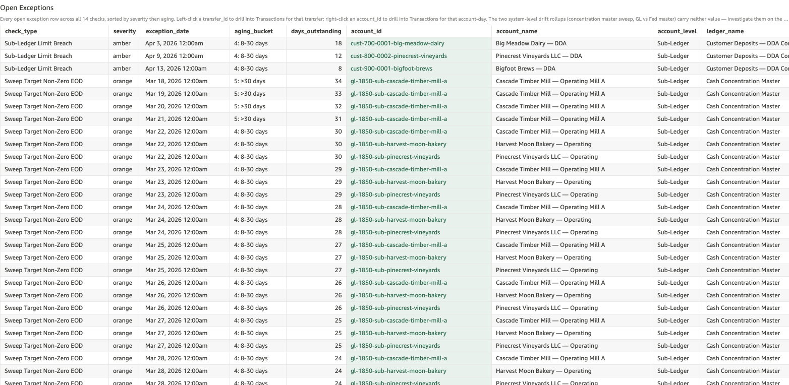

# Sub-Ledger Limit Breach

*Per-check walkthrough — Account Reconciliation Today's Exceptions sheet.*

## The story

SNB's GL control accounts carry per-transfer-type daily outbound
limits that govern how much the sub-ledgers under them are allowed
to push out in a single business day. The limits are policy, not
physics — a sub-ledger account *can* originate a wire bigger than
the limit; the limit-breach check exists to catch when it does so
the policy team hears about it the morning after, not weeks later
in an audit.

Limits today live on the **Customer Deposits — DDA Control** ledger:

- ACH outbound: **$12,000 / day** per sub-ledger
- Wire outbound: **$15,000 / day** per sub-ledger
- Cash outbound: **$10,000 / day** per sub-ledger

A limit breach is one (sub-ledger, day, transfer_type) combination
where the sum of outbound transfers of that type exceeded the
configured limit. Each combination becomes one row.

## The question

"Did any customer DDA push more than its allowed daily total out
yesterday — by ACH, wire, or cash?"

## Where to look

Open the AR dashboard, **Today's Exceptions** sheet. In the Controls
strip at the top of the sheet, set **Check Type** to
`Sub-Ledger Limit Breach`. The **Total Exceptions** KPI recounts to
just this check's rows, the **Exceptions by Check** breakdown bar
collapses to a single amber bar, and the **Open Exceptions** table
below shows every row for this check — one row per
(sub-ledger, day, transfer_type) breach.

Screenshot — Open Exceptions filtered to this check

## What you'll see in the demo

Three rows, one per planted breach. Key columns to read:

| column            | value for this check                                                    |
|-------------------|-------------------------------------------------------------------------|
| `account_id`      | the sub-ledger that breached (e.g. `cust-bigfoot-brews`)                |
| `account_name`    | the customer DDA name                                                   |
| `account_level`   | `Sub-Ledger`                                                            |
| `transfer_id`     | blank — breach is a (sub-ledger, day, type) aggregate, not one transfer |
| `transfer_type`   | `ach` / `wire` / `cash` — the outbound channel that was over limit     |
| `primary_amount`  | `overage` — dollars by which outbound exceeded the policy limit         |
| `secondary_amount`| `daily_limit` — the policy ceiling for that (ledger, type)              |

Three planted breaches in `_LIMIT_BREACH_PLANT` account for all
three rows:

| sub-ledger                    | date        | type | outbound  | limit  | overage |
|-------------------------------|-------------|------|----------:|-------:|--------:|
| Bigfoot Brews — DDA           | Apr 11 2026 | wire |  ~$22,000 | $15,000 |  ~$7,000 |
| Pinecrest Vineyards LLC — DDA | Apr 7 2026  | ach  |  ~$16,000 | $12,000 |  ~$4,000 |
| Big Meadow Dairy — DDA        | Apr 1 2026  | cash |  ~$13,000 | $10,000 |  ~$3,000 |

All three sub-ledgers roll up to **Customer Deposits — DDA Control**.
Unlike drift/overdraft/sweep, breaches don't roll forward
day-over-day — one breach is one row, always.

## What it means

Each row says: on `exception_date`, sub-ledger `account_name`
originated `outbound_total` dollars of `transfer_type` outbound, and
that exceeded the policy limit for that ledger / type combination by
`primary_amount` (overage) dollars.

Limit breaches don't necessarily mean fraud or error — large
legitimate transactions happen, and policy is intentionally a soft
ceiling. But every breach is something the policy team needs to know
about so they can decide whether to:

1. Approve the breach retroactively (this customer routinely sends
   bigger wires; consider a higher per-account limit).
2. Investigate the breach (the customer doesn't usually move money
   this size; somebody should ask why).
3. Adjust the policy itself (the limit hasn't been re-reviewed in
   N years; current normal activity routinely brushes against it).

The check doesn't decide which response — it surfaces the breach so
a human can.

## Drilling in

The `account_id` cell renders with a pale-green background — that
tint is the dashboard's cue that a right-click menu is available.
**Right-click** any `account_id` value and choose
**View Transactions for Account-Day** from the context menu.
QuickSight switches to the **Transactions** sheet and filters to
every posting that touched that sub-ledger on that date — exactly
the legs that made up the `outbound_total` figure.

From there you can see the individual transfers (often one big
transfer plus several smaller ones, or one unusually large single
transfer that single-handedly tripped the limit). Look at the
`account_name` of the counterparty and the `memo` column — together
with the customer relationship context, that's enough to classify
the breach as routine-large-transfer vs. needs-investigation.

The `transfer_id` column is blank because a breach is a daily
aggregate across potentially many transfers of the same type, not a
single transfer. Filter by `transfer_type` in Transactions if you
want to narrow to just the channel that breached.

## Next step

Limit breach rows go to **Compliance / Policy Review** by default.
Hand off:

- The sub-ledger ID + customer name
- The activity date and transfer type
- The outbound total, daily limit, and overage figures
- A pointer to the underlying transfers from the drill

Compliance decides whether the breach is approved, investigated, or
prompts a policy adjustment. Recurring breaches by the same customer
on the same transfer type strongly suggest the limit is too low for
that customer's normal activity — that's a per-account limit
adjustment, not a global policy change.

If the customer is new and the breach is the first ACH/wire/cash
outbound they've ever originated, that's a different conversation
(initial KYC review, not policy adjustment).

## Related walkthroughs

- [Sub-Ledger Overdraft](sub-ledger-overdraft.md) — different
  invariant (negative balance, not exceeding policy) but the same
  shape of investigation: pick the sub-ledger, drill into
  Transactions, look at the legs that drove the breach.
- [Internal Transfer Suspense Non-Zero EOD](internal-transfer-suspense-non-zero.md) —
  unrelated check but an analogous "this account is doing something
  the system says it shouldn't" pattern; sometimes a stuck transfer
  inflates a sub-ledger's apparent outbound and looks like a limit
  breach when it's actually a settlement issue.
