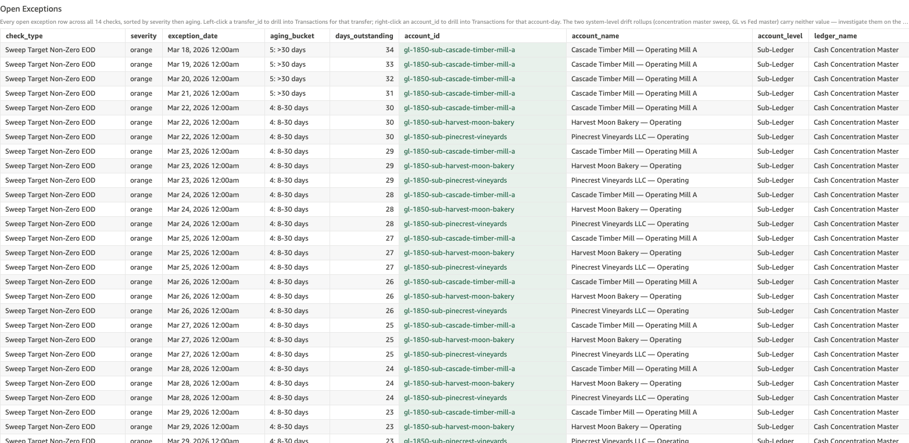

# Sub-Ledger Overdraft

*Per-check walkthrough — Account Reconciliation Today's Exceptions sheet.*

## The story

A customer DDA or operating sub-account at SNB shouldn't end the day
with a negative stored balance. Real customers can't have negative
deposits; sub-accounts inside the sweep automation are supposed to
be funded before they originate. When the EOD snapshot lands with
`stored_balance < 0`, that's an overdraft — and it tends to be
sticky, just like drift, because once a balance crosses below zero
it usually takes a deliberate compensating credit (next-day cover,
sweep reversal, internal funding) to bring it back.

A single overdraft incident often appears as multiple consecutive
overdraft *days* in the count: the day the negative balance first
landed, plus every subsequent day the account stayed negative until
covered. So the day count grows quickly even when the underlying
incident set is small.

## The question

"Did any sub-ledger account end the day with a negative stored
balance — and if so, for how long has it been negative?"

## Where to look

Open the AR dashboard, **Today's Exceptions** sheet. In the Controls
strip at the top of the sheet, set **Check Type** to
`Sub-Ledger Overdraft`. The **Total Exceptions** KPI recounts to
just this check's rows, the **Exceptions by Check** breakdown bar
collapses to a single red bar, and the **Open Exceptions** table
below shows every row for this check — one row per
(sub-ledger, date) cell where stored balance < 0.

Screenshot — Open Exceptions filtered to this check

## What you'll see in the demo

Several hundred rows — overdraft persists day over day, so one
planted incident contributes one row per day since. Key columns to
read:

| column            | value for this check                                             |
|-------------------|------------------------------------------------------------------|
| `account_id`      | the sub-ledger that's overdrawn (e.g. `cust-harvest-moon-bakery`) |
| `account_name`    | the sub-ledger's display name                                    |
| `account_level`   | `Sub-Ledger`                                                     |
| `transfer_id`     | blank — overdraft is an EOD-balance shape, not a transfer shape  |
| `primary_amount`  | `stored_balance` — the negative EOD dollar amount                |
| `secondary_amount`| blank                                                            |

Three planted overdraft incidents in `_OVERDRAFT_PLANT` account for
the count. Each lands a single oversized outbound on a specific day,
driving that sub-ledger negative; the account then stays negative
for several days until a compensating credit lands:

| sub-ledger                              | started     | drove negative    |
|-----------------------------------------|-------------|------------------:|
| Harvest Moon Bakery — DDA               | Apr 15 2026 | $40,000 outbound  |
| Sasquatch Sips — DDA                    | Apr 13 2026 | $45,000 outbound  |
| Cascade Timber Mill — ZBA Operating (a) | Apr 10 2026 | $35,000 outbound  |

Each planted incident keeps a similar (negative) `stored_balance`
every day afterward — same dollars rolling forward — so the count
per incident equals "days the account stayed negative."

## What it means

Each row says: on `exception_date`, sub-ledger `account_name` ended
the day with `primary_amount` dollars (negative). The row recurs
every day the account stays negative — so a single overdraft
incident that lasted 12 days shows up as 12 rows.

A few patterns to watch for:

- **Same `primary_amount` across consecutive days** for one
  sub-ledger means no posting activity in between — the account is
  just sitting in overdraft, untouched.
- **`primary_amount` getting more negative day over day** means the
  account is continuing to send money out without funding — that's
  much more concerning than a flat overdraft.
- **`primary_amount` swinging back toward zero day over day** means
  partial cover is landing but isn't yet enough — the customer is
  catching up.

The two customer DDA overdrafts (Harvest Moon Bakery, Sasquatch
Sips) are likely insufficient-funds conditions; the ZBA operating
sub-account overdraft (Cascade Timber Mill) is a sweep-engine
funding gap — that account isn't supposed to overdraft because the
sweep is supposed to fund it before it originates.

## Drilling in

The `account_id` cell renders with a pale-green background — that
tint is the dashboard's cue that a right-click menu is available.
**Right-click** any `account_id` value and choose
**View Transactions for Account-Day** from the context menu.
QuickSight switches to the **Transactions** sheet and filters to
every posting that touched that sub-ledger on that specific date.
The transfer that crossed the account into negative territory is
typically the largest debit on the day; identifying it is usually
a one-row scan.

To trace the overdraft back to its origin, right-click the *oldest*
row for a given `account_id` first. From there, walk forward day by
day in the Transactions sheet to find the posting that brings the
balance back above zero (a credit large enough to net the running
balance positive). The day before that credit is the last overdraft
day for the incident.

## Next step

Triage by sub-ledger type:

- **Customer DDA overdraft** → **Customer Operations / Treasury
  Services**. The customer-relationship team contacts the customer
  about insufficient funds and arranges cover. Bucket 4+ overdrafts
  on a customer DDA usually mean either a returned deposit nobody
  caught or an automated outflow (recurring ACH debit) that should
  have been blocked.
- **ZBA operating sub-account overdraft** → **ZBA Admin / Sweep
  Automation**. The sweep should have funded the account before it
  originated. Long-running overdrafts on a sweep sub-account
  indicate the sweep engine has a sub-account in its funding plan
  that's not actually getting funded.
- **GL control overdraft** → if surfaced (none in the current
  demo), goes to **GL Reconciliation** — control accounts going
  negative is a structural issue that often signals a posting class
  is being misrouted.

Old overdrafts (`aging_bucket` = 5: >30 days) are escalation
candidates — both because the operational fix window is closing and
because 30+ days uncovered overdraft on a customer DDA can have
regulatory implications (Reg E timing, customer-notification
requirements).

## Related walkthroughs

- [Sub-Ledger Limit Breach](sub-ledger-limit-breach.md) — different
  invariant (exceeding policy, not going negative) but very similar
  drill flow (pick a sub-ledger, drill into Transactions, find the
  driving leg).
- [Sub-Ledger Drift](sub-ledger-drift.md) — also a sub-ledger-level
  EOD-balance check; drift looks at stored vs computed mismatch,
  overdraft looks at stored < 0. The two checks are independent —
  a sub-ledger can drift without overdrafting and vice versa.
