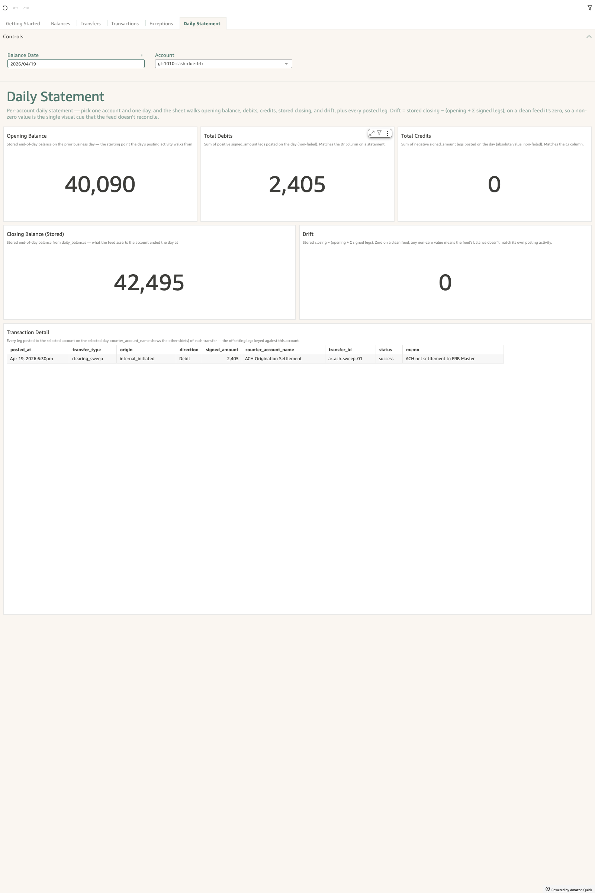
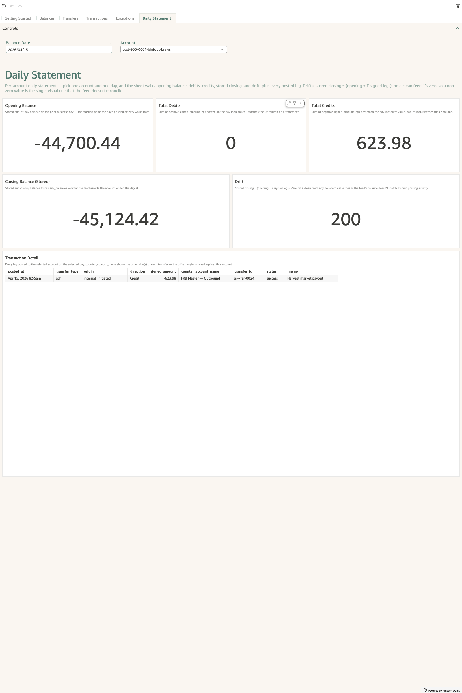
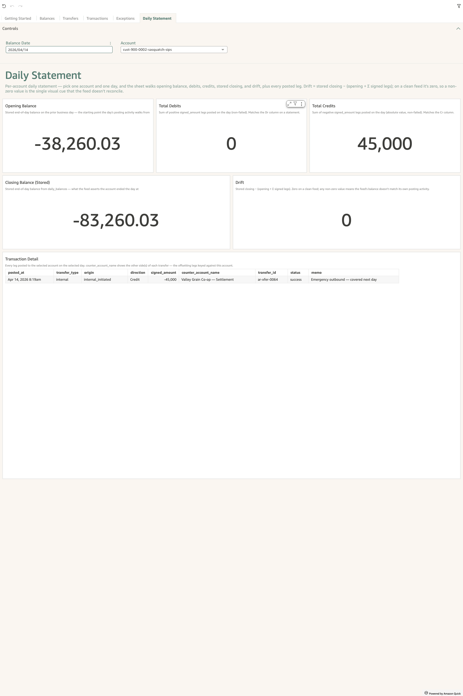

# How do I validate a single account-day after a load?

*Engineering walkthrough — Data Integration Team. Foundational.*

## The story

You loaded a slice into `<prefix>_transactions` and
`<prefix>_daily_balances`. The pre-flight invariants from
[How do I prove my ETL is working?](how-do-i-prove-my-etl-is-working.md)
returned zero rows, the dashboards render, and the L1 Today's
Exceptions KPI all look reasonable. The whole feed *looks* fine.

Now your treasury counterpart calls and asks: *"Did my account
`gl-1850` actually reconcile yesterday? Show me opening, the
moves, closing — and prove the drift is zero."* You don't want to
hand them a SQL transcript; you want to point them at a screen
that answers all four questions in the same place.

That screen is the **Daily Statement** sheet on the L1
Reconciliation Dashboard — a parameter-bound view of one account
on one date. Pick the account, pick the date, and the page renders
the canonical account-day reconciliation: opening balance, total
debits, total credits, closing balance (stored), drift KPI, and
the underlying legs as a table.

## The question

"For one specific `(account_id, business_day_start)` pair from my
freshly loaded slice, can I open a single screen that confirms
the day reconciles end-to-end — and shows me every leg that
moved the balance?"

## Where to look

One sheet, two reference points:

- **L1 Reconciliation Dashboard → Daily Statement tab**. Two
  sheet controls at the top: an **Account** dropdown and a
  **Balance Date** picker. Pick them and the whole page
  re-renders for that account-day.
- **`docs/Schema_v6.md` → Sign convention** — the invariant the
  Drift KPI checks (`stored balance = opening + net flow`) is the
  cumulative-sum identity from the column contract. The Daily
  Statement KPI is the row-level expression of that invariant.

You can land on the Daily Statement sheet two ways:

1. **Tab-click + manual select.** Click the "Daily Statement"
   tab, then pick the account + date you want to inspect.
2. **Right-click drill from another L1 sheet.** From Today's
   Exceptions or Drift, right-click any row and choose "View
   Daily Statement for this account-day" — the parameters are
   filled in for you. (Per the drill-direction convention:
   right-click moves you deeper into the investigation.)

## What you'll see in the demo

Three worked examples are pinned by the L1 dashboard's e2e test
suite against the deployed demo seed. Open the dashboard, switch
to the Daily Statement tab, and try each one in turn.

### Example 1 — A clean reconciling day

| Parameter      | Value                              |
| -------------- | ---------------------------------- |
| Account        | `gl-1010-cash-due-frb`             |
| Balance Date   | yesterday                          |

You should see:

- **Opening Balance**, **Total Debits**, **Total Credits**, and
  **Closing Balance (Stored)** all populated with non-zero
  values from the daily ACH origination sweep activity.
- **Drift = $0.00** — stored closing equals opening plus net
  flow.
- **Transaction Detail** table — at least one leg, every leg
  has a `counter_account_name` filled in (no NULLs).

??? example "Screenshot"
    

This is what every account-day in your slice should look like
when the projection is clean.

### Example 2 — A drift day

| Parameter      | Value                              |
| -------------- | ---------------------------------- |
| Account        | `cust-900-0001-bigfoot-brews`      |
| Balance Date   | 5 days ago                         |

You should see:

- **Drift = +$200.00** — stored closing balance is $200 higher
  than the legs in the table account for. The KPI flips from
  green to accent-colored, signaling a non-zero drift.
- **Transaction Detail** table renders normally — every leg has
  the right counter-account, status, and signed amount. The
  drift isn't *in* a leg; it's the absence of a leg that should
  have been there (or the presence of a balance row that
  shouldn't have been bumped).

??? example "Screenshot"
    

This is the planted `_SUBLEDGER_DRIFT_PLANT` scenario — the
demo seeds a $200 unexplained delta into the bigfoot-brews
balance row to give the L1 Drift sheet something to surface. In
a real ETL, the same shape would mean either a posting was
dropped on its way to `<prefix>_transactions` or an EOD `money`
value was written that doesn't match the postings feed.

### Example 3 — An overdraft day

| Parameter      | Value                              |
| -------------- | ---------------------------------- |
| Account        | `cust-900-0002-sasquatch-sips`     |
| Balance Date   | 6 days ago                         |

You should see:

- **Closing Balance (Stored)** is *negative* — the account
  ended the day overdrawn.
- **Drift = $0.00** — the overdraft is real. A $45,000 outbound
  leg drove the balance below zero, the leg is in the table,
  and the stored balance reflects it correctly.
- **Transaction Detail** table includes the offending outbound
  leg (memo: "Emergency outbound — covered next day").

??? example "Screenshot"
    

This is the planted `_OVERDRAFT_PLANT` scenario. The
distinction between Example 2 and Example 3 is the load-bearing
one: **drift is a bookkeeping break; overdraft is a real
balance condition.** The Daily Statement separates them
cleanly because the same row carries both signals.

## What it means

Each KPI on the strip answers a specific question, and the
table answers the rest:

- **Opening Balance** — yesterday's closing, pulled from the
  prior `<prefix>_daily_balances` row via `LAG()`. If this is
  null on a day you expected to have history, your daily-balances
  feed has a gap.
- **Total Debits** / **Total Credits** — the day's signed
  flows split by direction (`amount_money > 0` is a debit,
  `< 0` a credit) and absolute-valued for display.
- **Closing Balance (Stored)** — the value in
  `<prefix>_daily_balances` that your ETL wrote. Authoritative
  for the row-as-loaded.
- **Drift** — `stored − (opening + net flow)`. Zero means the
  posting feed and balance feed agree on this account-day.
  Non-zero means one of the two is wrong.
- **Transaction Detail** — every Posted leg that moved this
  account on this date, plus the counter-leg's account name
  (resolved via `transfer_id`) so you can see *what the other
  side of each transfer was*.

A clean account-day:

- Drift = 0 (the two feeds agree).
- Closing ≥ 0 (no overdraft).
- Every leg has a counter_account_name (chains intact).

If any of those three is off, the row is an exception. The
sheet's purpose is to make it the work of about ten seconds
to confirm or disprove all three for one specific account-day.

## Drilling in

A few patterns the sheet exposes that the morning rollups
collapse away:

- **Drift sign tells you which feed is wrong.** Positive drift
  (stored higher than recomputed) means a posting is missing
  from `<prefix>_transactions` *or* the balance was bumped above
  what the postings explain. Negative drift is the opposite —
  most often a duplicate or oversigned leg in
  `<prefix>_transactions`.
- **Counter-account NULL means the chain is broken.** The
  detail table joins on `transfer_id` to resolve the other
  leg's account. A NULL counter_account_name is the visible
  symptom of an Invariant 1 violation
  ([pre-flight](how-do-i-prove-my-etl-is-working.md)) — the
  transfer has only one side loaded.
- **A high leg count for a quiet account is a signal.** Most
  customer DDAs see ≤10 legs on a normal day. Twenty-plus on a
  single day usually means a batch was written without a
  `transfer_id` collapse — each line in the source file became
  its own transfer instead of legs of one transfer.
- **Overdraft on a sub-ledger ≠ drift.** The L1 Overdraft check
  fires on `closing < 0`; the L1 Drift check fires on `stored ≠
  recomputed`. Sasquatch Sips on day-6 has the first without
  the second. Treat them as orthogonal checks even though they
  share a row on the Daily Statement.

## Next step

Once you've opened the Daily Statement on a freshly loaded
account-day and the three signals look clean (drift = 0,
closing ≥ 0, every leg has a counter_account_name):

1. **Spot-check three more account-days from the same load.**
   The pre-flight catches universal violations; the Daily
   Statement catches account-specific ones. Sample one GL
   control account, one customer DDA, one external counter —
   different shapes, different ways the same projection bug
   surfaces.
2. **If drift is non-zero**, jump to
   [What do I do when the demo passes but my prod data fails?](what-do-i-do-when-demo-passes-but-prod-fails.md)
   Symptom 4 — it walks the three sub-causes (sign-flip,
   missing posting, business_day_start mismatch) with one-shot
   SQL for each.
3. **If a leg's counter_account_name is NULL**, you've got an
   Invariant 1 violation. Re-run pre-flight Invariant 1
   scoped to that `transfer_id` to confirm, then audit the
   projection branch that emitted the leg.
4. **Hand the screen to your treasury counterpart.** Once the
   Daily Statement shows a clean account-day on a real account
   from your load, screenshot it and send it to whoever owns
   the account. They'll spot semantic issues (wrong amounts,
   wrong memos, unexpected counter-accounts) that no SQL
   invariant can catch.

## Related walkthroughs

- [How do I prove my ETL is working before going live?](how-do-i-prove-my-etl-is-working.md) —
  the universal pre-flight invariants. The Daily Statement is
  the single-account-day version of those invariants, rendered
  as a screen instead of a SQL transcript.
- [What do I do when the demo passes but my prod data fails?](what-do-i-do-when-demo-passes-but-prod-fails.md) —
  Symptom 4 (Drift KPI fires unexpectedly) is the natural
  follow-up when the Daily Statement shows a non-zero drift.
- [How do I populate `<prefix>_transactions` from my core banking system?](how-do-i-populate-transactions.md) —
  the projection that this sheet reads. A drift here usually
  traces to a branch of that projection.
- [L1 Reconciliation Dashboard: Drift](../l1/drift.md) /
  [Drift Timelines](../l1/drift-timelines.md) — the
  dashboard-side aggregate views of the per-day drift the
  Daily Statement makes inspectable.
- [L1 Reconciliation Dashboard: Overdraft](../l1/overdraft.md) —
  the aggregate view of overdraft days; the Daily Statement is
  where you confirm the overdraft is real (not a drift symptom
  in disguise).
