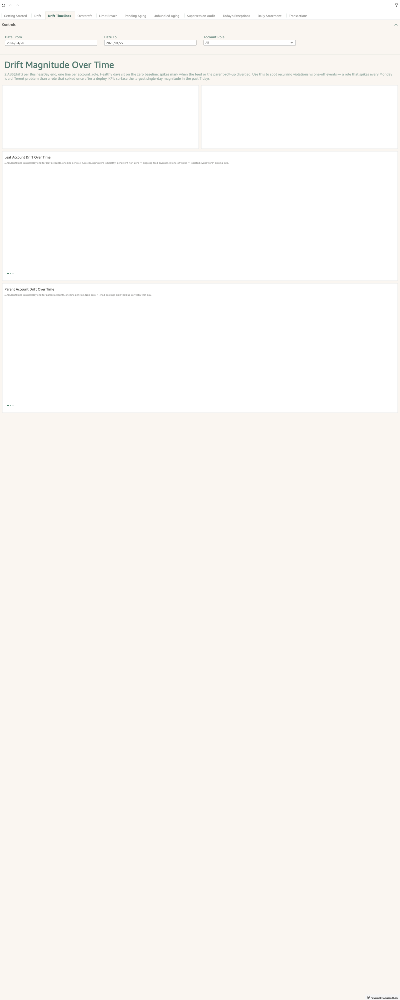

# Drift Timelines

*Per-sheet walkthrough — L1 Reconciliation Dashboard.*

## What the sheet shows

`Σ ABS(drift)` per BusinessDay end, broken out by `account_role`.
Two parallel charts:

- **Leaf account drift over time** — one line per leaf-account role.
- **Parent account drift over time** — one line per parent-account
  role.

Both lines hug the zero baseline on healthy days. Spikes mark when
the feed (leaf chart) or the parent-roll-up (parent chart) diverged.
A role that spikes every Monday is a different problem than a role
that spiked once after a deploy — the trend chart is what surfaces
the difference.

??? example "Screenshot"
    

## When to use it

After Drift's KPI count is non-zero. The detail tables on Drift
answer "which rows are broken right now"; the trend timelines answer
"is this a recurring pattern or a one-off." Together they decide the
investigation shape: recurring → fix the recurring cause; one-off →
backfill / unblock and move on.

## Visuals

- **Largest Leaf Drift Day** (KPI) — `MAX(abs_drift)` over the
  visible date range; the worst-affected single day for any leaf role.
- **Largest Parent Drift Day** (KPI) — same, parent scope.
- **Leaf Account Drift Over Time** (LineChart) — x-axis is
  `business_day_end`; y-axis is `SUM(abs_drift)`; one line per
  `account_role`.
- **Parent Account Drift Over Time** (LineChart) — same shape, parent
  scope.

## Drills

None outbound. Drift Timelines is the trend lens; drill back to
**Drift** for per-row detail or **Daily Statement** for per-account-day
walk.

## Filters

- **Date From / Date To** — universal date-range pickers.
- **Account Role** — narrow both lines to one role. Useful when one
  role's spikes are obscuring trends in the others.
