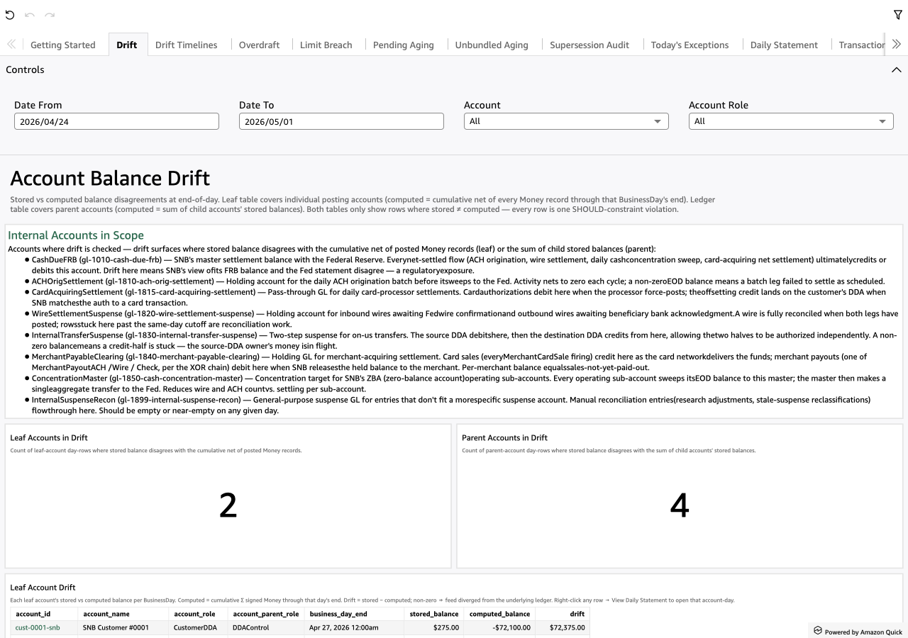

# Drift

*Per-sheet walkthrough — L1 Reconciliation Dashboard.*

## What the sheet shows

Stored vs computed balance disagreements at end-of-day. Two scopes:

- **Leaf account drift** — individual posting accounts whose stored
  balance disagrees with the cumulative net of every posted Money
  record through that BusinessDay.
- **Parent account drift** — parent accounts whose stored balance
  disagrees with the sum of their child accounts' stored balances.

Both tables only show rows where stored ≠ computed. Each row IS a
SHOULD-constraint violation; healthy = empty.

??? example "Screenshot"
    

## When to use it

Daily. A non-zero count on either KPI means the feed diverged from
the underlying ledger or a child posting didn't roll up correctly to
its parent.

## Visuals

- **Internal Accounts in Scope** — TextBox listing every internal
  account the L2 instance declares + its role + L2-supplied prose.
  Sets the universe drift can surface against.
- **Leaf Accounts in Drift** (KPI) + **Parent Accounts in Drift** (KPI)
  — count of distinct (account, day) violations per scope.
- **Leaf Account Drift** (Table) — one row per (leaf account, day)
  cell where stored ≠ computed. Carries `account_id`, `account_name`,
  `account_role`, `account_parent_role`, `business_day_end`,
  `stored_balance`, `computed_balance`, `drift`.
- **Parent Account Drift** (Table) — same shape minus
  `account_parent_role` (parents ARE the parents).

## Drills

- **Right-click any row → "View Daily Statement for this account-day"**
  — opens Daily Statement filtered to the clicked `(account_id,
  business_day_end)` for the per-leg walk.

## Filters

- **Date From / Date To** — universal date-range pickers, default
  last 7 days.
- **Account** — multi-select dropdown over `account_id`.
- **Account Role** — multi-select dropdown over `account_role`. Both
  filters apply to both tables (`ALL_DATASETS` scope).
