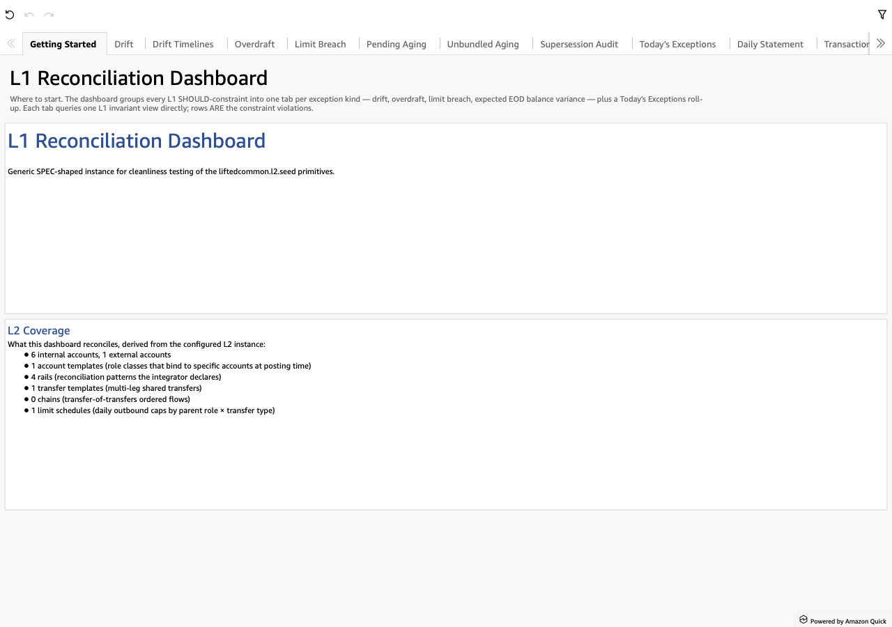

# Getting Started

*Per-sheet walkthrough — L1 Reconciliation Dashboard.*

## What the sheet shows

The landing page. Two TextBox blocks:

- **Welcome** — large heading + the L2 instance's top-level
  `description` field as the body. Switching the L2 instance switches
  this prose without a code change.
- **L2 Coverage** — bullet inventory derived from the L2 instance:
  internal account count, external account count, account templates,
  rails, transfer templates, chains, limit schedules. Tells the
  analyst the *shape* of the institution they're looking at before
  they tab over to specific exception sheets.

??? example "Screenshot"
    

## When to use it

First load. Re-open after switching L2 instances or after a major
schema change to confirm the dashboard is reading the L2 you expect.

## Visuals

- **Welcome** — TextBox with the L2's institution narrative.
- **L2 Coverage** — TextBox bullet list pulled from the L2 inventory.

No KPIs, no tables, no drills. The sheet is purely descriptive.

## Drills

None. This is the orientation page; the analyst's first click is
typically a tab over to **Today's Exceptions**.
