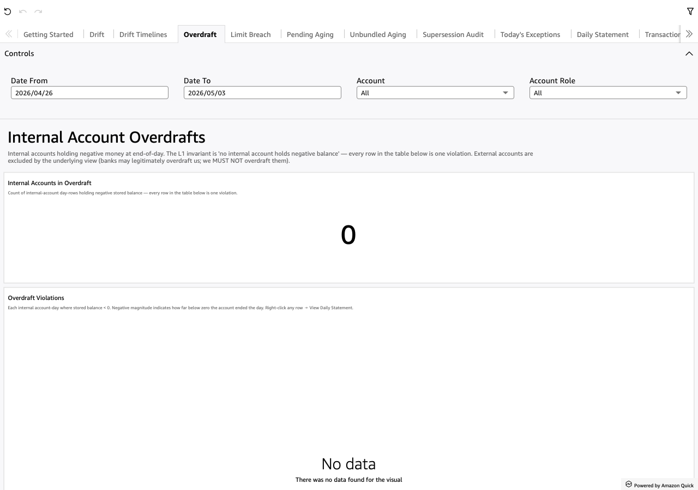

# Overdraft

*Per-sheet walkthrough — L1 Reconciliation Dashboard.*

## What the sheet shows

Internal accounts holding negative money at end-of-day. The L1
invariant: **no internal account holds negative balance**. Every row
is one violation; healthy = empty.

External counterparty accounts are excluded by the underlying view
(filtered to `account_scope = 'internal'`). The asymmetry is
intentional: banks may legitimately overdraft *us*; we MUST NOT
overdraft *them*.

## When to use it

Daily, second after Drift. Overdrafts and drift are the two
table-stakes invariants — neither should ever fire on a healthy
production feed.

## Visuals

- **Internal Accounts in Overdraft** (KPI) — count of (account, day)
  rows with stored balance < 0.
- **Overdraft Violations** (Table) — one row per overdrawn
  account-day. Carries `account_id`, `account_name`, `account_role`,
  `account_parent_role`, `business_day_end`, `stored_balance`.
  Negative magnitude indicates how far below zero.

## Drills

- **Right-click any row → "View Daily Statement for this account-day"**
  — opens Daily Statement filtered to the clicked `(account_id,
  business_day_end)` to see what postings drove the account negative.

## Filters

- **Date From / Date To** — universal date-range pickers.
- **Account** — multi-select dropdown over `account_id`.
- **Account Role** — multi-select dropdown over `account_role`.
