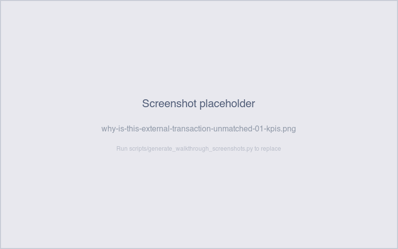
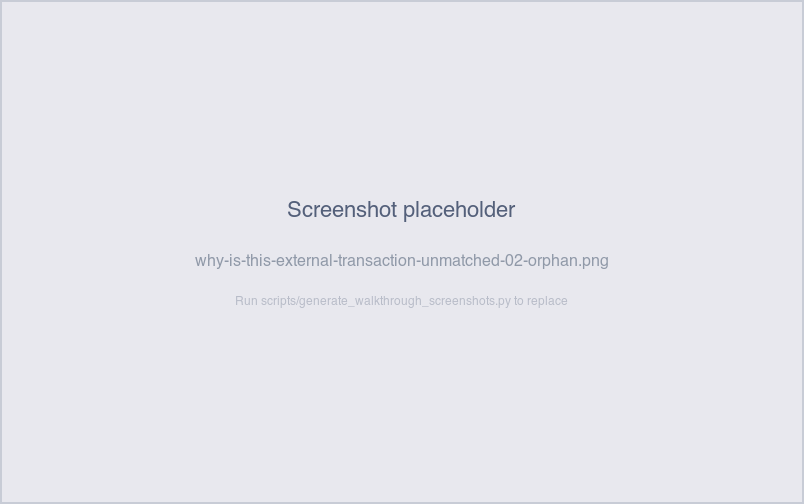
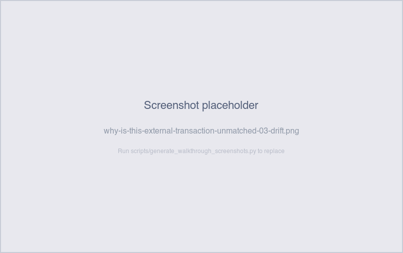

# Why is this external transaction unmatched?

*Operator-question walkthrough — Payment Reconciliation dashboard.*

## The story

Once a payment leaves SNB it lands at one of three external
clearing systems — **BankSync**, **PaymentHub**, or
**ClearSettle**. Each system reports back an *external
transaction*: a single aggregated row that may bundle one or many
SNB payments. The reconciliation job is to confirm every external
transaction maps cleanly to the right set of internal payments.

Most of the time the match is exact and there's nothing to look
at. The interesting cases are external transactions that *don't*
match — either because the dollar amounts don't reconcile, or
because no internal payment references the external row at all.
Those are what the **Payment Reconciliation** tab is built around,
and the side-by-side mutual-filter table on that tab is the
operator's main investigation tool.

## The question

"This external transaction is showing as `not_yet_matched` or
`late` — why? Did SNB never send a payment, or did the payment go
out and the external system is wrong?"

## Where to look

Open the Payment Reconciliation dashboard, **Payment
Reconciliation** sheet (the rightmost pipeline tab). Two tables
sit side-by-side:

- **Left table — External Transactions.** One row per external
  transaction with `match_status` (`matched` / `not_yet_matched` /
  `late`), `external_amount`, and `internal_total` (the SUM of any
  payments that reference it).
- **Right table — Payments.** One row per internal payment
  carrying its linked `external_transaction_id`.

The two tables filter each other. Click an external row → the
payments table narrows to the payments referencing it. Click a
payment row → the external table narrows to that payment's
external. So the operator picks an unmatched row on the left and
sees on the right whether *anything* on SNB's side claims to be
its source.

## What you'll see in the demo

The demo has roughly 60–70 external transactions. Most are
`matched`. The remainder split across three populations, almost
all of which carry `match_status = 'late'` because the demo
plants `expected_complete_at = posted_at + 1 hour` on every
external_txn row — rail observations are expected to match
almost immediately, so any unmatched external row aged more
than an hour is already past its `is_late` deadline:

- **Drifted batches.** Every 6th aggregated external transaction
  in the demo gets its `external_amount` bumped by a random
  $5–$40. The internal payments that compose it are correct;
  the external row's amount is off by the bump. These show
  `internal_total` non-zero but unequal to `external_amount`.
- **Orphan recent ext txns.** 8 external transactions in the
  demo have no SNB payment referencing them at all — random
  merchants, aged 0–25 days. `internal_total = 0`,
  `payment_count = 0`. Old enough that the rail-hour deadline
  has fired, but recent enough that an operator should still
  wait a cycle before declaring fraud.
- **Orphan older ext txns.** 5 external transactions aged 35–80
  days, same shape — orphans, old enough that they need
  manual workoff, not waiting.

Total non-matched rows in the demo: ~13 orphans plus a handful of
drifted-amount rows. The `not_yet_matched` status is now a
narrow transient — only the freshest rows that haven't crossed
their per-row `expected_complete_at` yet — so most ops time on
this tab is spent on `late` rows.

Screenshot — KPI strip with match-status counts

The side-by-side tables make the orphan-vs-drift distinction
obvious. Click an orphan row on the left — the right table
empties (no payments link to it). Click a drift row on the left —
the right table shows the linked payments, and you can see by
eye that the SUM doesn't match the external amount.

Screenshot — side-by-side tables, orphan row selected

Screenshot — side-by-side tables, drift row selected

The aging bar chart at the bottom of the tab shows the age
distribution of unmatched rows — orphan-recent populations
sit in buckets 1–3 (`0-7 days`); orphan-older + drifted
populations sit in buckets 4–5 (`8+ days`). Aging buckets are
independent of `is_late` (which fires at the rail-hour deadline);
read them as urgency tiers, not status indicators.

## What it means

Each non-`matched` row is one of two patterns, sliced by age:

- **Drifted amount** (`internal_total` ≠ 0, ≠ `external_amount`)
  → SNB sent the payment(s); the external system reported a
  different aggregate. Could be a fee taken at the external
  system, a reversal applied on their side, or a flat reporting
  bug. Recent rows (buckets 1–3) — investigate by walking the
  linked payments and confirming their sum, then contacting the
  external system. Old rows (buckets 4–5) — escalate; a 30+ day
  drift usually means the external system has already moved on
  and may not be able to re-issue the report.
- **Orphan** (`internal_total = 0`, `payment_count = 0`) → no
  SNB payment claims this external row. Either the external
  system reported a transaction SNB never originated (fraud,
  duplicate notification, or a different originator), or — for
  the freshest rows only — SNB has a payment in flight that
  hasn't yet posted with the external reference attached. Recent
  rows (buckets 1–3) — wait one cycle, then escalate if still
  orphan. Old rows (buckets 4–5) — write off or open a manual
  reconciliation ticket.

Both patterns surface as `match_status = 'late'` once the row
crosses its own `expected_complete_at` deadline (1 hour after
posting in the demo's external_txn rail). The rare
`not_yet_matched` row is the very recent window before that
deadline; it doesn't need investigation, just one more cycle.

## Drilling in

The Payment Reconciliation tab is itself the drill — there's no
deeper level. The investigation pattern:

1. **Click the unmatched external row** on the left. Watch the
   right table react.
   - **Right table empty** → orphan. Note the merchant ID and
     age; if recent, wait a cycle; if old, escalate.
   - **Right table has rows** → drifted. Compare the SUM of
     `payment_amount` to the `external_amount` shown on the left.
2. **For drifted rows, click each payment row** to drill back to
   the Payments tab. Confirm each payment's status is
   `completed` (not `returned` — a returned payment shouldn't be
   in the SUM).
3. **For orphan rows, search the Payments tab** for any payment
   with `external_transaction_id = NULL` and the same merchant.
   If you find one, the link wasn't recorded — the payment
   actually went to this external transaction but the join key
   didn't propagate.

For the converse direction — *unmatched payments* (SNB sent it,
no external row references it) — there's a `Show Only Unmatched
Externally` toggle on the Payments tab. The demo plants 4 such
payments.

## Next step

Unmatched-external rows go to **Reconciliation Operations** —
prioritize by aging bucket, since `match_status='late'` covers
nearly all of them:

- **Drifted amount, buckets 1–3 (≤7 days)** → contact the
  external system, ask them to verify the aggregate they
  reported. Most resolve as a fee or a small operational
  adjustment they neglected to report.
- **Drifted amount, buckets 4–5 (8+ days)** → same, but
  escalate. A 30+ day drift usually means the external system
  has already moved on and may not be able to re-issue the
  report.
- **Orphan, buckets 1–3 (≤7 days)** → wait one cycle (24h).
  Most orphans are duplicate notifications that get superseded.
- **Orphan, buckets 4–5 (8+ days)** → write off or open a
  manual reconciliation ticket. The external system's
  transaction did not originate from SNB; it's either a
  different originator or fraud.

Customer-facing: orphan transactions don't usually involve a
specific merchant call, since by definition no SNB payment is
involved. Drifted transactions might: if the drift is a fee taken
on the external side, the merchant's deposit will be short by
that amount, and they'll call.

## Related walkthroughs

- [Where's my money for [merchant]?](wheres-my-money-for-merchant.md) —
  the merchant-first version of this trail. If a merchant calls
  about a missing deposit and the payment shows
  `external_match_state = Unmatched`, this walkthrough is the
  next step.
- [Did all merchants get paid yesterday?](did-all-merchants-get-paid.md) —
  the Unmatched External Transactions KPI on the Exceptions tab
  is the morning-scan version of this check.
